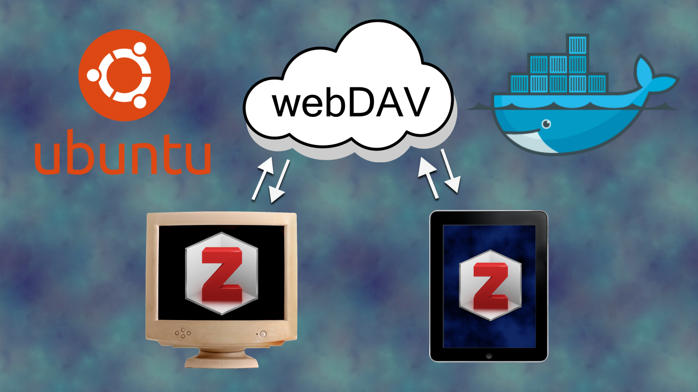
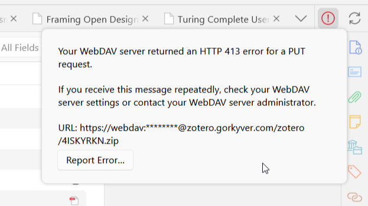

## Introduction {.invisible}


[Zotero](https://www.zotero.org/){target="_blank"} is an open-source reference management software and an excellent tool for marking PDF files and tracking readings. Additionally, Zotero provides 300 MB of cloud space for storing PDFs on their servers, which can be synched in real-time to multiple devices. This option is particularly useful if you have a Tablet as it makes annotation and note taking easier, and all changes are updated on all devices. 

You can get more cloud storage from Zotero for a low fee, but as I already have a VPS that I use to host my website, I wanted to host Zotero on my own server; in this post, I'm going to explain how I did that using NGINX, docker, and Apache WebDAV.

### Prerequisites

📝**NOTE**
This tutorial assumes that you have a VPS server running Ubuntu, Docker and NGINX 
{.note} 

+ Ubuntu 22.04 cloud server with SSH enabled: [Initial Server Setup with Ubuntu 20.04](https://www.digitalocean.com/community/tutorials/initial-server-setup-with-ubuntu-20-04){target="_blank"}
+ A domain name pointed to your server’s IP
+ UFW firewall setup
+ NGINX installed as a reverse proxy: [How To Configure Nginx as a Reverse Proxy on Ubuntu 22.04](https://www.digitalocean.com/community/tutorials/how-to-configure-nginx-as-a-reverse-proxy-on-ubuntu-22-04){target="_blank"}
+ Docker and Docker Compose: [Install Docker on Ubuntu](https://docs.docker.com/compose/install/){target="_blank"}
+ SSL with Let’s Encrypt: [How To Secure Nginx with Let's Encrypt](https://www.digitalocean.com/community/tutorials/how-to-secure-nginx-with-let-s-encrypt-on-ubuntu-20-04){target="_blank"}


<!-- This tutorial assumes that you have a VPS running UBUNTU 22.04, with NGINX as your reverse proxy and ufw and Docker. I'll not go into detail on how to create this setup you can check the following articles for that. -->
## Setup
I'm using the Apache WebDAV docker container [maintained by bytemark.](https://hub.docker.com/r/bytemark/webdav/){target="_blank"} The setup is pretty straight forward, you need docker compose to set it up. Create a new folder in your server directory with `mkdir webdav` and create the compose file by `nano docker-compose.yml`.
```bash
mkdir webdav
nano docker-compose.yml
```
Paste the following in the file and replace `<username>` and `<password>` with the login information you want to use. You will use these credentials to setup a connection to your server from Zotero so make sure to save them.

```yml
version: '3'
services:
  webdav:
    image: bytemark/webdav
    restart: always
    ports:
      - "81:80"
    environment:
      AUTH_TYPE: Digest
      USERNAME: <username>
      PASSWORD: <password>
      LOCATION: /zotero/
    volumes:
      - /srv/dav:/var/lib/dav
```
📝**NOTE**
I'm using port `81` as port `80` is already in use in my server.
{.note} 

Next, from your project directory start up your application by running docker compose up.

```bash
docker compose up
```

Your Webdav server is now running! but we have to setup the domain for the server before we can configure the server in Zotero.

## Domain Setup

Go to your domain registrar and create a new A record for your domain/subdomain. I'm going to use `zotero.gorkyver.com` as the domain for the server so I'm creating an A-record with `zotero` as host and `my_server_ip_address` as the value. 

### Reverse Proxy with NGINX
Now we have the domain setup but we need to route the incoming traffic to the server that's running in docker, we are going to use NGINX to do that. Simply create a conf file for routing:

```bash
sudo nano /etc/nginx/sites-available/<your-domain>
```
In the file paste the folllowing:

```bash
server{
	server_name your_domain www.your_domain
	location / {
		proxy_pass docker_container_ip #this should look something like: 0.0.0.0:81 etc.
        proxy_set_header HOST $host;
        proxy_set_header X-Forwarded-Proto $scheme;
        proxy_set_header X-Real-IP $remote_addr;
        proxy_set_header X-Forwarded-For $proxy_add_x_forwarded_for;
		}
}
```
Replace `your_domain` with your domain name and `docker_container_ip` with the address of your container, If you don't know the IP address of your docker container you can view it by

```bash
docker ps
docker inspect <CONTAINER NAME>
```

When NGINX proxies a request, it forwards the request to a designated server, retrieves the response, and then sends it back to the client. In this case we will re-route the traffic to the docker container that is running our webdav server.


Next enable file link to `sites-enabled`:
```bash
sudo ln -s /etc/nginx/sites-available/your_domain /etc/nginx/sites-enabled/
```
check syntax error in config file:
```bash
sudo nginx -t
```
restart nginx for changes to take effect:
```bash
sudo systemctl restart nginx
```

### Secure connection with SSL

I'm going to use let's encrypt NGINX integration known as certbot to secure the server with SSL you can [follow this guide](https://www.digitalocean.com/community/tutorials/how-to-secure-nginx-with-let-s-encrypt-on-ubuntu-22-04){target="_blank"} if you have not set up certbot already.

With certbot installed, simply run
```bash
sudo certbot --nginx -d your_domain.com -d www.your_domain.com
```
Your server should be accessible on `your_domain.com` now! Next we'll setup Zotero to connect with the webdav server.
## Zotero Configuration
### Initial setup on PC/Mac

Launch Zotero on your computer, go to `Edit`->`Settings` and log-in with your Zotero account.

Next, uncheck the Zotero Storage option and check `Sync attachment files in my Library` and from the drop down select `WebDAV`.

and enter your host e.g. your_domain.com, and the login details you set-up for WebDAV in the Setup section and click Verify Server.

### Increase file-size limit



The error “413 – Request Entity Too Large” [indicates that Nginx was configured to restrict large file sizes.](https://www.cyberciti.biz/faq/linux-unix-bsd-nginx-413-request-entity-too-large/){target="_blank"} The default maximum file size is `1M` and We have to edit Nginx conf file to allow larger file sizes. Edit the conf file by

```bash
nano /etc/nginx/nginx.conf
```

add this line to the `http` section

```bash
client_max_body_size 70M;
```
Next restart NGINX for changes to take effect:

```bash
sudo systemctl restart nginx
```
Now you can open Zotero and use the sync button at the top right to backup all your files onto your WebDAV server!
