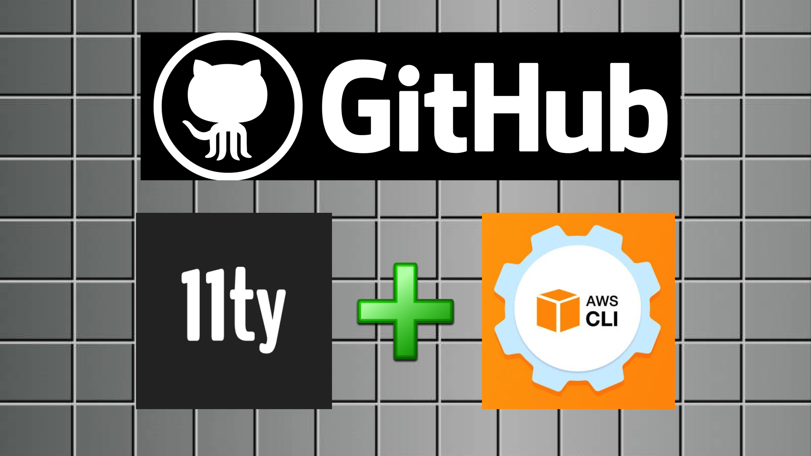
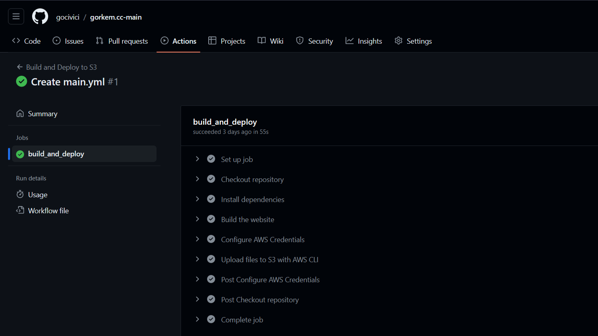

## Introduction {.invisible}



Currently I'm using the powerful static website generator Eleventy (11ty) for this website without any server-side operation, however, the workflow of updating the website, publishing post/projects is cumbersome, as it requires for me to build the website locally and upload files manually every time I make a change. 

Thus I decided to find a way to automate the process, in this post I'm going to explain how I did it. 

The workflow uses a custom GitHub actions command to build the website on ubuntu and transfers files to an S3 bucket whenever the GitHub repo is updated and is based on [this method by Monica.](https://monicagranbois.com/blog/webdev/use-github-actions-to-deploy-11ty-site-to-s3/){target="_blank"}


## Eleventy setup

11ty is "zero-config" by default which means that it will process all the files in the root directory, run a build process, and output resulting files to a `_site` directory. I made some changes in the 11ty folder structure, by creating a `src` folder as the input directory and a `public` folder as the output directory. At the end my folder structure looks like this:

```treeview
root_folder/
  |-- src/
  |-- public/
  |-.eleventy.js
  |-.gitignore
  |-package.json
```
I also created a .gitignore file in the root directory with the following contents:

```git
/public
node_modules
```

## S3 Setup

AWS S3 is great for storing files. It’s cheap, fast and reliable. What you may not know is that you can also host static websites on this platform.

Hosting a static webpage is ridiculously cheap. S3 has a pay-as-you-use system. Even with a lot of users visiting your website you don’t pay much, it can serve 100.000 users just under 1 dollar. [You can read the official documentation here.](https://docs.aws.amazon.com/AmazonS3/latest/userguide/WebsiteHosting.html){target="_blank"}

After following the documentation, your static website should be available at:

`your-bucket.s3-website.eu-central-1.amazonaws.com`

If you want to use your own domain name as I do, you can follow [this guide](https://docs.aws.amazon.com/AmazonS3/latest/userguide/website-hosting-custom-domain-walkthrough.html){target="_blank"} and use route 53 as your dns service.

### Creating a policy

First, we have to create a policy that will only allow certain permissions, to create the policy I followed Monica's guide, here's the .json file that is customized to work with my website:

```json
{
    "Version": "2012-10-17",
    "Statement": [
        {
            "Sid": "VisualEditor0",
            "Effect": "Allow",
            "Action": [
                "s3:PutObject",
                "s3:GetObject",
                "s3:ListBucket",
                "s3:DeleteObject",
                "s3:GetBucketLocation"
            ],
            "Resource": [
                "arn:aws:s3:::BUCKET-NAME",
                "arn:aws:s3:::BUCKET-NAME/*"
            ]
        }
    ]
}
```
### Assign policy to user

I created a user with programmatic access on the AWS console from Access Management -> Users -> Add user and selected “Programmatic access” in the “Access Type” section. Next I assigned the policy that I've created to the user by clicking on the “Attach existing policies directly” box in the “Set permissions” section.

Now we have our user with programmatic access, but we need the user’s AWS credentials to give access from Github. To get the credentials visit the "Security Credentials" tab and copy the `Access Key ID` and `Secret`

## GitHub Setup

I added the AWS credentials as Repository Secrets in the repo, and configured a GitHub actions workflow like this:

```yml
name: Build and Deploy to S3
on: [push]
jobs:
  build_and_deploy:
    runs-on: ubuntu-latest
    steps:
      - name: Checkout repository
        uses: actions/checkout@v4

      - name: Install dependencies
        run: npm ci

      - name: Build the website
        run: npx @11ty/eleventy
      
      - name: Configure AWS Credentials
        uses: aws-actions/configure-aws-credentials@v4
        with:
          aws-access-key-id: ${{ secrets.AWS_ACCESS_KEY_ID }}
          aws-secret-access-key: ${{ secrets.AWS_SECRET_ACCESS_KEY }}
          aws-region: eu-central-1 # replace this with your aws-region

      - name: Upload files to S3 with AWS CLI
        run: |
          aws s3 sync public/ s3://${{ secrets.S3_BUCKET }} --delete 
```
📝**NOTE**
The `aws s3 sync` command copies files from the `public directory` to the S3 bucket and the `--delete` option will delete every file that is not in that directory, If you want to keep files/folders in your s3 bucket separate from your 11ty build do not use this method. {.note}

## Running the workflow



Now every time when a commit is pushed to the repo the workflow will run, it will build the 11ty website and upload the results to your s3 bucket replacing the previous files.


