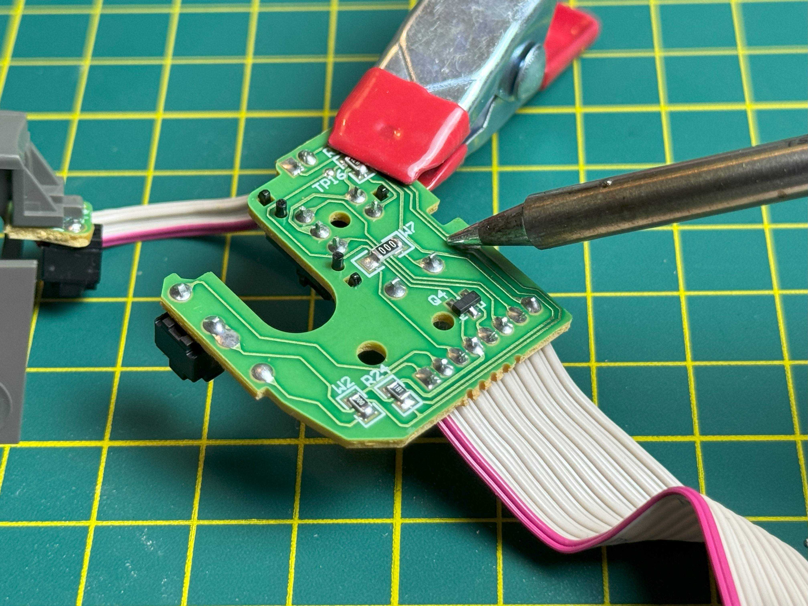

## Introduction {.invisible}

I’ve been using the Microsoft Trackball mouse for years now. It's ergonomic, offers a fantastic grip and layout, and it's an ideal replacement if you are suffering from wrist problems as it removes all the moving back and forth by keeping your hand in one position. 

Unfortunetly, it started to develop some problems recently like double-clicking and dropping files when you are trying to drag etc. I considered replacing it due to its age, but later discovered that there are no trackballs with similar layouts available on the market. Finding official replacement parts are also not an option since this mouse was discontinued in 2001..

In this post we will teardown the Trackball Explorer and replace the micro-switch that causes the issue.

## Teardown

To open the track ball first remove the ball and locate the 6 screws on the botom side of the trackball, 3 of these screws are under the rubber feet which is glued to the bottom of the mouse. 

You don't have to remove the tubber feet completely to access them, I simply peeled them just enough so I could remove the screws.

<section id="main-carousel" class="splide" aria-label="project images">
  

    <ul class="splide__list">
      <li class="splide__slide">
        
      </li>
      <li class="splide__slide">
        
      </li>
    </ul>
  

</section>

<ul id="thumbnails" class="thumbnails">
  <li class="thumbnail">
    
  </li>
  <li class="thumbnail">
    
  </li>
</ul>

Next, remove the bottom side but be gentle as there are cables that hold the two pieces together. After removing the cables with a pair of tweezers you should be able to pull the to halves apart. 

Inside we can see three circuit boards: (1) The base, (2) Optical image sensor board, and (3) Scrollwheel and Buttons. It might be a good idea to clean all the boards with IPA before reassembly but for now we are going to focus on the 3rd board which is the root of our problem.

## Investigating the problem

It looks like the cause of the problem is this micro-switch which is the left click of the mouse. I tried cleaning the switch with IPA but testing the switch with a multimeter revealed that not every click was registered.

### Finding a replacement

The replacement button I found is the OMRON D2F-01F Subminiature Snap Action Switch, which is the same brand as the one I'm replacing. It's cheap and It's rated for 100.000 cycles electrically which should be sufficient. You can find it on [Mouser for 1,71€ ](https://www.mouser.com.tr/ProductDetail/Omron-Electronics/D2F-01F?qs=0w99tykdtPLhoVh2lktm%252BQ%3D%3D){target="_blank"}

## Repairing the trackball
### Removing the old switch

<section id="main-carousel" class="splide" aria-label="project images">
  

    <ul class="splide__list">
      <li class="splide__slide">
        
      </li>
            <li class="splide__slide">
        
      </li>
      <li class="splide__slide">
        
      </li>
            <li class="splide__slide">
        
      </li>
    </ul>
  

</section>

<ul id="thumbnails" class="thumbnails">
  <li class="thumbnail">
    
  </li>
    <li class="thumbnail">
    
  </li>
  <li class="thumbnail">
    
  </li>
    <li class="thumbnail">
    
  </li>
</ul>

I used a soldering Iron set at 300 C along with a solder wick. If the solder wick doesn't work you can also use a solder pump to clear out the pins. Be careful and don't hold the soldering iron more then 2 seconds at once as this can cause the solderingpads to break.

### Soldering the new switch

<section id="main-carousel" class="splide" aria-label="project images">
  

    <ul class="splide__list">
      <li class="splide__slide">
        
      </li>
            <li class="splide__slide">
        
      </li>
                  <li class="splide__slide">
        
      </li>
    </ul>
  

</section>

<ul id="thumbnails" class="thumbnails">
  <li class="thumbnail">
    
  </li>
    <li class="thumbnail">
    
  </li>
      <li class="thumbnail">
    
  </li>

</ul>

Solder the new switch using some flux, and clean up any residue with IPA. Now you can re-assemble the trackball and you are done!

That's it for the repair of the Microsoft Trackball Explorer, and I'm happy with the results, no more issues and the click of the switch has a good feel to it, it feels brand new!

