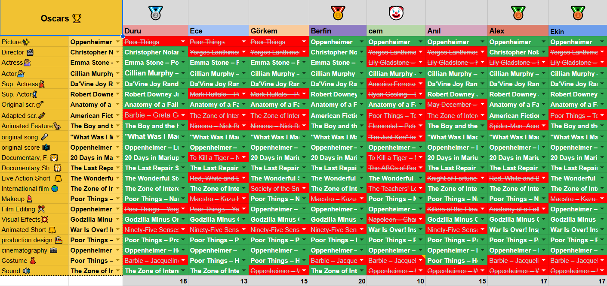
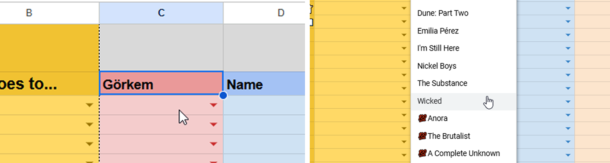
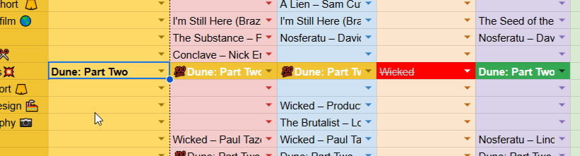

## Introduction {.invisible}

<small style="text-align:center;display:block;"><em>The ballot for the 2024 Oscars</em></small>

Every year, my friends and I fill out a ballot for the Oscars. Initially, we used printable ballots from Vanity Fair, Rotten Tomatoes etc. Later, we started manually logging our guesses into a spreadsheet. Over the years, I automated the process, added a point system, and made it more interactive with conditional formatting and formulas.

This year I’ve decided to make the template public so anyone can use it! You’ll find the link to the spreadsheet below, followed by instructions on how to use it.

Click below for the template, and then go to `File -> Make Copy`!

[📝Oscars Ballot 2025 Google Sheets Template w/ Confidence Bonus](https://docs.google.com/spreadsheets/d/1BDI6llck_u9lWVksBzF9MN-0Sf4xV2Y0VMMGQ_rHaf0/edit?usp=sharing){target="_blank"}

📝**NOTE**
DO NOT edit the gray areas, they contain formulas that make the magic happen!
{.note} 

## Instructions
### 1) Fill the sheet

Share the spreadsheet with friends giving them edit privileges, choose a column and put your name in the name field, use the dropdown menu to select your guess!
- Entries with the 💯 count as confidence bonus, they are worth `2 points` if they match with the result. if not you loose 1 point (`-1 points`).
- Entries without the 💯 are regular entries and are worth `1 point`, if they don't match you get `0 points`.

📝**NOTE**
Delete any empty columns, this sheet works best when every column is filled! To delete a column, simply left-click the column header at the top and select `delete column`
{.note} 

### 2) Enter Results

As the results are announced, select the corresponding result from the dropdown menu in the yellow field. Once you make a selection, each row will be compared to the result, and a color will be assigned to each guess. A medal will be awarded to the current leader at the top, and you’ll also see point changes displayed at the bottom!

