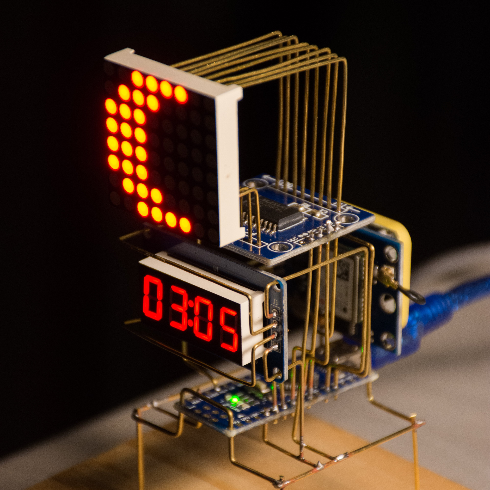
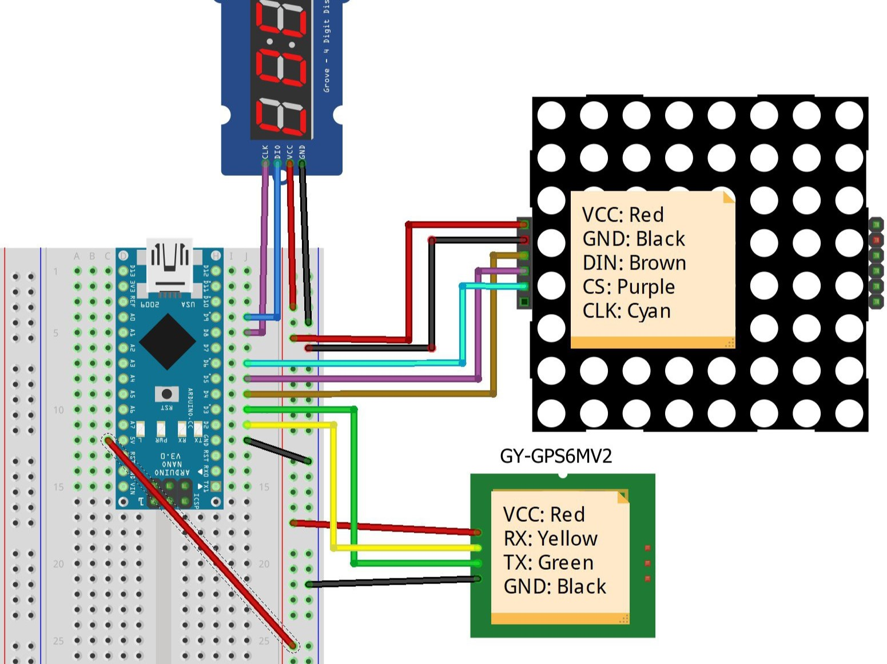
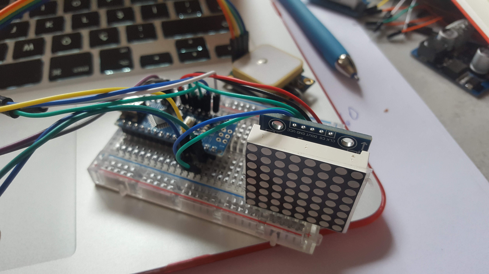
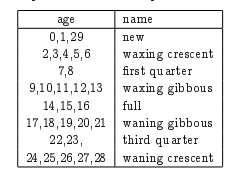
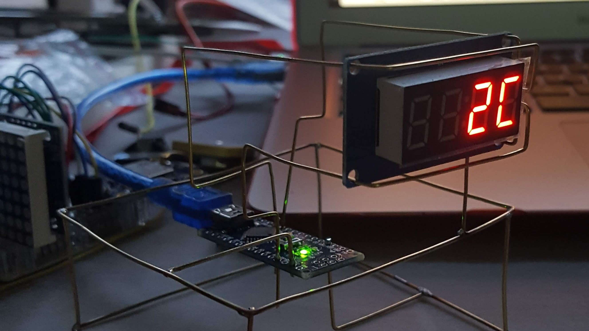
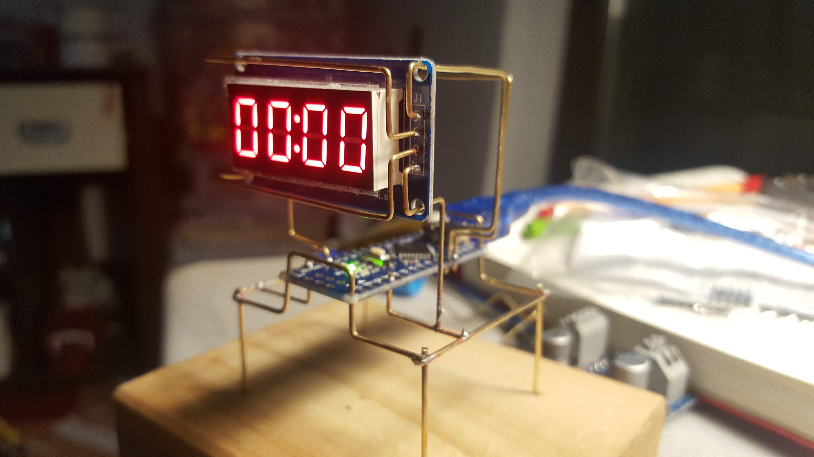
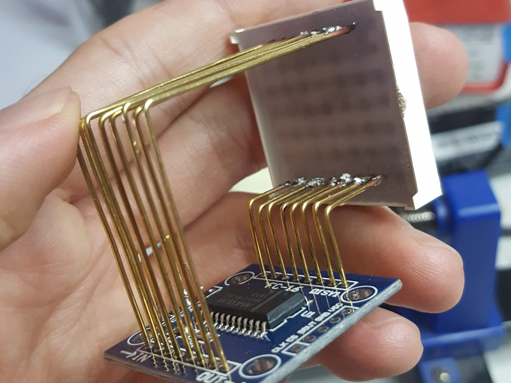
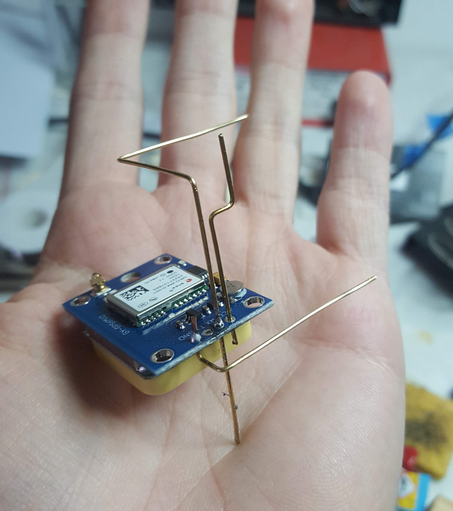

## Introducion {.invisible}



📝**NOTE**
This project is archived and no longer maintained. While the core concepts may still be applicable, the instructions and code provided may not work with the latest versions of hardware, software, or libraries. It was originally published on hackaday in 2019, you can view the comments to the original article on this archived link: [https://archive.ph/RrIdg](https://archive.ph/RrIdg){target="_blank"}  
{.note}

<!-- - The structure is built using 0.8mm and 1.0mm brass wire.
- The local sidereal time (LST) is calculated using this algorithm: [http://www.stargazing.net/kepler/altaz.html](http://www.stargazing.net/kepler/altaz.html)
- The Lunar Phase is calculated using _John Conway's moon age algorithm_ -->

### How to use this clock

The Local Sidereal Time(LST) is defined as the time reckoned from the motion of the earth relative to the stars. It is 0h when the vernal equinox is on the observer's local meridian. 

When you look at a stargazing chart you'll see 2 celestial coordinates the Right Ascension (RA) and Declination (DEC).  the RA of star X is the angular distance from the vernal equinox to X = 1h = LST. The DEC value is 0 when on the horizon and 90 when on the top. Thus if a star has a RA=3h and DEC=30 it will be on your meridian 30 degrees up from the horizon when the LST clock is 3h.


## Prototyping

📝**NOTE**
I didn't use sketches/drawings for the brass structure, after 3 days of trial&error I ended up with this. So in these instructions I'll provide you the wiring schematics, explain the code and tell you how I managed to solder the structure. But I can't provide dimensions, etc. since I also don't know them.
{.note}

### Parts:

- 1 × Arduino Nano
- 1 × GY-GPS6MV2 GPS module
- 1 × TM1637 4 digit display
- 1 × 8x8 LED Matrix
- 1 × MAX7219 LED Matrix driver
- lots of jumper cables
- A breadboard

Here is the wiring schematic:



I always prototype first to develop the code and test it before making anything permanent.



After you're done with wiring upload the code "Astroclock.ino" provided in the files tab to Arduino and wait a bit. The GPS should lock into a satelite soon enough and you'll see the matrix and display light up.

## The Algorithms

The code Astroclock.ino is commented so you'll have an idea of how the code works upon examining it. Here I will tell you which algorithms I used and implemented in the code.

### John Conway's Moon Age Algorithm

John Conway is an English mathematician who came up with [the method of mentally computing the day of the week for any given date](https://www.timeanddate.com/date/doomsday-weekday.html). Also [a method to calculate the age of the moon for any given date.](https://www.cs.williams.edu/~bailey/cs135/lectures/Lecture02.pdf) The error rate for this method is a liitle larger than other longer methods but in my case it works well because I only display the 8 phases of the Moon. 

I implemented the algorithm to arduino as a function called conwayMoon(year,month,day) which takes the year,month and day from the GPS as input, and returns the moon age as output. Than I used this output to draw the Moon phase on to the matrix display using this table:



### Calculating Local Sidereal Time (LST)

The formula to calculate LST is:

```arduino
LST = 100.46 + 0.985647*d + long + 15*UT
```

where,

d = the days from J2000 ([more info here](http://www.stargazing.net/kepler/altaz.html))

long = longtitude from GPS

UT = Universal time from GPS converted to decimal hours

This formula gives the LST in degrees.  Then it is converted in the format HH:MM.

## The Structure

### Tools & Parts:

- 0.8mm and 1.00mm Brass Rod or Wire
- Soldering equipment
- Pliers
- Diagonal cutting pliers 

I didn't have acces to brass rods since they are not avaliable in my region. Thus I had to use brass loop wire and straighten it.

The first structure I tried was a mess and unstable because I used a larger square for the base and the bent points were visible seen here:



Later tried a smaller base which I was happy with:



Instead of soldering the 8x8 matrix to the driver directly, I soldered them using brass wires which gave this cool look:



I bent the wires estimating the dimensions by eye:



In every step I tested if the components worked correcly.

## Further Reading

History - [http://csep10.phys.utk.edu/astr161/lect/retrograde...](http://csep10.phys.utk.edu/astr161/lect/retrograde/aristotle.html)

RA and DEC - [http://www.physics.csbsju.edu/astro/sky/sky.11.htm...](http://www.physics.csbsju.edu/astro/sky/sky.11.html)

Celestial Sphere - [http://www.astronomyforbeginners.com/astronomy/cel...](http://www.astronomyforbeginners.com/astronomy/celestialsphere.php)

Coordinate Systems - [https://dept.astro.lsa.umich.edu/ugactivities/Labs...](https://dept.astro.lsa.umich.edu/ugactivities/Labs/coords/)

Celestial Coordinates - [http://sbo.colorado.edu/SBO\_OLD\_SITE/sbo/astroinfo...](http://sbo.colorado.edu/SBO_OLD_SITE/sbo/astroinfo/coords/coordinates.html)

Finding Astronomical Objects - [https://www.saddleback.edu/faculty/mhaeri/document...](https://www.saddleback.edu/faculty/mhaeri/documents/CoordinatesH.pdf)

Local Side Real Clock converter - [http://www.jgiesen.de/astro/astroJS/siderealClock/](http://www.jgiesen.de/astro/astroJS/siderealClock/)

How to Calculate Sidereal time - [http://aa.usno.navy.mil/faq/docs/GAST.php](http://aa.usno.navy.mil/faq/docs/GAST.php)