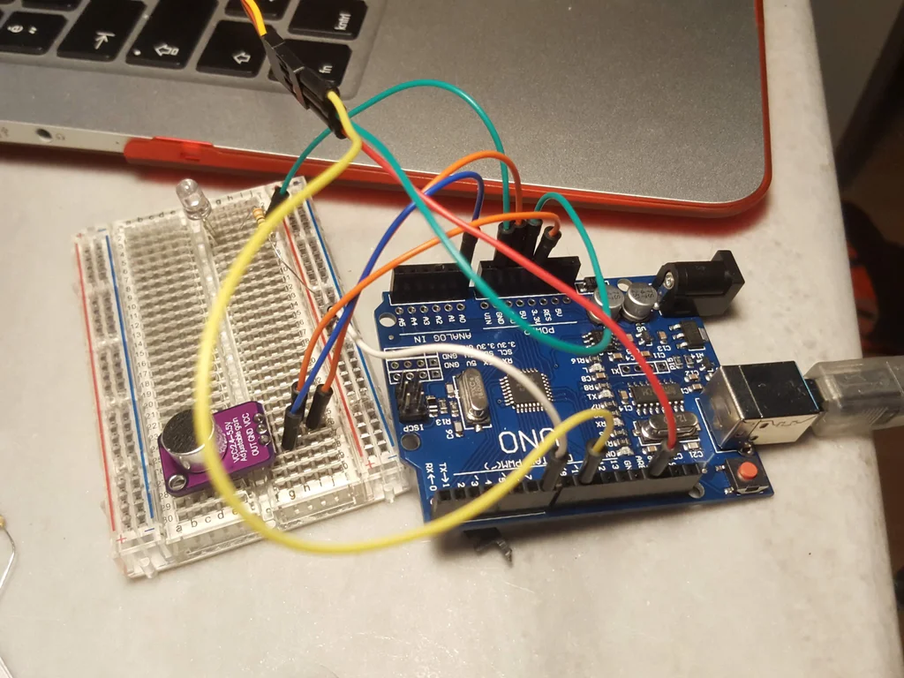

## Introducion {.invisible}

https://www.youtube.com/watch?v=bMhx1hWMXbo

**Featured on**
 [Hackaday.com | Sound-Triggered Eye Protection For The Forgetful Among US](https://hackaday.com/2019/02/08/ya-only-get-one-set-of-eyes/){target="_blank"}
 [Arduino Blog | Automatic eye protection triggered by sound](https://blog.arduino.cc/2019/02/05/automatic-eye-protection-triggered-by-sound/){target="_blank"}
 [Hackster.io |Eye Guardian: Sound-Triggered Eye Protection](https://www.hackster.io/news/eye-guardian-sound-triggered-eye-protection-92bb3daf804c){target="_blank"}
 [Adafruit News | Eye Guardian Provides Sound Triggered Eye Protection](https://blog.adafruit.com/2019/02/06/eye-guardian-provides-sound-triggered-eye-protection-wearablewednesday/){target="_blank"} {.press}

📝**NOTE**
This project is archived and no longer maintained. While the core concepts may still be applicable, the instructions and code provided may not work with the latest versions of hardware, software, or libraries. It was originally published on instructables, you can view the comments to the original article on this archived link: [https://archive.ph/DToMv](https://archive.ph/DToMv){target="_blank"}  
{.note}

Eye Guardian is an Arduino powered, High-Decibel continuous sound triggered eye protection wear. It detects heavy equipment sound and lowers protective eye goggles while the equipment is in use.

**Outline**

In the first step, I will explain the Inspiration&Idea behind this project. Next, I will give you a Tools&Parts list that I have used to build this. Then I will explain the design choices I made and give you a guide to 3D print the parts needed for this instructable. After giving you a step by step assembly guide on the electronics and hat assembly I will end the instructable with a troubleshooting guide and a What's Next section where I will discuss what can be added or changed in the future.

The purpose of this instructable is not just to give you a cookbook. I'll show you the way I built this project and provide you with open-ended questions, so you can add your own ideas, and take this project even further.

I strongly encourage you to share your build when it's done!

Let's get started.

## Step 1: Inspiration & Idea

I try to wear eye protection when I use heavy equipment, but with the excitement of building something, I usually forget to wear it. While I was watching [Adam Savage's One Day Builds](https://youtu.be/-HfaLqmRO1k?t=230) I saw that I was not the only one. And I thought that many of the people who build things share the same problem with me. So I decided to build a hat that does it for me. The first thing I thought was to use Fourier Analysis to detect specific sounds, but later I decided that the algorithm should be as simple as possible to be used by everyone, It shouldn't be triggered only by my tools. And everyone should be able to edit the code to their own use. So after that, a prototyping journey has begun...

## Step 2: Tools & Parts

_All the 3d parts & Code of this project can be found on the project repository on the right.

**Tools:**

- Pliers
- Drill and 3mm Tip
- Diagonal Pliers
- Soldering Equipment
- Basic Sewing Equipment

_Note: This project requires some soldering and sewing knowledge, I won't get into the details, so if you're new to them I recommend you to check out some [tutorials on soldering](https://www.instructables.com/id/Soldering/)and [sewing](https://www.instructables.com/class/Hand-Sewing-Class/) first._

**Parts:**

[1 x Electret Microphone Amplifier - MAX4466 with Adjustable Gain](https://www.adafruit.com/product/1063)

[1 x Arduino Nano](https://store.arduino.cc/usa/arduino-nano)

1 x Safety Goggles

1 x Hat

1 x 9g Micro Servo Motor

1 x 9V Battery

1 x Red LED

1 x 220ohm resistor

4 x (8mm m3 bolt&nut)

3cm 0.8 mm brass wire
    

## Step 3: Design & Print

In this step, I will show you how I designed the parts in **Fusion 360** in detail. If you just want to print the parts, you can skip this step.

_Note: I suggest you read this step in detail before you print anything. I designed the parts according to my dimensions of the hat. So it is best if you design the structure according to your dimensions/parts._

Detailed comments are attached to the images as notes, check them out!

**Printing**  
Printer: Tevo Tornado

I used PLA to print the parts, my settings are:

- 0.4 nozzle
- 50% infill
- temp. 195C

## Step 4: Assembly: Electronics

<section id="main-carousel" class="splide" aria-label="project images">
  

    <ul class="splide__list">
      <li class="splide__slide">
        
      </li>
      <li class="splide__slide">
        
      </li>
      <li class="splide__slide">
        
      </li>
      <li class="splide__slide">
        
      </li>
      <li class="splide__slide">
        
      </li>
      <li class="splide__slide">
        
      </li>

    </ul>
  

</section>

<ul id="thumbnails" class="thumbnails">
  <li class="thumbnail">
    
  </li>
  <li class="thumbnail">
    
  </li>
  <li class="thumbnail">
    
  </li>
  <li class="thumbnail">
    
  </li>
  <li class="thumbnail">
    
  </li>
  <li class="thumbnail">
    
  </li>
</ul>

I recommend you to create a prototype first before soldering anything. As seen in the second image some jumper cables and a breadboard is enough to test the setup.

After You've assembled the prototype, upload the code to the Arduino and check the serial monitor while using a drill or other loud tool(Dremel etc.). If It doesn't display drill on the serial monitor while the tool is used, edit the sensitivity value in the code until you are satisfied.

Now you can start soldering!

_Note: I didn't explain the Arduino setup in detail. If you did not use an Arduino board before you can check this tutorial first:_

[_https://www.instructables.com/class/Arduino-Class/_](https://www.instructables.com/class/Arduino-Class/)

## Step 5: Assembly: Sewing

I used Velcro to attach the board and battery to the hat. You can also sew them directly to the hat if you want.

## Step 6: Assembly: Googles & Hat

<section id="main-carousel" class="splide" aria-label="project images">
  

    <ul class="splide__list">
      <li class="splide__slide">
        
      </li>
      <li class="splide__slide">
        
      </li>
      <li class="splide__slide">
        
      </li>
      <li class="splide__slide">
        
      </li>

    </ul>
  

</section>

<ul id="thumbnails" class="thumbnails">
  <li class="thumbnail">
    
  </li>
  <li class="thumbnail">
    
  </li>
  <li class="thumbnail">
    
  </li>
  <li class="thumbnail">
    
  </li>
</ul>

You'll need a drill and a caliper for this step. First carefully drill a hole into the middle of the goggles. While wearing the hat and goggles measure where the google is intersecting with the hinge and mark it. now drill a hole on the hinge and attach the goggles to the hinge along with the carrier piece using the m3 bolt.

## Step 7: First Test

Connect the 9v battery to the circuit and you are ready to go! Get a drill and test if the googles correctly align with your face.

## Step 8: Troubleshooting

\+ **Servo is not working / Arduino is resetting**

\- The battery you are using could be empty I had the same Issue while I tested my circuit with an old battery

**\+ The code doesn't work / sound doesn't trigger the circuit**

\- The gain level of the microphone module can be changed thanks to a potentiometer on the board. Get a small screwdriver and try to adjust the level.

\+ **The led is not working**

\- Make sure you are using the right resistor.

**\+ The goggles do not open fully**

\- Edit the servo values in the code until you are satisfied. If this doesn't solve your problem try to change the orientation of your hat. some hats have a front with a slight slope.

## Step 9: What's Next

This is not a finished project, it's a prototype. There are a lot of things that can be added or changed. I've only used this hat 2-3 times while working and found out some things that can be improved.

This is where you come in. In this step, I will list some things I had in my mind. Feel free to add more Ideas or ways to improve this project in the comments.

**Here are a few,**

- A button can be added to manually control the goggles
- A wireless charger module and rechargeable battery can be added so It will be fully charged while not in use.
- The electronics can be hidden by creating/sewing a custom hat.

I hope you enjoyed this project,

If you have any questions ask away! & tell me about your build!