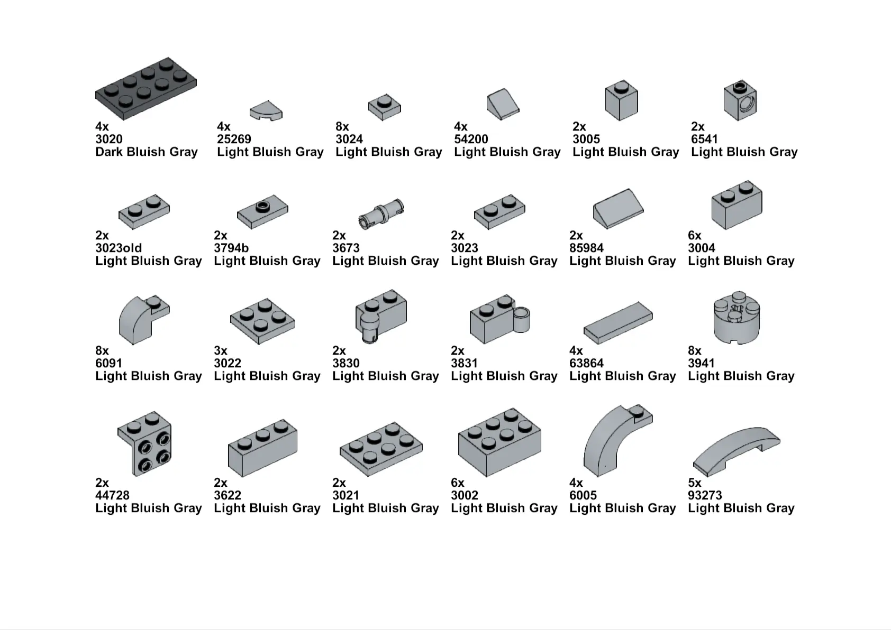
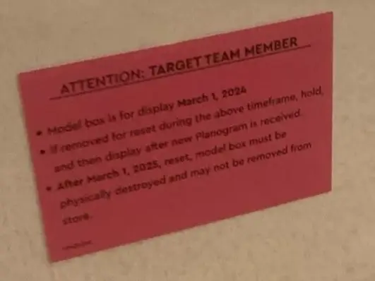

## Introduction {.invisible}

<link
  rel="stylesheet"
  href="https://cdn.jsdelivr.net/npm/img-comparison-slider@8/dist/styles.css"
/>

https://youtu.be/gZPEoz-PpNI

<!--  -->

**Featured on**
 [Hackaday.com | A Throne For LEGO Baron Harkonnen](https://hackaday.com/2024/07/22/a-throne-for-lego-baron-harkonnen/){target="_blank"}
 [blog.adafruit.com | LEGO Dune – Baron Harkonnen throne automata build](https://blog.adafruit.com/2024/07/22/lego-dune-baron-harkonnen-throne-automata-build/){target="_blank"} {.press}

The LEGO Harkonnen Throne is a custom-built LEGO automata set based on the Harkonnen throne room from Denis Villeneuve's DUNE adaptation. When the button is pressed, it triggers a kinetic recreation of the [iconic throne room scene from the movie](https://www.youtube.com/watch?v=WQCV8O3oIU8){target="_blank"}, complete with audio and movement. 

  
  
</img-comparison-slider>
<small style="text-align:center;display:block;"><em>Dune: Part One (2021)</em> vs <em>my LEGO Recreation</em> (click & drag the slider to compare)</small>

## Background

### Inspiration
Prior to the premiere of Dune: Part Two last March, LEGO unveiled the 10327 Dune Atreides Royal Ornithopter [in a presentation led by Mike Psiaki.](https://www.youtube.com/watch?v=Rdy2XRyggG4){target="_blank"} It featured functional blades that flap and retract like a dragonfly, and included 8 minifigures: Paul Atreides, Lady Jessica, Gurney Halleck, Chani, Leto Atreides, Liet Kynes, Duncan Idaho, and Baron Harkonnen.

I purchased the set as soon as it became available in my country. It was super fun to build, and despite being an Icons set, it included creative mechanics like a Technics set, which I appreciated. I also liked the included minifigures, though I felt that one of them, *Baron Harkonnen*, did not quite fit with the rest. So, I decided to build a LEGO throne based on the movie for the Baron and design a display case to showcase it like an actual set!

<section id="main-carousel" class="splide" aria-label="My Awesome Gallery">
  

    <ul class="splide__list">
      <li class="splide__slide">
        
        <small>source: <a target="_blank" href="https://www.lego.com/en-us/categories/adults-welcome/article/making-the-lego-dune-ornithopter">Official LEGO Dune Set</a></small>
      </li>
      <li class="splide__slide">
        
         <small>source: <a target="_blank" href="https://www.lego.com/en-us/categories/adults-welcome/article/making-the-lego-dune-ornithopter">Official LEGO Dune Set</a></small>
      </li>
      <li class="splide__slide">
        
         <small>LEGO Star Wars interactive store display, one of the inspirations for this project</small>
      </li>
    </ul>
  

</section>

<ul id="thumbnails" class="thumbnails">
  <li class="thumbnail">
    
  </li>
  <li class="thumbnail">
    
  </li>
    <li class="thumbnail">
    
  </li>
</ul>

## Supplies

### Parts List
- [Arduino Nano](https://en.wikipedia.org/wiki/Arduino_Nano){target="_blank"}
- [28byj-48 stepper and ULN Driver](https://en.wikipedia.org/wiki/ULN2003A){target="_blank"}
- 16mm LED Momentary Push Button
- 220 x 500 x 1mm Clear PETG Sheet
- 75mm Speaker - 4Ω 3W
- [DFPlayer mini MP3 module](https://wiki.dfrobot.com/DFPlayer_Mini_SKU_DFR0299){target="_blank"}
- white LED Strip
- Glossy A4 Photo Paper
  
### Tools
- 3D printer
- Soldering Iron, Solder & Flux
- 16mm Drill bit
- Multitool

### Lego Parts

[Full Instruction Guide PDF   ](./Duneinstruction.pdf)

<!-- 

<section id="main-carousel" class="splide" aria-label="My Awesome Gallery">
  

    <ul class="splide__list">
      <li class="splide__slide">
        
      </li>
      <li class="splide__slide">
        
      </li>
      <li class="splide__slide">
        
      </li>
    </ul>
  

</section>

<ul id="thumbnails" class="thumbnails">
  <li class="thumbnail">
    
  </li>
  <li class="thumbnail">
    
  </li>
  <li class="thumbnail">
    
  </li>
</ul> -->

### 3D parts
I printed the parts on a FDM 3D printer with a .4 nozzle and 40% infill.

| Complete Render | Part Name | Download |
|-----------|--------|------|
|   <iframe id="vs_iframe" src="https://www.viewstl.com/?embedded&url=https%3A%2F%2Fraw.githubusercontent.com%2Fgocivici%2FLegoHarkonnen%2F1d5eae7f858123f1e8fdb88a23c56d40ce6c3760%2FCAD%2Fstl%2Fassembled%2FbaseComplete.stl&orientation=bottom&clean=no&bgcolor=transparent&noborder=yes&color=white" style="border:0;margin:0;width:100%;"></iframe>   | `Base.stl`, `BaseBack.stl`, `BaseRail.stl`, `BaseRoof.stl`, `SpeakerMount.stl`  |  |
|<iframe id="vs_iframe" src="https://www.viewstl.com/?embedded&url=https%3A%2F%2Fraw.githubusercontent.com%2Fgocivici%2FLegoHarkonnen%2F5a7d04a37a9ffdd9585129f125cd81a9c898169f%2FCAD%2Fstl%2Fassembled%2FLiftAssembled.stl&orientation=front&clean=no&bgcolor=transparent&noborder=yes&color=white&shading=flat&edges=no" style="border:0;margin:0;width:100%;"></iframe>      |  `LiftMotorMount.stl`, `LiftGuide.stl`, `LiftLeftLego.stl`, `LiftRightLego.stl`, `LiftRack.stl`, `LiftSpurGear.stl`      |      |

<!-- <iframe id="vs_iframe" src="https://www.viewstl.com/?embedded&url=https%3A%2F%2Fraw.githubusercontent.com%2Fgocivici%2Ftrinteract%2F52988a95eed437b606ec555fda16bd22da3d8532%2FCAD%2Fstl%2Fbase.stl&color=red" style="border:0;margin:0;width:100%;height:100%;"></iframe> -->

## Design and build
### The Throne
I couldn’t find any reference materials of the throne. There are no behind-the-scenes footage or pictures of the throne room set available online. So, my only source was to take screenshots from the movie and zoom in to get the details I needed.

<section id="main-carousel" class="splide" aria-label="My Awesome Gallery">
  

    <ul class="splide__list">
      <li class="splide__slide">
        
        <small>Throne Room Scene 300% Zoomed in</small>
      </li>
      <li class="splide__slide">
        
         <small>First prototype</small>
      </li>
      <li class="splide__slide">
        
         <small>First prototype using Technic bricks</small>
      </li>
    </ul>
  

</section>

<ul id="thumbnails" class="thumbnails">
  <li class="thumbnail">
    
  </li>
  <li class="thumbnail">
    
  </li>
    <li class="thumbnail">
    
  </li>
</ul>

<!-- ### LEGO Studio -->
After having a clear picture of what I wanted in my mind, I began creating the build using BrickLink Studio. Studio allows you to render your build, which was extremely helpful for me as I wanted to compare it with references from the movie.

<section id="main-carousel" class="splide" aria-label="My Awesome Gallery">
  

    <ul class="splide__list">
      <li class="splide__slide">
        
        <small><a target="_blank" href="https://www.bricklink.com/v3/studio/download.page">BrickLink Studio 2.0</a></small>
      </li>
      <li class="splide__slide">
        
         <small>Initial render</small>
      </li>
    </ul>
  

</section>

<ul id="thumbnails" class="thumbnails">
  <li class="thumbnail">
    
  </li>
  <li class="thumbnail">
    
  </li>
</ul>

### LEGO Instructions
I created step-by-step LEGO style instructions with a full list of parts needed for the build, you can download the PDF here: 
[Link to PDF   ](./Duneinstruction.pdf)

<section id="main-carousel" class="splide" aria-label="My Awesome Gallery">
  

    <ul class="splide__list">
      <li class="splide__slide">
        
      </li>
      <li class="splide__slide">
        
      </li>
    </ul>
  

</section>

<ul id="thumbnails" class="thumbnails">
  <li class="thumbnail">
    
  </li>
  <li class="thumbnail">
    
  </li>
</ul>

<!--  -->
<!-- <embed src="./Duneinstruction.pdf" width="100%" height="600" 
 type="application/pdf"> -->
### Enclosure: Inspiration

My main inspiration for the display came from official LEGO Store displays, which are often built for third-party stores like Target and Walmart. These displays typically feature a combination of light and sound effects triggered by a button. Although they're designed to be destroyed after their set shelf life, you can find them in flea markets or on auction sites like eBay.

<section id="main-carousel" class="splide" aria-label="My Awesome Gallery">
  

    <ul class="splide__list">
      <li class="splide__slide">
        
        <small><a target="_blank" href="https://archive.is/5mOSC">Official LEGO store display sold on eBay</a></small>
      </li>
      <li class="splide__slide">
        
         <small><a target="_blank" href="https://www.reddit.com/r/lego/comments/p5ihzk/i_found_the_lego_store_display_valhalla_this_is/">A set of store displays found on Reddit</a></small>
      </li>
            <li class="splide__slide">
        
         <small>Instructions to destroy the display</small>
      </li>
    </ul>
  

</section>

<ul id="thumbnails" class="thumbnails">
  <li class="thumbnail">
    
  </li>
  <li class="thumbnail">
    
  </li>
  <li class="thumbnail">
    
  </li>  
</ul>

### Enclosure: My Build
Rather than building a high-end plexiglass collector's case I wanted to create a display case similar to the official display cases, as if it were an actual moviee tie-in lego set you would see in a third party store. 

I designed the case in Fusion 360 and printed it on my 3D Printer, I used a hairdryer to bend a PET-G sheet around the enclosure, marked the holes and drilled them.

<section id="main-carousel" class="splide" aria-label="My Awesome Gallery">
  

    <ul class="splide__list">
      <li class="splide__slide">
        
      </li>
      <li class="splide__slide">
        
      </li>
      <li class="splide__slide">
        
      </li>
    </ul>
  

</section>

<ul id="thumbnails" class="thumbnails">
  <li class="thumbnail">
    
  </li>
  <li class="thumbnail">
    
  </li>
  <li class="thumbnail">
    
  </li>
</ul>

<!--  -->

### Wiring

__28BYJ-48 Stepper__: The stepper motor pins `IN1`, `IN2`, `IN3`, `IN4` are connected to pins `9`, `10`, `11`, `12` on the Arduino.
__DFplayer mini__: `RX` is connected to `D4` with a 10K resistor, and `TX` is connected to `D3`. `SPK1` and `SPK2` are connected to a speaker less than 3W.
__Push Button__: The LED on the push button is connected to `D5` and `NO` is connected to `D6` with a 10K resistor in parallel.

<section id="main-carousel" class="splide" aria-label="My Awesome Gallery">
  

    <ul class="splide__list">
      <li class="splide__slide">
        
      </li>
      <li class="splide__slide">
        
      </li>
    </ul>
  

</section>

<ul id="thumbnails" class="thumbnails">
  <li class="thumbnail">
    
  </li>
  <li class="thumbnail">
    
  </li>
</ul>

### Firmware
I simply programmed the arduino to closely match the speed of the motor to the movement of the Baron in the movie. The motor and sound are triggered by the button press, the program is reset after the animation is complete.

Complete source code for this project is available on the [project’s GitHub page.](https://github.com/gocivici/LegoHarkonnen)

## Assembly and Demo

I forgot to get detailed still images of the project while I was working on it. However I have a video in the works, will share it here once it's done!

<small>
<blockquote class="instagram-media" data-instgrm-permalink="https://www.instagram.com/p/C9kIv8CNcKW/?utm_source=ig_embed&amp;utm_campaign=loading" data-instgrm-version="14" style=" background:#FFF; border:0; border-radius:3px; box-shadow:0 0 1px 0 rgba(0,0,0,0.5),0 1px 10px 0 rgba(0,0,0,0.15); margin: 1px; width:100%; min-width:326px; padding:0; width:99.375%; width:-webkit-calc(100% - 2px); width:calc(100% - 2px);">
 <a href="https://www.instagram.com/p/C9kIv8CNcKW/?utm_source=ig_embed&amp;utm_campaign=loading" style=" background:#FFFFFF; line-height:0; padding:0 0; text-align:center; text-decoration:none; width:100%;" target="_blank"> 
 

 
 

 

 
<svg width="50px" height="50px" viewBox="0 0 60 60" version="1.1" xmlns="https://www.w3.org/2000/svg" xmlns:xlink="https://www.w3.org/1999/xlink"><g stroke="none" stroke-width="1" fill="none" fill-rule="evenodd"><g transform="translate(-511.000000, -20.000000)" fill="#000000"><g><path d="M556.869,30.41 C554.814,30.41 553.148,32.076 553.148,34.131 C553.148,36.186 554.814,37.852 556.869,37.852 C558.924,37.852 560.59,36.186 560.59,34.131 C560.59,32.076 558.924,30.41 556.869,30.41 M541,60.657 C535.114,60.657 530.342,55.887 530.342,50 C530.342,44.114 535.114,39.342 541,39.342 C546.887,39.342 551.658,44.114 551.658,50 C551.658,55.887 546.887,60.657 541,60.657 M541,33.886 C532.1,33.886 524.886,41.1 524.886,50 C524.886,58.899 532.1,66.113 541,66.113 C549.9,66.113 557.115,58.899 557.115,50 C557.115,41.1 549.9,33.886 541,33.886 M565.378,62.101 C565.244,65.022 564.756,66.606 564.346,67.663 C563.803,69.06 563.154,70.057 562.106,71.106 C561.058,72.155 560.06,72.803 558.662,73.347 C557.607,73.757 556.021,74.244 553.102,74.378 C549.944,74.521 548.997,74.552 541,74.552 C533.003,74.552 532.056,74.521 528.898,74.378 C525.979,74.244 524.393,73.757 523.338,73.347 C521.94,72.803 520.942,72.155 519.894,71.106 C518.846,70.057 518.197,69.06 517.654,67.663 C517.244,66.606 516.755,65.022 516.623,62.101 C516.479,58.943 516.448,57.996 516.448,50 C516.448,42.003 516.479,41.056 516.623,37.899 C516.755,34.978 517.244,33.391 517.654,32.338 C518.197,30.938 518.846,29.942 519.894,28.894 C520.942,27.846 521.94,27.196 523.338,26.654 C524.393,26.244 525.979,25.756 528.898,25.623 C532.057,25.479 533.004,25.448 541,25.448 C548.997,25.448 549.943,25.479 553.102,25.623 C556.021,25.756 557.607,26.244 558.662,26.654 C560.06,27.196 561.058,27.846 562.106,28.894 C563.154,29.942 563.803,30.938 564.346,32.338 C564.756,33.391 565.244,34.978 565.378,37.899 C565.522,41.056 565.552,42.003 565.552,50 C565.552,57.996 565.522,58.943 565.378,62.101 M570.82,37.631 C570.674,34.438 570.167,32.258 569.425,30.349 C568.659,28.377 567.633,26.702 565.965,25.035 C564.297,23.368 562.623,22.342 560.652,21.575 C558.743,20.834 556.562,20.326 553.369,20.18 C550.169,20.033 549.148,20 541,20 C532.853,20 531.831,20.033 528.631,20.18 C525.438,20.326 523.257,20.834 521.349,21.575 C519.376,22.342 517.703,23.368 516.035,25.035 C514.368,26.702 513.342,28.377 512.574,30.349 C511.834,32.258 511.326,34.438 511.181,37.631 C511.035,40.831 511,41.851 511,50 C511,58.147 511.035,59.17 511.181,62.369 C511.326,65.562 511.834,67.743 512.574,69.651 C513.342,71.625 514.368,73.296 516.035,74.965 C517.703,76.634 519.376,77.658 521.349,78.425 C523.257,79.167 525.438,79.673 528.631,79.82 C531.831,79.965 532.853,80.001 541,80.001 C549.148,80.001 550.169,79.965 553.369,79.82 C556.562,79.673 558.743,79.167 560.652,78.425 C562.623,77.658 564.297,76.634 565.965,74.965 C567.633,73.296 568.659,71.625 569.425,69.651 C570.167,67.743 570.674,65.562 570.82,62.369 C570.966,59.17 571,58.147 571,50 C571,41.851 570.966,40.831 570.82,37.631"></path></g></g></g></svg>

 
View this post on Instagram

 

 

 

 

 

 

 

 

 

 
 

 

</a>
<a href="https://www.instagram.com/p/C9kIv8CNcKW/?utm_source=ig_embed&amp;utm_campaign=loading" style=" color:#c9c8cd; font-family:Arial,sans-serif; font-size:14px; font-style:normal; font-weight:normal; line-height:17px; text-decoration:none;" target="_blank">A post shared by Gorkyver (@gorkyver)</a>

</blockquote> 
</small>

<!-- 

<section id="main-carousel" class="splide" aria-label="My Awesome Gallery">
  

    <ul class="splide__list">
      <li class="splide__slide">
        
      </li>
      <li class="splide__slide">
        
      </li>
      <li class="splide__slide">
        
      </li>      
      <li class="splide__slide">
        
      </li>
      <li class="splide__slide">
        
      </li>
    </ul>
  

</section>

<ul id="thumbnails" class="thumbnails">
  <li class="thumbnail">
    
  </li>
  <li class="thumbnail">
    
  </li>
  <li class="thumbnail">
    
  </li>
  <li class="thumbnail">
    
  </li>
  <li class="thumbnail">
    
  </li>
</ul> -->

If you like what I do and want to stay updated you can follow me on [social media](/about). If you'd like to support my projects consider getting me a cup of coffee! 

<small>
 
</small>

<!-- <blockquote class="tiktok-embed" cite="https://www.tiktok.com/@gorkyver/video/293628450995908608" data-video-id="293628450995908608" style="width: 325px;" > <section> <a target="_blank" title="@gorkyver" href="https://www.tiktok.com/@gorkyver?refer=embed">@gorkyver</a> 

 <a target="_blank" title="♬ It&#39;s Your Birthday - R.Kelly" href="https://www.tiktok.com/music/It's-Your-Birthday-222584464017645568?refer=embed">♬ It&#39;s Your Birthday - R.Kelly</a> </section> </blockquote>  -->

<!--  -->