## Introduction {.invisible}

<video controls autoplay loop muted playsinline
src="img/demo.mp4" style="width:100%"></video>

**Featured on**
 [Hackaday.com | Haunted TV Does Mirror Scares With Raspberry Pi](https://hackaday.com/2020/11/13/haunted-tv-does-mirror-scares-with-raspberry-pi/)
 [Hackster.io | Adding Spooky Visual Effects to a TV with a Raspberry Pi and OpenCV](https://www.hackster.io/news/adding-spooky-visual-effects-to-a-tv-with-a-raspberry-pi-and-opencv-263f656867fd)
{target="_blank"}
 {.press}


📝**NOTE**
This project is archived and no longer maintained. While the core concepts may still be applicable, the instructions and code provided may not work with the latest versions of hardware, software, or libraries. It was originally published on instructables, you can view the comments to the original article on this archived link: [https://archive.ph/5B1hY](https://archive.ph/2LUzj){target="_blank"}  
{.note}

Happy Halloween!

This year I decided to expand on the Idea of a classic horror movie cliche: the mirror scare(a scene where a reflection is used to suddenly reveal a monster, ghost, etc.) I've used a Raspberry Pi, camera, and OpenCV to create a creepy camera feed on an old B&W TV which is triggered by face/eye detection. When the Raspberry Pi detects a face, it turns on the TV displaying a live camera feed. When the face looks away from the TV a ghost is displayed in the background(using background subtraction). Once the face looks back at the TV, sees the ghost and turns behind a second time, the ghost disappears and, after a few seconds the TV turns off, restarting the cycle.

I've also implemented eye detection to detect faces with masks, so you can use this as an outdoor decoration in 2020!

**Outline**

In the first step, I'll explain the inspiration behind this project, later I will give you a list of all the things you need to build this project on your own. Then I'll show you how to set up your Raspberry Pi to run this program. later I will show you how the face/eye detection and background removal algorithms work. After giving you a step by step assembly guide I'll end the Instructable with a troubleshooting guide.

Let's get started!

## Inspiration

<video controls autoplay loop muted playsinline src="img/mirror.mp4" style="width:100%"></video>

As I mentioned above, the inspiration for this project came from a famous trick used in horror movies. I wanted to build a project that could create the same effect. The trick is usually done in 4 parts:

1. A character goes to get something from the mirror cabinet, we see the character's reflection in front of the mirror.
2. They open the cabinet or get distracted while doing something else.
3. They look back at the mirror again and see something is behind them.
4. They look behind and see nothing.

Here's a compilation of mirror scares from various movies to give you an idea:

https://www.youtube.com/watch?v=3tjoqhx_dwk

I wanted to create this effect on a different medium, and I decided to use a crappy old TV. The low resolution and interference created a unique effect as if the TV was mirroring a parallel but different reality. This is where I came up with this Idea.

## Tools & Parts

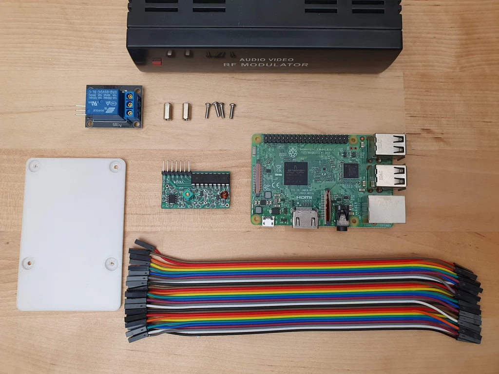


**_All the necessary files (3D print files and Code) can be found on the project repo at_** [_**this link.**_](https://code.gorkyver.com/Gorkem/haunted-tv)

**Tools:**

- 3D printer _(optional if you can use wood, acrylic, etc. to mount the Raspberry Pi)_
- Drill/Dremel
- Soldering Iron

**Parts:**

- [Raspberry Pi 3 or better](https://www.raspberrypi.org/products/raspberry-pi-3-model-b-plus/?resellerType=home)_(more processing power --> less lag)_
- [Raspberry Pi camera](https://www.raspberrypi.org/products/camera-module-v2/?resellerType=home)
- CRT TV
- AV to RF converter _(If the TV does not have composite input)_
- YK04 Remote control Module
- [KY-019 5V Relay Module](https://arduinomodules.info/ky-019-5v-relay-module/)
- 4 x m2.5 threaded spacer
- 4 x m2.5 nut & bolt
- 2 x 330 Ohm Resistors
- Composite video cable for Raspberry Pi

**3D Printed Parts:**

- Raspi Mount
- Camera mount

## Setting Up the Raspberry Pi


_Note: You can skip this step if you have already installed the Raspberry Pi OS_

**Installing** **Raspberry Pi OS**

_note: you'll need a keyboard, mouse, and monitor to set up your raspberry pi_

Before we get into the program, we first need to set up our Raspberry Pi.You can follow this official guide on how to install an operating system on your Pi:

[https://www.raspberrypi.org/documentation/installation/installing-images/README.md](https://www.raspberrypi.org/documentation/installation/installing-images/README.md)

Make sure you install ["Raspberry Pi OS (32-bit) with desktop and recommended software"](https://www.raspberrypi.org/downloads/raspberry-pi-os/), this version will have all the software we need to run our program.

After you've installed the operating system and started your raspberry pi, open up the terminal and type:

sudo raspi-config

This will open up the configuration menu, navigate to _Interfacing Options,_ and enable the _camera_ and _SSH_.

Enabling SSH will help us get into the Raspberry Pi remotely so we won't have to use a keyboard, mouse, and monitor every time.

Now our Raspberry Pi is ready for our code!, in the next step, we'll assembly the camera and electronics to our Raspberry pi and test it with the Code.

## Assembly - Electronics

<div class="imageSlides">
<section id="main-carousel" class="splide" aria-label="project images">
  <div class="splide__track">
    <ul class="splide__list">
      <li class="splide__slide">
        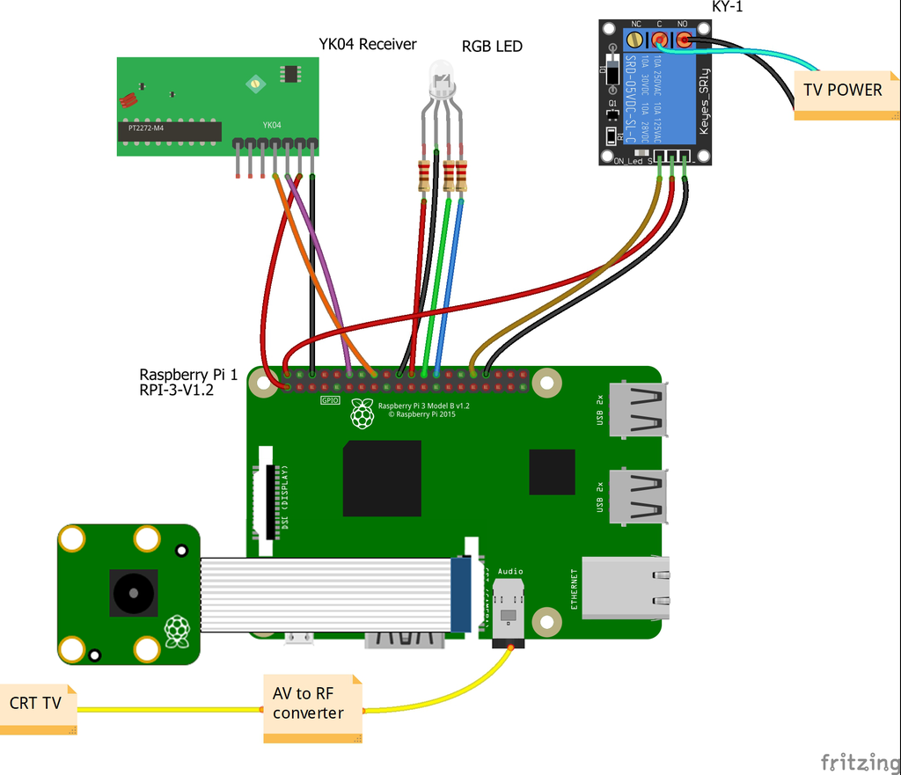
      </li>
      <li class="splide__slide">
        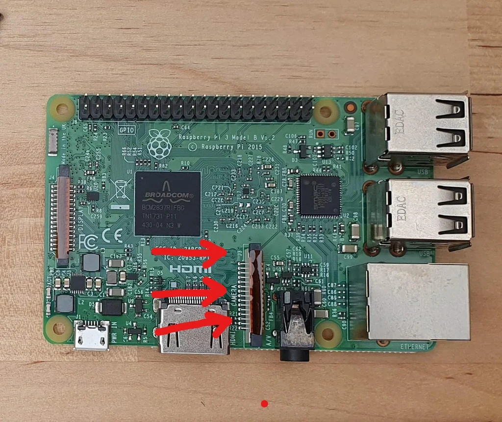
      </li>
      <li class="splide__slide">
        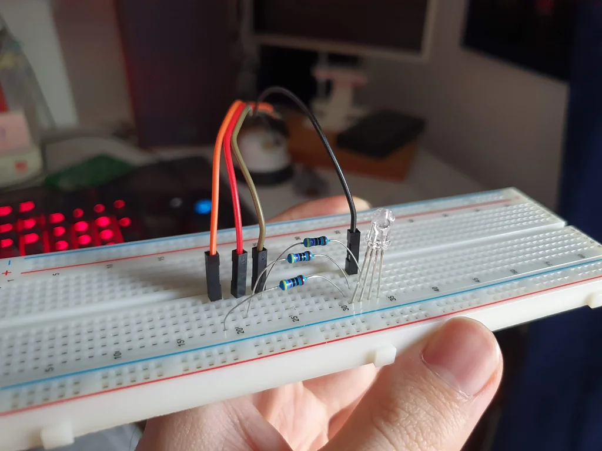
      </li>

    </ul>
  </div>
</section>
</div>
<ul id="thumbnails" class="thumbnails">
  <li class="thumbnail">
    
  </li>
  <li class="thumbnail">
    
  </li>
    <li class="thumbnail">
    
  </li>

</ul>

_note: At this stage, you don't have to use a soldering iron. I strongly recommend you to use jumper cables, so you can change any component if it isn't working properly._

**Raspberry Pi GPIO Pins**

_I've used the physical pin numbering as shown in the diagram below_


source: [https://www.raspberrypi.org/documentation/usage/gpio/](https://www.raspberrypi.org/documentation/usage/gpio/)

**The Camera**

The camera port is between the HDMI output and Audio jack, insert the camera cable in a way that the open contact points on the cable face the HDMI port.

Connect the Receiver, RGB and Relay with jumper cables to your Raspberry Pi as shown:

**YK04 Receiver**

| YK04 | Raspberry Pi 3 |
| --- | --- |
| GND | GND |
| POWER | 3.3V |
| D0 | 12 |
| D1 | 16 |

**RGB LED**

| LED | Raspberry Pi 3 |
| --- | --- |
| GND | GND |
| RED | 22 |
| GREEN | 24 |
| BLUE | 26 |

**Relay**

| Relay | Raspberry Pi 3 |
| --- | --- |
| GND | GND |
| POWER | 5V |
| Data | 32 |

## The Code


We'll be using OpenCV(Open Source Computer Vision Library) for face detection and background removal. Let's install this library on our Pi,

**Install OpenCV**

The OpenCV Python module can be downloaded from the Raspbian repository, to do this simply open up a Terminal and type;
```bash
sudo apt update
sudo apt install python3-opencv
```
this command will install all packages necessary to run OpenCV.

reboot your Pi after the installation with;
```bash
sudo reboot
```
**Haunted TV Code**

First, navigate to the Documents folder;
```bash
cd Documents
```
next, install the Haunted TV code from the Github Repository by:
```bash
git clone https://github.com/gocivici/haunted-tv.git
```
This command will install the most recent version of the code.

After navigating into the project folder;
```bash
cd haunted-tv
```
you should be able to run the program by:
```bash
python3 hauntedTV.py
```
Now to test and debug the code you can use the keyboard instead of the remote. Use 'h' to take a haunted picture and 'a' to start face detection.

_Note: If you get an error when you run the code, check the troubleshooting guide at the end._

**Autostart**

_for more info and troubleshooting check: [https://learn.sparkfun.com/tutorials/how-to-run-a-raspberry-pi-program-on-startup#method-2-autostart](https://learn.sparkfun.com/tutorials/how-to-run-a-raspberry-pi-program-on-startup#method-2-autostart)_

We want to run our script automatically when the Raspberry Pi boots up. To do that we will be using a method called [Autostart](https://learn.sparkfun.com/tutorials/how-to-run-a-raspberry-pi-program-on-startup#method-2-autostart). With this method, the graphical interface will initialize first and then run our script.

Open the Terminal and type:
```bash
mkdir /home/pi/.config/autostart
nano /home/pi/.config/autostart/hauntedTV.desktop
```
Now copy the contents below inside the file you've just created:
```bash
\[Desktop Entry\]
Type=Application
Name=HauntedTV
Exec=/usr/bin/python3 /home/pi/Documents/haunted-tv/hauntedTV.py
```
save, exit with ctrl + x and reboot:
```bash
sudo reboot
```
**Customization**

To edit the code while in the project directory type:
```bash
sudo nano hauntedTV.py
```
There are three timers that are important for the jumpscare effect to work, these are:
```python
timeTV = 5
timeGhost = 25
timeNoGhost = 10
```
These values are not in seconds. They are a value that is set by the _faceFreqCounter_. This counter starts when a face is detected, and continues to count if the face is still in the picture. If the face leaves the screen for more than 4 seconds the counter is set to 0. (This way false positives are filtered)

1. _**timeTV:**_ When the faceFreqCounter hits this value, the TV will turn on.
2. **timeGhost:** When the faceFreqCounter hits this value, the ghost will be displayed after the face looks away. You can set this to a larger value if you want your guests to inspect the TV a little more before the ghost is displayed.
3. **_timeNoGhost:_** This value determines when to disable the visibility of the ghost after the face sees the ghost and looks away.

You should also customize the background sensitivity in the code.
```python
backgroundSensitivity = 20
```
This value determines the sensitivity of the background subtraction. You should increase this value If the haunted picture is not visible in the background.

You're done! Now it's time to test the setup with your TV.

## Face/Eye Detection & Background Removal (Optional)

In this step, I will get into detail on how I used OpenCV to detect faces and remove the background. You can skip this step if you just want to download and run the code.

**Face/Eye detection with OpenCV**

There are many methods to detect a face, the method I used is called [object detection with Haar Cascades.](https://pythonprogramming.net/haar-cascade-face-eye-detection-python-opencv-tutorial/) Haar Cascade is a machine learning object detection algorithm that can detect objects in an image based on the concept of features. _([Click here](http://www.willberger.org/cascade-haar-explained/) to learn how it works)_

This method can be used to detect any object not just faces. In order to detect a face, first, we need cascade files. You can use any search engine to find various cascades of things you want to detect.

In this project, we'll use Face Cascade and Eye Cascade, you can find them [here](https://github.com/opencv/opencv/blob/master/data/haarcascades/haarcascade_frontalface_default.xml) and [here.](https://github.com/opencv/opencv/blob/master/data/haarcascades/haarcascade_eye.xml)

After downloading the cascades as .xml files we import them to our code:
```python
import numpy as np
import cv2

#importing the cascades
detected = cv2.CascadeClassifier('haarcascade\_frontalface\_default.xml')
#detected = cv2.CascadeClassifier('haarcascade\_eye.xml')
```
I'm just importing the face cascade for now, as I mentioned in the last step you can customize the code to detect faces, eyes or both.

Next, we start the camera and initialize a while loop so the code checks if a face is detected:
```python
cam = cv2.VideoCapture(0)
while True:
    ret, img = cam.read()
    gray = cv2.cvtColor(img, cv2.COLOR\_BGR2GRAY)
    faces = detected.detectMultiScale(gray, 1.3, 5)<br>
```
The cascade classifier, "detectMultiScale" simply detects the faces. Now we create a loop to draw a rectangle around the detected faces.
```python
for (x,y,w,h) in detected:
    cv2.rectangle(img,(x,y),(x+w,y+h),(255,0,0),2)
    #put code here to run when a face is detected
```
finally we display the final image in a window:
```python
cv2.imshow('img',img)
```
here's the full code for face detection:
```python
import numpy as np
import cv2

#importing the cascades
detected = cv2.CascadeClassifier('haarcascade\_frontalface\_default.xml')
#detected = cv2.CascadeClassifier('haarcascade\_eye.xml')
cam = cv2.VideoCapture(0)
while True:
    ret, img = cam.read()
    gray = cv2.cvtColor(img, cv2.COLOR\_BGR2GRAY)
    faces = detected.detectMultiScale(gray, 1.3, 5)
    for (x,y,w,h) in detected:
        cv2.rectangle(img,(x,y),(x+w,y+h),(255,0,0),2)
        #put code here to run when a face is detected
    cv2.imshow('img',img)
cam.release()
cv2.destroyAllWindows()
```
save this file as FaceDetection.py and run it, you should be able to see a blue rectangle around your face.

**Background Removal with OpenCV**

I wanted to use a background removal algorithm to remove and replace the background with a haunted picture attached to the background. With this method, I was able to put the ghost behind the person. This was an important feature since I wanted to create the effect that there was a ghost behind the person. While searching the web on how to do this I found a very good tutorial:

https://www.youtube.com/watch?v=tKA_Ht4P1Gw

In this tutorial, Misbah shows us how to replace the background with a video. however, to use this with our code we need to edit this for our needs. We want to display a picture instead of a video in the background when triggered.

There are also other background subtraction methods that you can use. I will link all the sources at the bottom of this step.

_**References:**_

_[https://pythonprogramming.net/haar-cascade-face-eye-detection-python-opencv-tutorial/](https://pythonprogramming.net/haar-cascade-face-eye-detection-python-opencv-tutorial/)  
_

_[https://docs.opencv.org/3.4/d1/dc5/tutorial\_background\_subtraction.html](https://docs.opencv.org/3.4/d1/dc5/tutorial_background_subtraction.html)_

_[https://github.com/misbah4064/backgroundRemoval](https://github.com/misbah4064/backgroundRemoval)_

## First Prototype & Test

<video controls autoplay loop muted playsinline
 src="img/proto.mp4" style="width:100%"></video>


For the first prototype, I built an adjustable stand for the camera and put it on the TV with the Raspberry Pi. At this stage, the main objective is to test the setup and TV to check if they're working properly.

- Connect your Raspberry Pi to the TV with the composite cable (If your TV doesn't have a composite input use the AV-RF converter)
- Connect the Raspberry Pi to power and wait for it to boot up.
- Check if there is a problem with the video feed

## Design & 3D Print

<div class="imageSlides">
<section id="main-carousel" class="splide" aria-label="project images">
  <div class="splide__track">
    <ul class="splide__list">
      <li class="splide__slide">
        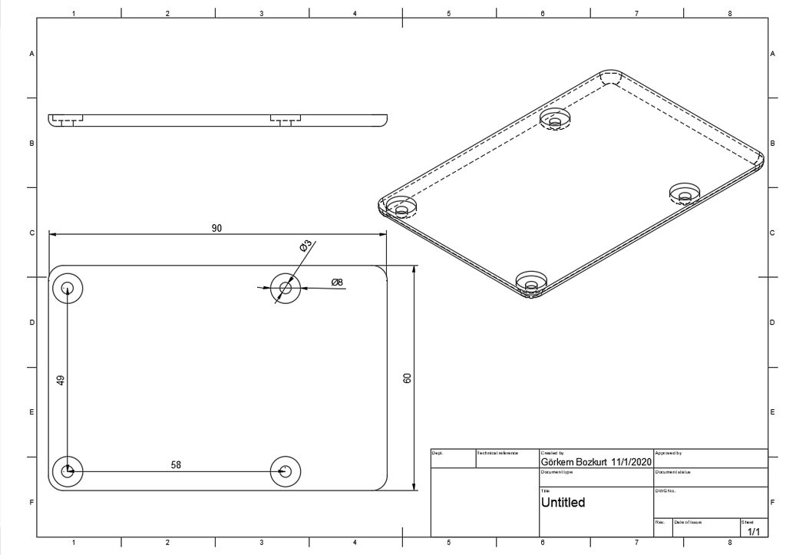
      </li>
      <li class="splide__slide">
        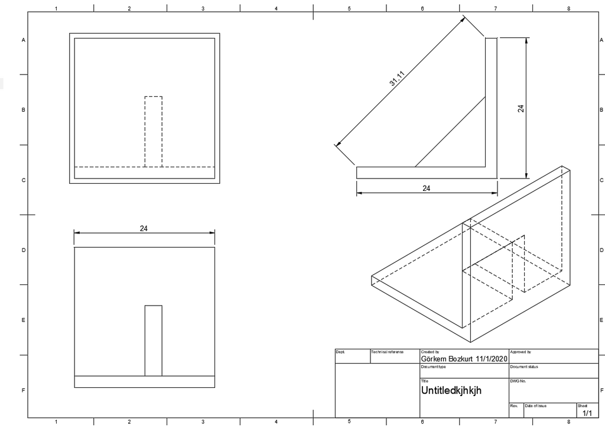
      </li>


    </ul>
  </div>
</section>
</div>
<ul id="thumbnails" class="thumbnails">
  <li class="thumbnail">
    
  </li>
  <li class="thumbnail">
    
  </li>


</ul>

There are two 3d printed parts for this build, one is the Raspberry Pi mount that will be glued inside the TV. The other part is the camera mount, which will help us mount the camera.

_Note: You can edit/customize these parts in fusion360 they are attached to this step_

The printer I used is the TEVO Tornado with the following settings:

- Nozzle: 0.4mm
- infill: %30
- Filament: PLA

## Soldering

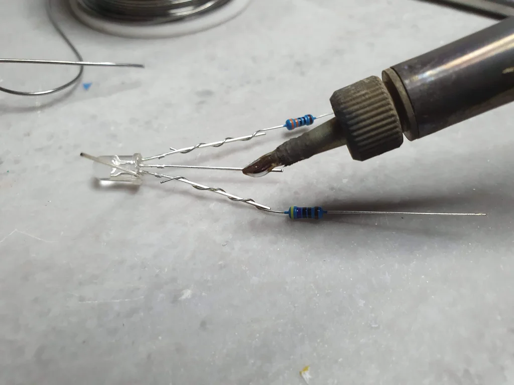

There are two parts to solder. The LED and the antenna for the Receiver.

## Disassemble & Clean the TV

**Safety First!**

Even though we will be only disassembling a small part of the TV, it can be very dangerous if you don't practice safety procedures. High voltage may remain stored inside the tube even after being unplugged.

I highly recommend you to read MrJentis's instructable on this topic:

[https://www.instructables.com/How-to-dismantle-a-CRT-monitor/](https://www.instructables.com/How-to-dismantle-a-CRT-monitor/)

## Assembly
### Raspberry Pi

<div class="imageSlides">
<section id="main-carousel" class="splide" aria-label="project images">
  <div class="splide__track">
    <ul class="splide__list">
      <li class="splide__slide">
        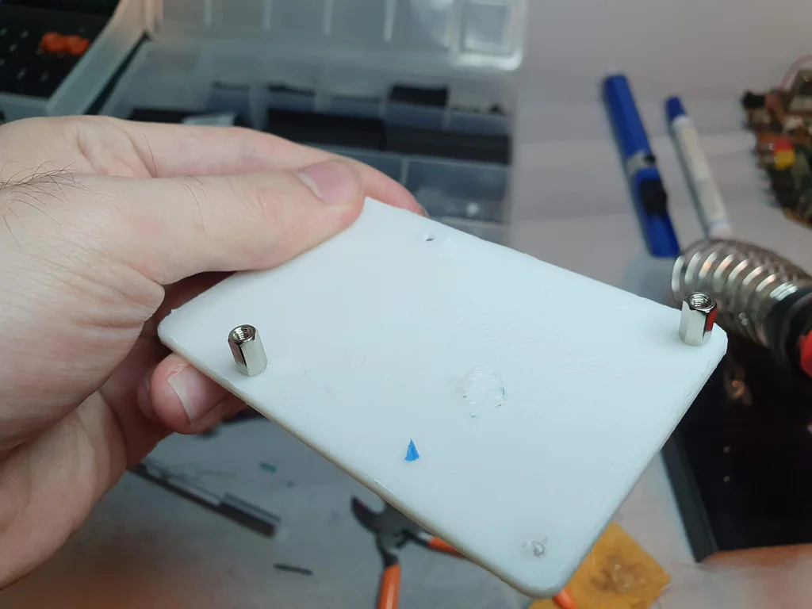
      </li>
      <li class="splide__slide">
        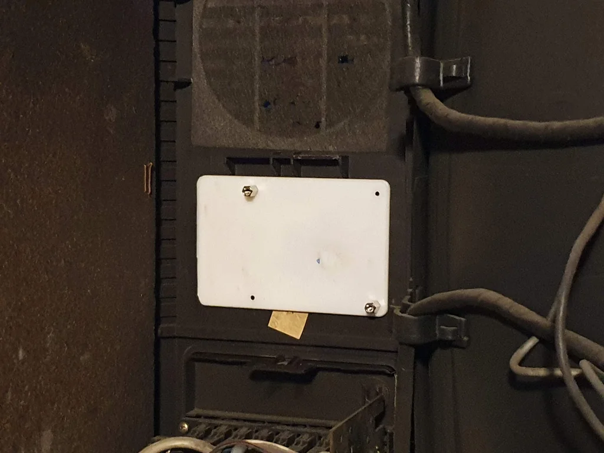
      </li>
      <li class="splide__slide">
        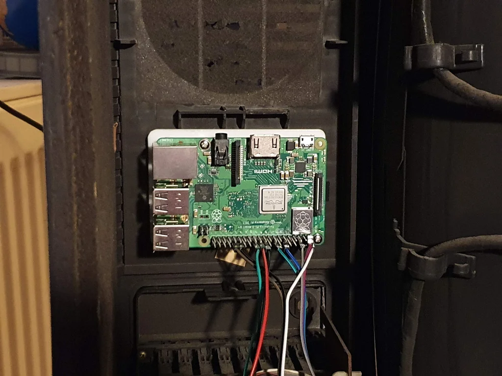
      </li>

    </ul>
  </div>
</section>
</div>
<ul id="thumbnails" class="thumbnails">
  <li class="thumbnail">
    
  </li>
  <li class="thumbnail">
    
  </li>
    <li class="thumbnail">
    
  </li>

</ul>

### Camera

<div class="imageSlides">
<section id="main-carousel" class="splide" aria-label="project images">
  <div class="splide__track">
    <ul class="splide__list">
      <li class="splide__slide">
        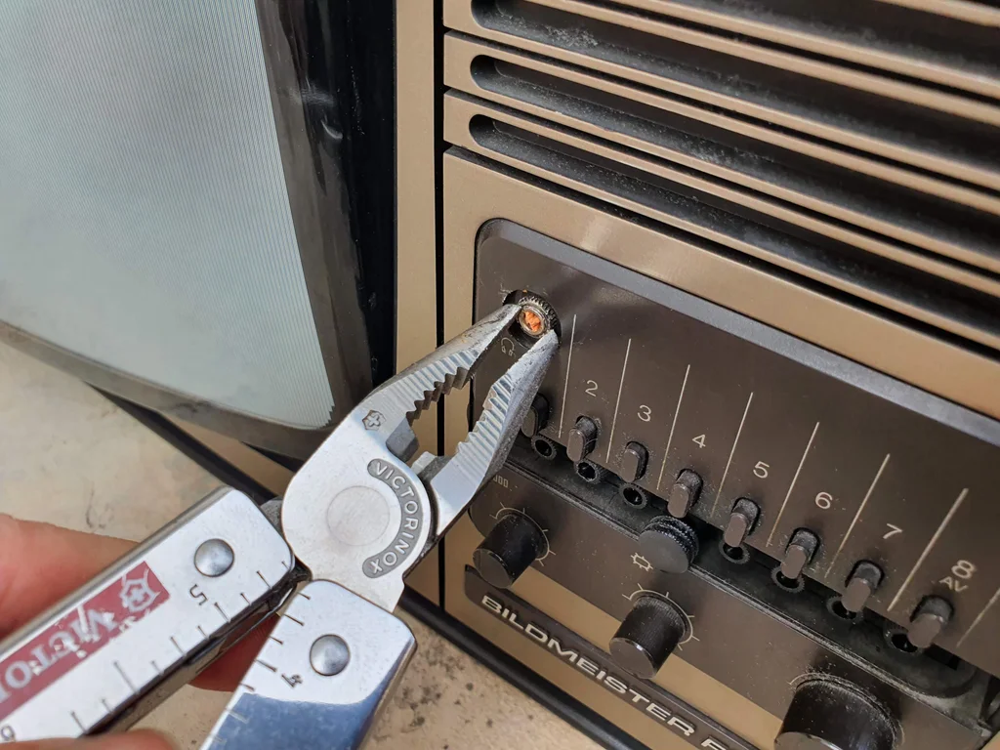
      </li>
      <li class="splide__slide">
        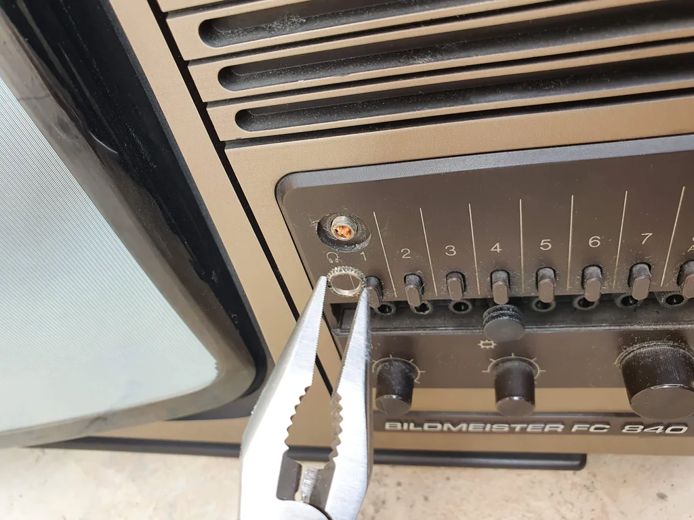
      </li>
      <li class="splide__slide">
        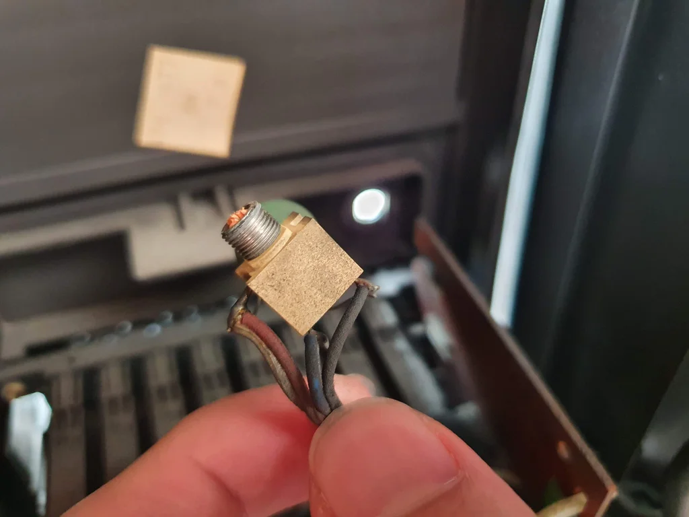
      </li>
            <li class="splide__slide">
        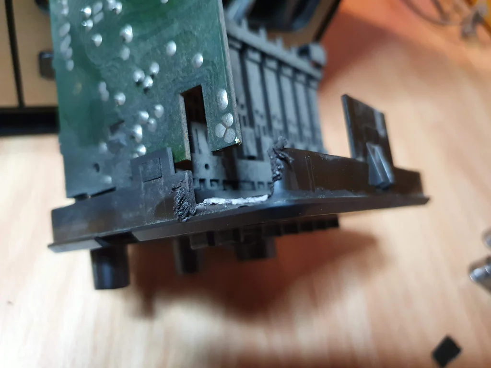
      </li>
            <li class="splide__slide">
        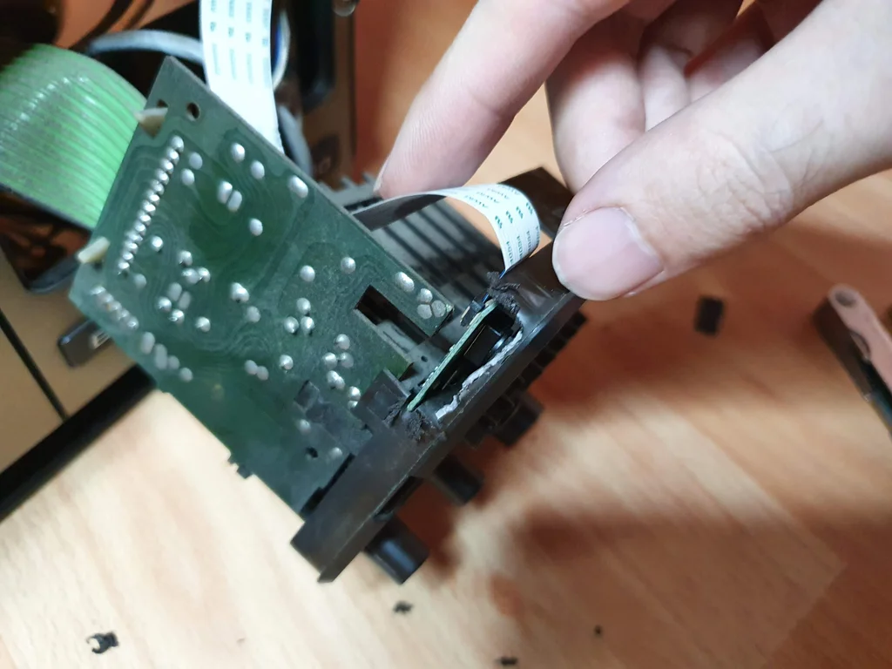
      </li>

    </ul>
  </div>
</section>
</div>
<ul id="thumbnails" class="thumbnails">
  <li class="thumbnail">
    
  </li>
  <li class="thumbnail">
    
  </li>
    <li class="thumbnail">
    
  </li>
      <li class="thumbnail">
    
  </li>
      <li class="thumbnail">
    
  </li>

</ul>


- I removed the headphone output jack on the TV and mounted the camera there.

## Final Assembly & Test

https://www.youtube.com/watch?v=x6hZMVFb5B4

Now with your Raspberry Pi mounted to the TV, power up the setup. The Raspberry Pi should boot and run the Python script at startup, after a few seconds the TV should turn on, and you should be able to see yourself on the TV.

Next, find a spooky costume, get in front of the TV with your Remote and take the Haunted Picture by pressing B on the Remote. Now the script is ready to run. Press the D button on the remote, the TV should turn off and start detecting faces.

Test the setup by getting in front of the TV and look away after a few seconds. This should trigger the setup and now you should be able to see the Haunted Image in the background, if not, go to the Troubleshooting guide at step 13.

## Troubleshooting

**+The Haunted picture is not visible.**

\-light is very important for background removal. Make sure the TV is in a well-lit area. Also move the light source behind the TV.

**+I'm not sure if face detection is working or not.**

\-Go to step 6 and run the face detection code alone. You should be able to see a rectangle around your face.

**+The CRT TV isn't displaying the picture.**

\-[Go into the config.txt file](https://www.raspberrypi.org/documentation/configuration/config-txt/) in your raspberry pi, and make sure that the TV region is the same as your TV.

_Leave a comment If you're having other problems. I'll collect them and try to answer them here._

**+There's a lot of lag/latency on the live feed.**

\- I've used a Raspberry Pi 3 for this project. Any Raspberry pi with a lower processing power could cause latency and lag. But there are some [optimizations you can do](https://www.pyimagesearch.com/2015/12/28/increasing-raspberry-pi-fps-with-python-and-opencv/) to prevent that.

## What's Next

In this step, I will list some ideas that I had. But did not find the time/resources to add them:

- A Bluetooth speaker to make a noise when the ghost appears behind.
- An Infrared Camera and LEDs could make this work in the dark. Which creates a scarier vibe.
- A special stand for the TV with spooky decorations.
- A more powerful computer, like the Nvidia Jetson which is built for visual tasks. This would reduce the latency.

Feel free to add more ideas or ways to improve this project in the comments!