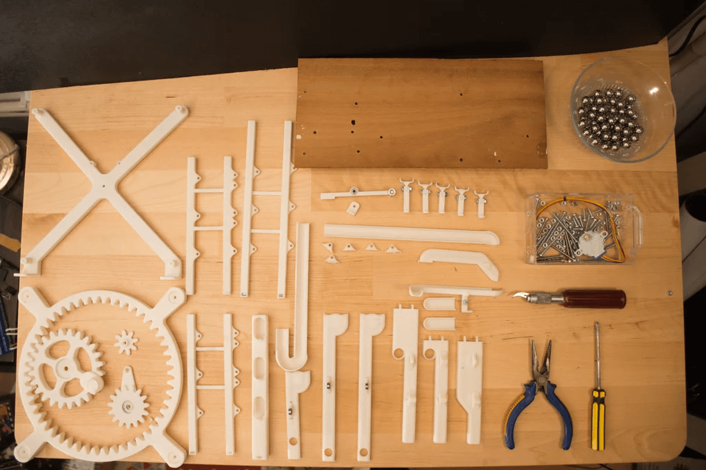
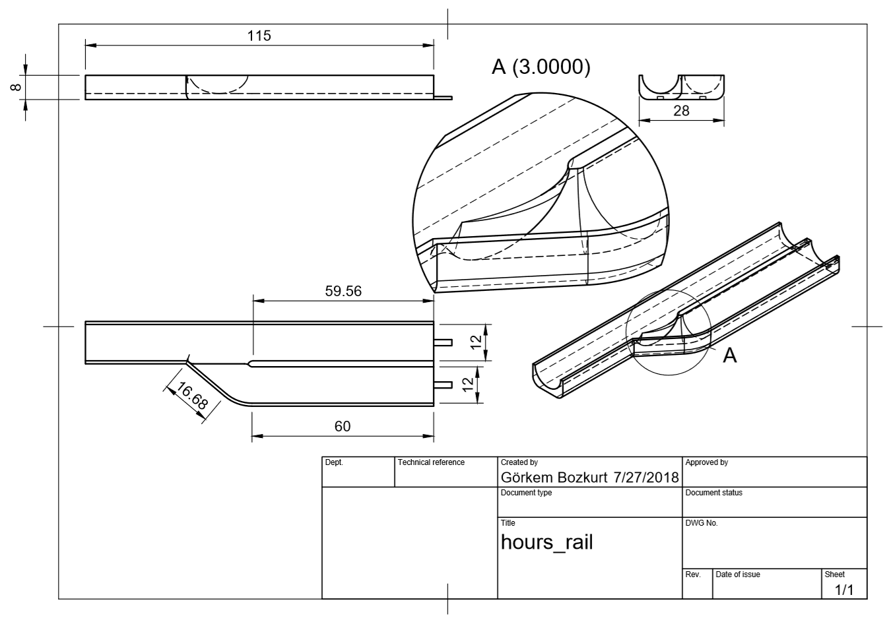
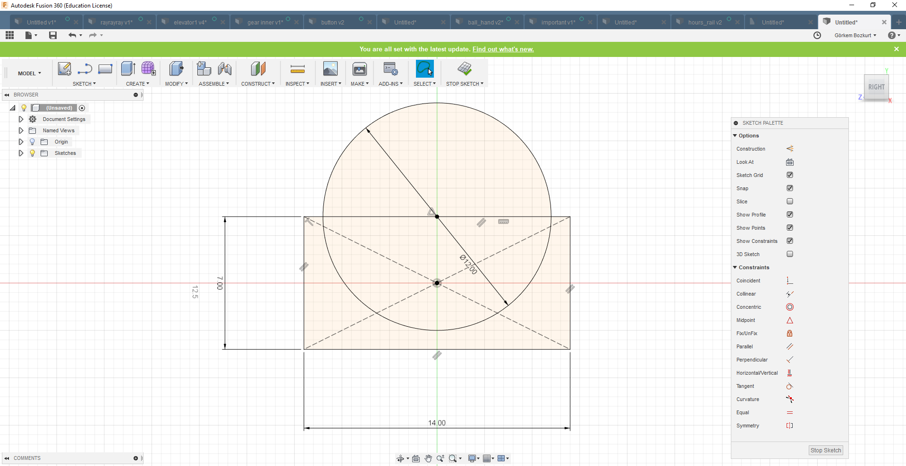
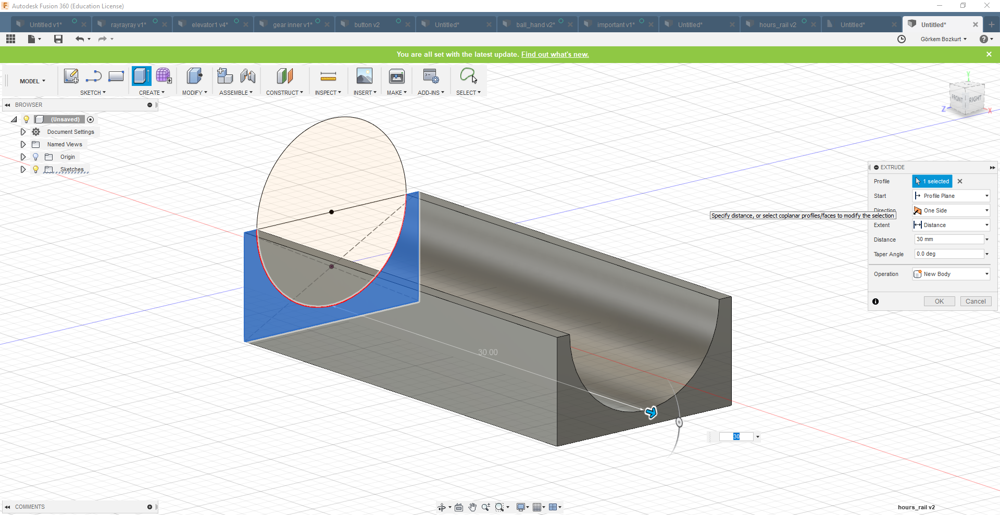
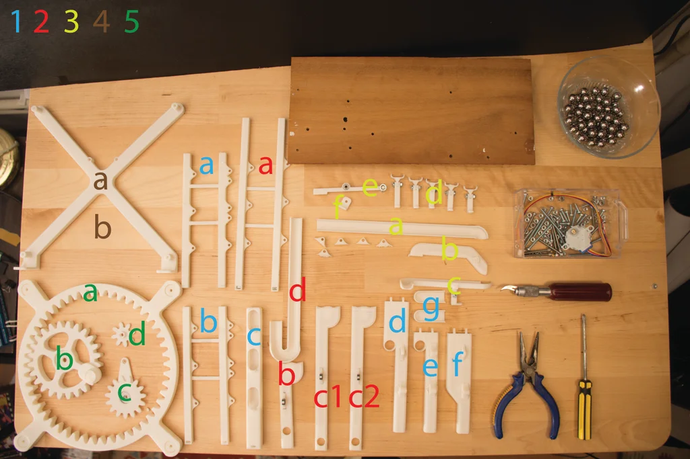

https://vimeo.com/281662044

⚠️WARNING
This project is archived and no longer maintained.  {.warning}

Marble Clock is a 3D printed rolling ball clock that tells the time by the location of marbles/balls. It consists of 3 main rails, where,

- The 5-minute rail with 1-minute intervals
- The 60-minute rail with 5-minute intervals
- The 12-hour rail with 1-hour intervals
- test

add up and tell the time.

In the first step, I will give you a little bit of history of rolling ball clocks and ball clocks in general. Next, I will explain the Idea behind this project. Then I will give you an insight into the design process of this clock, so you'll be able to design your own clock. I'll give you a 3d print guide so you can easily print the required pieces and arrange them. After giving you a step by step assembly guide and show you how to sync your clock, I'll end this guide with a troubleshooting section. So, if you encounter any problems during your build you can solve them easily.

The purpose of this guide is not just to give you a cookbook. I'll show you the way I built this project and provide you with open-ended questions, so you can add your own ideas, and take this project even further. Many parts I've designed are not connected. This way you can change the design to your own liking and then glue them together.

I strongly encourage you to share your build when it's done!

Let's get started.

## Step 1: A Short History of Marble Clocks
https://www.youtube.com/watch?v=Md9WtLwaODU

This project is based on the design called "rolling ball clock" that was invented by Harley Mayenschein in the 1970s. He patented his invention and started a company which began to manufacture these clocks from solid hardwoods in the 1980s.[1]

The original rolling ball clock had 3 main rails, 2 for minutes and 1 for the hour. by adding the two rails one can get the total minute. This way the time was shown.[1]

There were many varieties of these clocks ... for example the kineticlock (more info: kineticlock.ca)which had 10 minutes intervals instead of 4, or the Chronomeans Clock which was built with anodized aluminium.

Other rolling ball clock varieties:

Pendulum rolling ball clock
Wall mounted ball clock
Celebration rolling ball clock
About time ball clock
Source:

[1] https://en.wikipedia.org/wiki/Rolling_ball_clock

Further Reading:

http://www.chilton.com/~jimw/ballclks.html

## Step 2: The Idea

I've been a long time fan of ball clocks. I've seen one when I was a kid in a novelty store. And I just stood there watching it endlessly. The movement of the balls with time was magic to me. After I heard about the clock contest on Instructables. It gave me the Idea to try to design and build a ball clock from scratch. So I started to sketch on paper.

What I wanted to do was to design a different lifting mechanism instead of the traditional rotating scoop type design. So then it hit me. I was going to use a rotary to linear motion mechanism so while the mechanism was rotated by a motor the ball would be moving in a line, up and down. Creating a little illusion.

The rails were mostly inspired from other ball clocks but I had an idea to create a bell mechanism so everytime one hour passes there would be a sound. Unfortunately, I could not build this into the project.

[!NOTE]Highlights information that users should take into account, even when skimming.

## Step 3: Tools & Parts

Note: these are the Tools&Parts I had available. You can use any other part for your needs.

### Tools:

 3D printer - min 25*25*15cm area
 exacto knife (to cut sharp edges)
drill/dremel with 3mm tip
 Tack-it (or any other reusable & removable adhesive)

### Parts:

9 x 40mm M3 bolts and nuts
7 x 30mm M3 bolts and nuts
2 x 20mm M3 bolts and nuts
4 x 15mm M3 bolts and nuts
8 x 10mm M3 bolts and nuts
16 x 6mm M3 bolts and nuts
 7 x (3mm*6mm*2.5mm) ball bearing
 1 x (F6-14M 6mm x 14mm x 5mm) Thrust Bearing
 1 x 28byj-48 stepper
1 x Arduino uno (or any other microcontroller to drive the stepper motor)
100 x 11mm Steel Ball (you only need 30 but they get lost quite easy)
290x130x3mm wood plate
3D Printed Parts :

all parts are on step 5 I recommend you to read read step5 before printing them.

## Step 4: Design Process

<section id="main-carousel" class="splide" aria-label="My Awesome Gallery">
  

    <ul class="splide__list">
      <li class="splide__slide">
        
      </li>
      <li class="splide__slide">
        
      </li>
      <li class="splide__slide">
        
      </li>
      <li class="splide__slide">
        
      </li>
    </ul>
  

</section>

<ul id="thumbnails" class="thumbnails">
  <li class="thumbnail">
    
  </li>
  <li class="thumbnail">
    
  </li>
  <li class="thumbnail">
    
  </li>
  <li class="thumbnail">
    
  </li>
</ul>

You can skip this step if you just want to print the project. This step is for people who want to design their own ball clocks or want to add new features to this project. It gives an insight on how the ball rails were designed in Fusion 360.

If you are new to the Fusion 360 environment I suggest you take a look at a few tutorials.
You can enroll in this class: https://www.instructables.com/class/3D-Design-Clas...

also, this youtube series gives a good beginner tutorial: https://www.youtube.com/watch?v=A5bc9c3S12g

I suggest you to read this step after you've seen the tutorials.

Details on the design process are noted on the images.

### Base Structure & Rails

The base structure is basically 6 rails holding 4 rods. The rods(8mmx8mm) were designed to be sturdy. They are held by bolts to a wood plate. The rails were inspired by the original rolling ball clock. But the dimensions are different due to different ball sizes and weight distribution.

### Elevator

The elevator design was inspired by this mechanism. User mgg942 used this design and created a rotary to linear drive on Thingiverse . I tweaked and re-designed this to create an elevator mechanism.

## Step 5: 3D Print

There are two seperate .zip files you can download.

The 3d parts.zip folder contains all the parts for the clock separately.

The 3d_parts_sets.zip contains 5 sets. each set is designed for a 25x25cm print area.

If you have a large print area you can print these like I arranged them in sets. Or you can print them separately.

I suggest you to finish printing before the assembly of any pieces. It's much easier if you lay them on a table in an arrangement. Like a LEGO set.

Each part is given a number and a letter. these will be useful while following the building instructions next step.

## Step 6: Base Assembly

you can use the pdf template to drill holes on the wood.

Parts used in this step:

[3d printed] 1a-3f (28 parts)
5 x 40mm M3 bolts & nuts
6 x 30mm M3 bolts & nuts
3 x 15mm M3 bolts & nuts
6 x 10mm M3 bolts & nuts
10 x 6mm M3 bolts & nuts
4 x (3mm*6mm*2.5mm) ball bearing

Tools used:

Tack-it
philips head screwdriver
pliers
Estimated Time:

15-20 minutes
Note: Assembly instructions are noted on the images.

## Step 7: Center of Gravity
This is the most important part of this project. I did not design the rail pieces connected to the joints. This way everyone can adjust them to their needs. The rails and the connectors under them are not attached. You have to figure out the center of gravity and glue it when you are certain. Let's begin,

### The 5min rail:

Slowly put 4 balls on the minute rail. And position the connector piece accordingly so it doesn't tip over. It should tip over when the 5th ball comes. This takes a bit of time to adjust. When you're satisfied go to the 15min rail.

### The 15min rail:

Slowly put 11 balls on the rail. again it shouldn't tip over while 11 balls are on it. When the 12th ball arrives it should tip over.

### The Hour rail:

This is the same as the 15min rail. wherever you glued the connector on the 15min rail you can glue it on the same place on the hour rail.

Lastly, to test them all at once put 11 balls on the hour and 15min rails and 4 balls on the 5 min rail. then drop one ball to the 5 min rail. They all should go smoothly and leave the rails

## Step 8: Elevator Assembly

Parts used in this step:

[3d printed] 4a-5d (9 parts)
1 x 25byj-48 Stepper
4 x (3mm*6mm*2.5mm) ball bearing
1 x (F6-14M 6mm x 14mm x 5mm) Thrust Bearing
2 x 10mm M3 Bolts & Nuts
2 x 25mm M3 Bolts & Nuts
2 x 6mm M3 Bolts & Nuts
4 x 40mm M3 Bolts & Nuts
Tools used:

Tack-it
philips head screwdriver
pliers
Estimated Time:

5-10 minutes

Note: Assembly instructions are noted on the images.

## Step 9: Driving the Motor & Timing

### How to drive the motor

To drive the 28byj-48 stepper motor with a constant speed I've used an Arduino Uno with the AccelStepper library. you can download the library here . If you don't have experience with Arduino or don't know how to install libraries you can check this site.

Connect the pins on the stepper motor to the Arduino like this:

Stepper---Arduino

IN1 ----> 2
IN2 ----> 3
IN3 ----> 4
IN4 ----> 5
After uploading the code you are good to go!

### Timing

The most important thing about a clock is precision. We want this clock to be as precise as any other wall clock/ watch so it works without any error. To do this we have to change the speed of the motor so the elevator completes 1 revolution in 60 seconds precisely.

Now get a stopwatch in your hand and run the motor. Start the stopwatch when the elevator gear crosses a specified point. And stop your watch when it crosses the point again. Take a note at the time. now let's calculate the required speed

T = time on your stopwatch

t = 60s (time you want it to complete 1 revolution)

M = old motor speed("stepper.setSpeed()" in code)

m = new motor speed("stepper.setSpeed()" in code)

new motor speed(m) =(T*M) / t

Insert this into the code and check your stopwatch again, repeat this until you are satisfied with the result

## First Test
You're done with the build now it's time to test this clock!

Check your watch and put the balls according to the time. And start the motor when you are ready. It's really fun to watch time go by with this clock. Go and put yourself some tea and enjoy the sound off balls clicking. Now while doing that you should check a few things to be sure that this clock can run for 7/24 straight.

### Things to look for:

Can the elevator bring a ball without dropping it each minute?
Are balls not getting stuck on the rails after 2-3 hours?
Is the clock on time after several hours?
If your answer is no for at least one of those questions, you can check the Troubleshooting step!

If your answer is yes, then congratulations you've built a precise ball clock!

## Troubleshooting