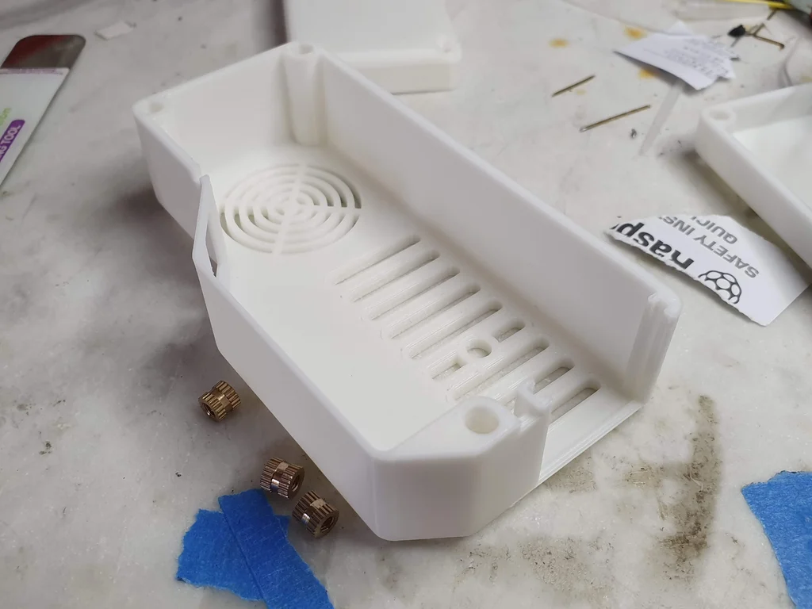
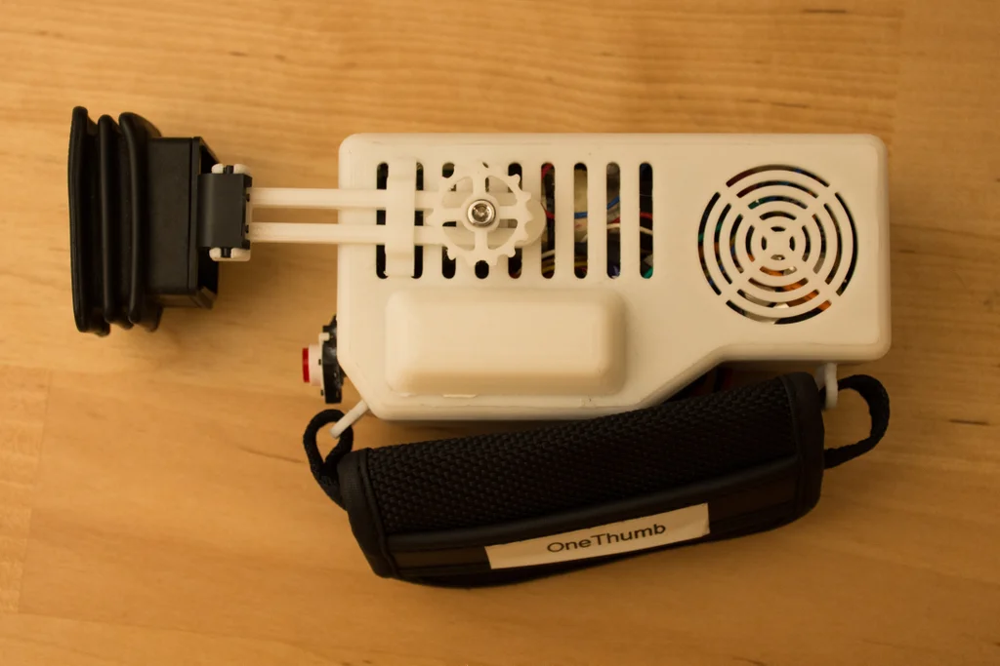

## Introducion {.invisible}

https://www.youtube.com/watch?v=nJMUtHf6_T0

**Featured on**
 [Raspberry Pi Blog | Portable retro CRT game console: the one-thumb entertainment system](https://www.raspberrypi.com/news/portable-retro-ctr-game-console-the-one-thumb-entertainment-system/){target="_blank"}
 [Hackaday.com | Thumbs Up For This CRT Handheld Gaming Console](https://hackaday.com/2019/05/06/thumbs-up-for-this-crt-handheld-gaming-console/){target="_blank"}
 [Hackster.io | One-Thumb Entertainment System](https://www.hackster.io/news/one-thumb-entertainment-system-d467f2b03967){target="_blank"} {.press}

📝**NOTE**
This project is archived and no longer maintained. While the core concepts may still be applicable, the instructions and code provided may not work with the latest versions of hardware, software, or libraries. It was originally published on instructables, you can view the comments to the original article on this archived link: [https://archive.ph/6qFYL](https://archive.ph/6qFYL){target="_blank"}  
{.note}

OTES (One-Thumb Entertainment System) is a Raspberry Pi powered, retro-inspired portable CRT Game Console which has only one button. It's running PICO-8, a fantasy console. And It's based on a stand-alone cartridge firmware meaning that it will boot directly to the game on the SD card like a GameBoy. So SD cards can be used as cartridges.

Currently, It has one game called ODEF(Ocean Defender) [developed by me and my friends](https://www.lexaloffle.com/bbs/?tid=33071).(You can play it [here](https://www.lexaloffle.com/bbs/?tid=33071)) And I hope there will be many others as people develop games that can be played with only one button on this platform.

**Outline**

In the first step, I'll talk about the Idea&Inpiration behind this project, later I'll give you a list of the things you'll need to build this on your own. Then I will talk about Fantasy Consoles, After giving you a step by step assembly guide I will end this Instructable with a troubleshooting guide.

## Step 1: The Idea


My gaming journey began with the GameBoy Advance SP. And with time other versions joined my collection. It has been 13 years since I got my first GameBoy and I still enjoy playing it to this day. I think the main reason for that is the aesthetics created by the limitations of the hardware.

While I was searching for a GB emulator on the internet I came across **PICO-8**. which is an emulator for a console that does not exist, called Fantasy Console. So what is a Fantasy Console?

It's basically a virtual console with a development environment. The console is designed to be limiting like 8bit retro computers. In case of PICO-8, the display is limited by 128x128 pixels, disk size by 32k etc.(_more details on step 3._) Developers building games using this platform can share/play their games and many others on the internet. You can explore some [here](https://www.lexaloffle.com/bbs/?cat=7&carts_tab=1&#sub=2&mode=carts).

While I was trying to learn game development in this environment I came up with the Idea to build fantasy hardware for this fantasy console. Also adding some limitations to the hardware. like a 'one button' input.

## Step 2: Tools & Parts


**Tools:**

- 3D printer (optional)
- Soldering Iron
- Jumper cables

**Parts:**

- CRT viewfinder (_details on next step_)
- Raspberry Pi Zero
- Arduino Micro
- 9V Battery
- DC-DC 5V step-down voltage regulator
- Pushbutton
- On-Off Switch
- 3 x (20mm M3 bolt & nut)
- 4 x (8mm M3 bolt & nut)
- 3 x (5x5mm M3 heat insert)
- 1 x (3x5mm M3 heat insert)

**3D Printed Parts :**

- Base
- Lid
- Hand Piece
- Knob
- Rail
- Rail Holder

_Note: All part files are on step 8._

## Step 3: Fantasy Console


In this step I will get into some detail on the Fantasy Console we will be using called PICO-8. And how to set up your raspberry pi Zero.

### PICO-8

The pico-8 environment has everything in it to develop a game from scratch:

- A lua code editor.
- Sprite and tile creation tools.
- Map editor.
- Sound effect and music editor.

You can get PICO-8 [here](https://www.lexaloffle.com/pico-8.php).

Here is a video by Dylan Bennett that shows how easy it is to create games using PICO-8:

If you want to develop your own games, here are some tutorials to get you started with game development using PICO-8:

[PICO-8 Game Dev. for Beginners Series - by bridgs](https://www.youtube.com/watch?v=NOcZonu65hE)

[PICO-8 Fanzine #1](https://sectordub.itch.io/pico-8-fanzine-1)

### Setting up your ZERO

We will be using [PICOPi](https://guillermoamaral.com/read/picopi/) which is a stand-alone, corruption resistant cartridge firmware which uses an sd card to act as a cartridge (like a Gameboy). The Raspberry Zero will directly boot into the game on the SD card, so you can create different cartridges for different games.

You can follow this guide to create your SD card:

## Step 4: CRT Viewfinder ​Disassembly

<div class="imageSlides">
<section id="main-carousel" class="splide" aria-label="project images">
  <div class="splide__track">
    <ul class="splide__list">
      <li class="splide__slide">
        
      </li>
      <li class="splide__slide">
        
      </li>

    </ul>
  </div>
</section>
</div>
<ul id="thumbnails" class="thumbnails">
  <li class="thumbnail">
    
  </li>
  <li class="thumbnail">
    
  </li>

</ul>

The most important thing first. You have to find an old camcorder which has a CRT viewfinder. It's usually easy to tell if a camcorder has a CRT viewfinder since it's a bulky part sticking off the side of the camcorder. I found this viewfinder on an old JVC camcorder which I bought from the flea market. To test the viewfinder I used a 9v battery to power up the camcorder. There was no image on the viewfinder but I got a static white noise which is enough to tell if the viewfinder works. Now It's time to disassemble it and find the composite cable.

### Finding the Cables

**Power**

First you need to find the (+9V) and GND cables. It's usually obvious, red being (+) and black being GND. If not, try to use a multimeter to measure the outputs while the camcorder is connected to power.

**Composite**

The second cable you need to find is the composite video input. Which you'll use to get the video signal from your Raspberry Pi to the CRT. Usually, it is the yellow colored cable but if you are not sure, try to connect the cable to your raspberry pi.

Now mark the cables and you are done!

## Step 5: Assembly - Electronics


_For the first protoype you don't have to use a soldering Iron. I strongly recommend you to use jumper cables, so you can change any component if it isn't working properly._

### Raspberry Pi Zero

The raspberry pi zero runs pico 8 firmware and displays it on the CRT via the Composite output on it. two cables from the CRT(composite(+) and GND) are connected to the raspberry pi.

### Arduino Micro

The arduino micro acts like a keyboard to the raspberry pi. when the button is pressed it passes the signal as the "z" key on the keyboard. To do that first you have to upload this basic sketch to the arduino micro:
```Arduino
#include <keyboard.h><br>int buttonPin = 9;  // Set a button to any pin </keyboard.h>void setup()
{
  pinMode(buttonPin, INPUT\_PULLUP);  // Set the button as an input
  Keyboard.begin();
} void loop()

{

if (digitalRead(buttonPin) == 0)  // if the button goes low

 {

Keyboard.press('z');  // send a 'z' to the computer via Keyboard HID     // delay so there aren't a kajillion z's
}else{

 Keyboard.releaseAll(); 
  }
  delay(50);
}
```
### Voltage Regulator

The Raspberry Pi does not have a voltage regulator on it. Thus the 9V from the battery can fry the board. This is why you have to use a voltage regulator to output the voltage to 5v which is the raspberry pi input voltage.
    

## Step 6: First Prototype & Test

<div class="imageSlides">
<section id="main-carousel" class="splide" aria-label="project images">
  <div class="splide__track">
    <ul class="splide__list">
      <li class="splide__slide">
        
      </li>
      <li class="splide__slide">
        
      </li>
      <li class="splide__slide">
        
      </li>

    </ul>
  </div>
</section>
</div>
<ul id="thumbnails" class="thumbnails">
  <li class="thumbnail">
    
  </li>
  <li class="thumbnail">
    
  </li>
    <li class="thumbnail">
    
  </li>

</ul>

Plug in the SD card you've prepared to your Raspberry Pi and power it up! You should see the booting screen of PICO-8.

If you don't have a 3D printer you can use the CRT Viewfinder case with rubberbands to hold the Raspberry Pi ZERO on it. Before I've built the 3D enclosure I used it as seen on the picture.

_If you are having problems go to the troubleshooting section at the end of this project._

## Step 7: 3D Print


I recommend you to print all pieces before assembly. It will be much easier to assemble with every piece on your reach.

The printer I used is the TEVO Tornado with the following settings:

- Nozzle: 0.4mm
- infill: %20
- Filament: PLA


    

## Step 8: Assembly - Case

<div class="imageSlides">
<section id="main-carousel" class="splide" aria-label="project images">
  <div class="splide__track">
    <ul class="splide__list">
      <li class="splide__slide">
        
      </li>
      <li class="splide__slide">
        
      </li>
      <li class="splide__slide">
        
      </li>
      <li class="splide__slide">
        
      </li>

    </ul>
  </div>
</section>
</div>
<ul id="thumbnails" class="thumbnails">
  <li class="thumbnail">
    
  </li>
  <li class="thumbnail">
    
  </li>
  <li class="thumbnail">
    
  </li>
  <li class="thumbnail">
    
  </li>
</ul>

## Step 9: Soldering

<div class="imageSlides">
<section id="main-carousel" class="splide" aria-label="project images">
  <div class="splide__track">
    <ul class="splide__list">
      <li class="splide__slide">
        
      </li>
      <li class="splide__slide">
        
      </li>
      <li class="splide__slide">
        
      </li>
      <li class="splide__slide">
        
      </li>
      <li class="splide__slide">
        
      </li>
      <li class="splide__slide">
        
      </li>

    </ul>
  </div>
</section>
</div>
<ul id="thumbnails" class="thumbnails">
  <li class="thumbnail">
    
  </li>
  <li class="thumbnail">
    
  </li>
  <li class="thumbnail">
    
  </li>
  <li class="thumbnail">
    
  </li>
  <li class="thumbnail">
    
  </li>
  <li class="thumbnail">
    
  </li>
</ul>

Detailed comments are available on the images.

I recommend you to use heatshrink on the cables to prevent short circuits.

## Step 10: Final Assembly & Test

<div class="imageSlides">
<section id="main-carousel" class="splide" aria-label="project images">
  <div class="splide__track">
    <ul class="splide__list">
      <li class="splide__slide">
        
      </li>
      <li class="splide__slide">
        
      </li>
      <li class="splide__slide">
        
      </li>

    </ul>
  </div>
</section>
</div>
<ul id="thumbnails" class="thumbnails">
  <li class="thumbnail">
    
  </li>
  <li class="thumbnail">
    
  </li>
    <li class="thumbnail">
    
  </li>

</ul>

Fit the CRT in to the box gently with the 9V battery. Before closing up the box test the setup and check if it's still working.

You're done with the build now it's time to test it!

## Step 11: Troubleshooting



**\- There is no image visible on the CRT**

Many CRT's have their own contrast/brightness potentiometers on them. You can use a small screwdriver to set these to get a clearer image

**\- Raspberry Pi is not booting**

The SD card may be corrupted you can format it on your PC and start a fresh install of your cartridge

**\- The Case is wobbling**

You heat inserts can get detached from the case make sure they are sturdy. If not, use your soldering iron to secure them into place.

## Step 12: What's Next


In this step, I will list some things I had in my mind. Feel free to add more Ideas or ways to improve this project in the comments:

**A few ideas:**

- Create a more portable case. So it can be attached to your belt etc.
- Attach a mini-speaker for sound
- Adding a color CRT for more range of colors!
- Create custom cartridge boxes

This is not a finished Project. I hope many of you try to build their own consoles so we can develop this together.

If you have any questions ask away! & tell me about your build!