## Introduction {.invisible}

https://vimeo.com/803934835

In this guide, you'll learn how to create a unique clock that displays the time with the atomic numbers of elements on the periodic table. By illuminating specific elements on the table, time is represented in hours, minutes, and seconds. If you are familiar with the periodic table or the atomic numbers of the elements, you can tell the time from far away just by seeing the elements!

### How Is the Time Displayed?

The time is displayed using 3 colors Blue, Green, and Red representing hours, minutes, and seconds. If Oxygen is illuminated Blue, and Neon is illuminated Green it means the time is 8h:10m or in other words Neon past Oxygen! 

## Supplies

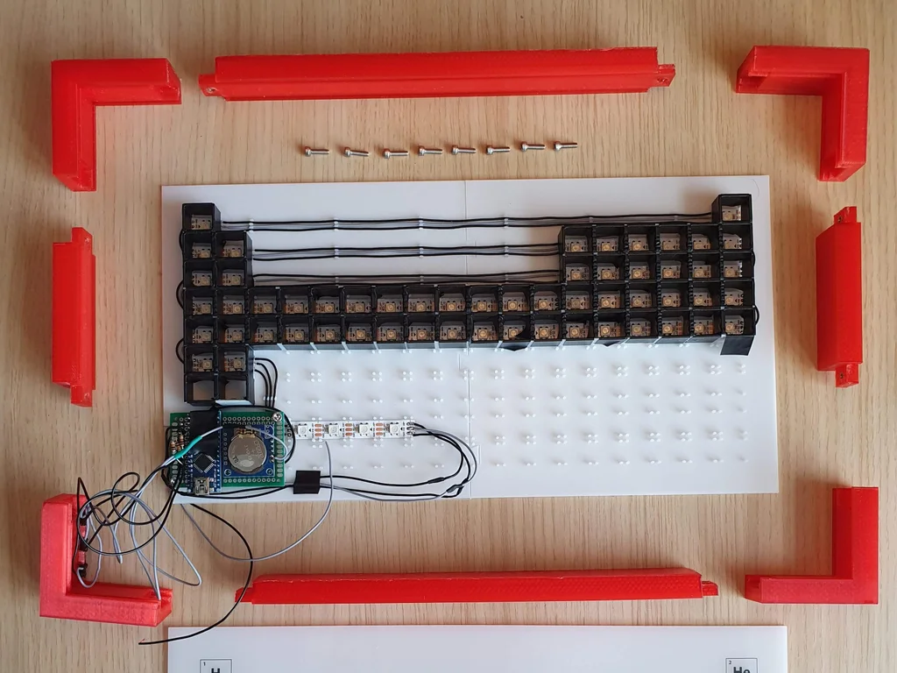

#### Tools
- 3D Printer
- Pliers
- Soldering Iron, solder and flux
#### Parts
- Arduino Nano
- RTC DS1307 realtime clock module
- WS2812B LED Strip: 60 LEDs per meter
- 330.8 x 173 x 3mm semitransparent plexiglass
- 12 x 3mm threaded inserts
- 12 x 8mm hex screws
- 5v 2A power supply
#### 3D Printed Parts
- Base Plate 1 & 2
- Frame Corner x 3
- Frame Corner with Buttons x 1
- Frame Long x 2
- Frame Short x 2
- Light guide 1 & 2 & 3

## 3D Print

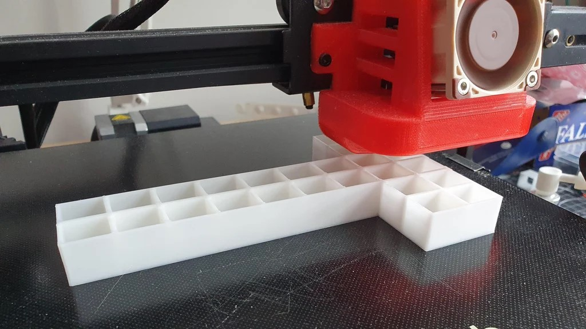

I recommend you to print all pieces before assembly. It will be much easier to assemble with every piece on your reach.

I've used two different filaments for the frame and the base.

**Red Filament** - All frame parts

**White Filament** - Base and Light guides

The printer I used is the Voxelab Aquila with the following settings:
- Nozzle: 0.4mm
- Infill: %20
- Filament: ZIRO Translucent PLA

## The Periodic Table

<div class="imageSlides">
<section id="main-carousel" class="splide" aria-label="project images">
  <div class="splide__track">
    <ul class="splide__list">
      <li class="splide__slide">
        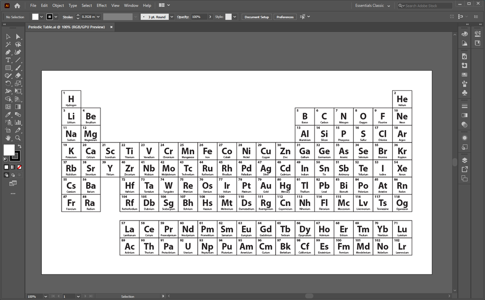
      </li>
      <li class="splide__slide">
        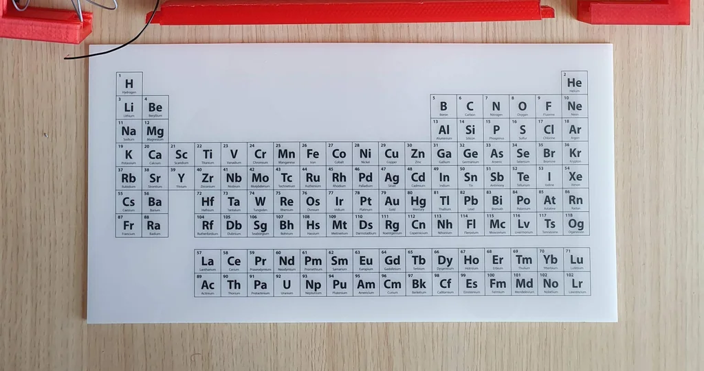
      </li>
    </ul>
  </div>
</section>
</div>
<ul id="thumbnails" class="thumbnails">
  <li class="thumbnail">
    
  </li>
  <li class="thumbnail">
    
  </li>
</ul>


I created the Periodic table from scratch in Adobe Illustrator to match the exact dimensions, the design was later UV printed onto the 3mm plexiglass. I contacted a local advertising agency that produces engraved keychains etc. but also offers UV prints on plexiglass.

My second option was to print the periodic table onto transparent sticker paper with an inkjet printer and attach the paper to the plexiglass. This would also keep the transparency for light to shine through however the first option was more accessible for me that's why I went with that one instead.

## Assembly

### Electronics

<div class="imageSlides">
<section id="main-carousel" class="splide" aria-label="project images">
  <div class="splide__track">
    <ul class="splide__list">
      <li class="splide__slide">
        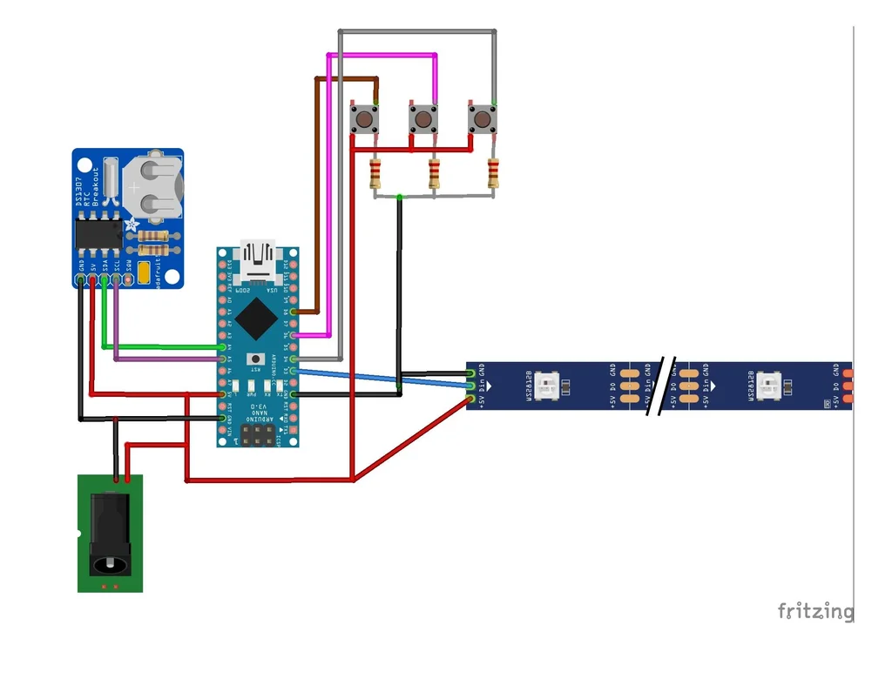
      </li>
      <li class="splide__slide">
        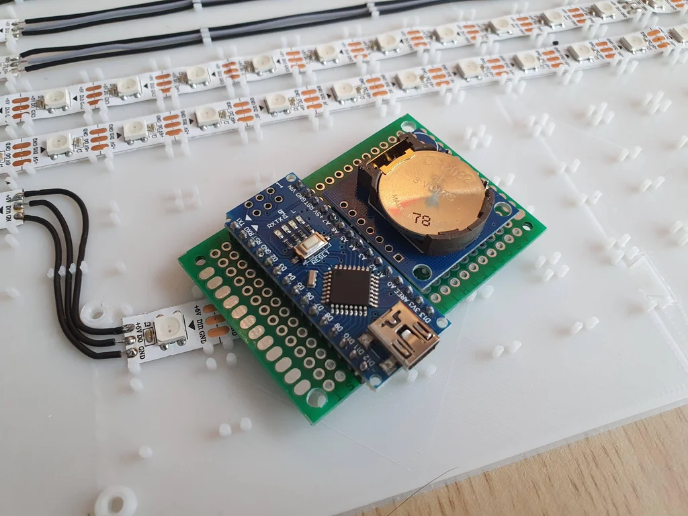
      </li>
      <li class="splide__slide">
        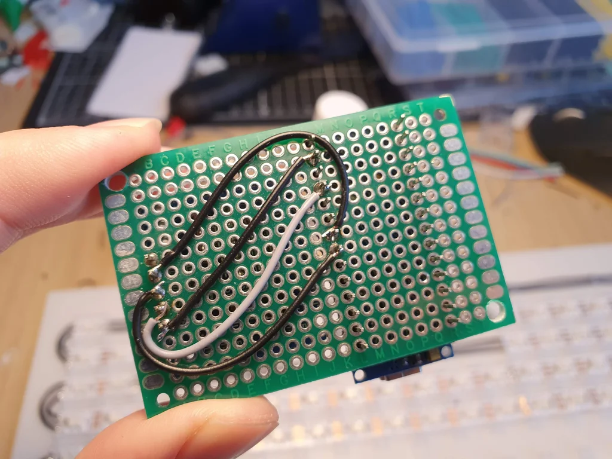
      </li>
      <li class="splide__slide">
        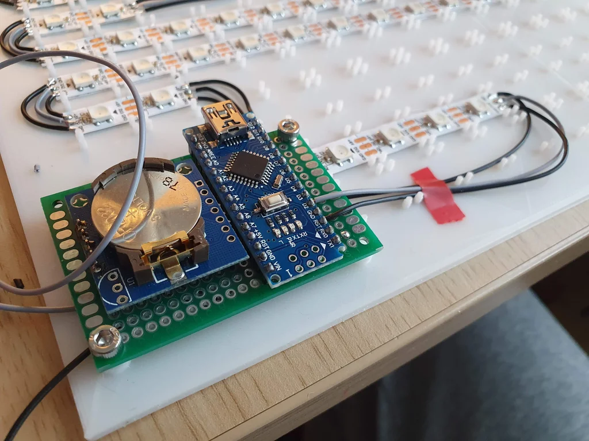
      </li>
    </ul>
  </div>
</section>
</div>
<ul id="thumbnails" class="thumbnails">
  <li class="thumbnail">
    
  </li>
  <li class="thumbnail">
    
  </li>
    <li class="thumbnail">
    
  </li>
  <li class="thumbnail">
    
  </li>
</ul>

For the first protoype you don't have to use a soldering Iron. I strongly recommend you to use jumper cables, so you can change any component if it isn't working properly.
Soldering on the Protoboard

First, make the connections as shown on a breadboard and make sure that it works probably before soldering the Arduino and RTC to the board.

### Base Plate


<div class="imageSlides">
<section id="main-carousel" class="splide" aria-label="project images">
  <div class="splide__track">
    <ul class="splide__list">
      <li class="splide__slide">
        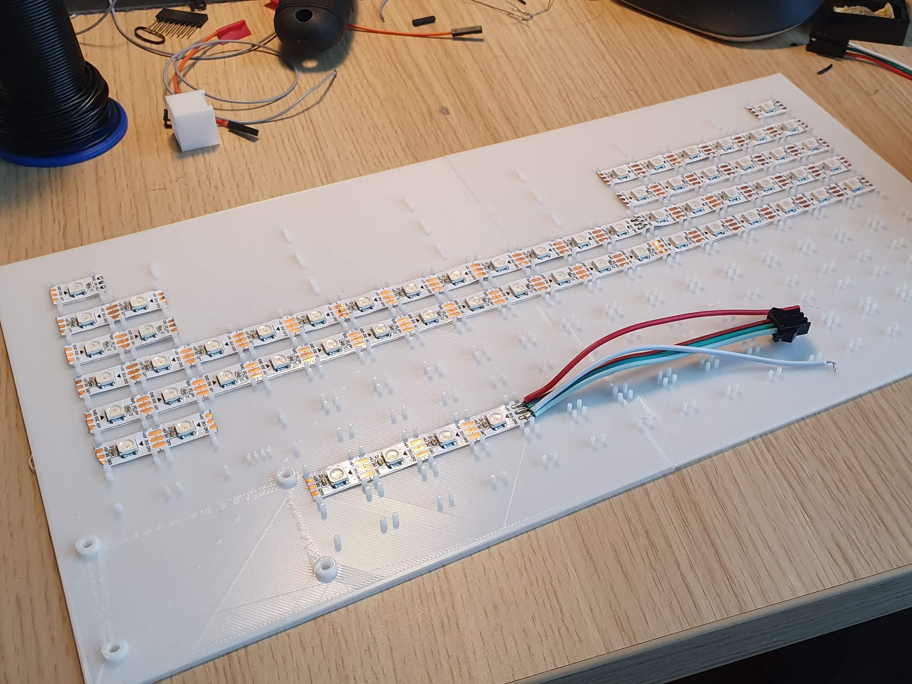
      </li>
      <li class="splide__slide">
        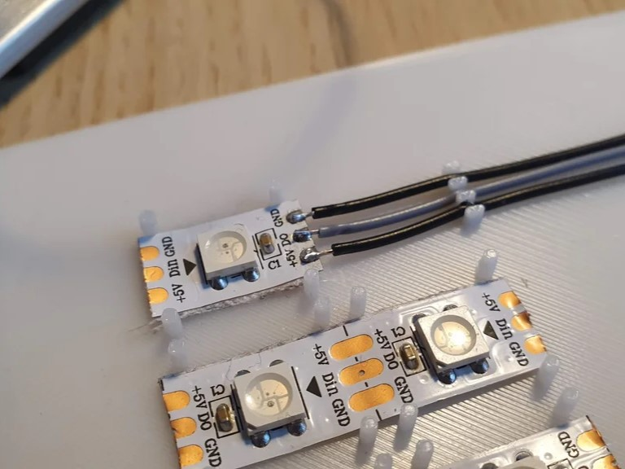
      </li>
      <li class="splide__slide">
        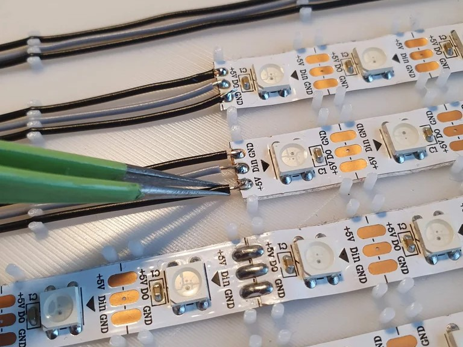
      </li>
      <li class="splide__slide">
        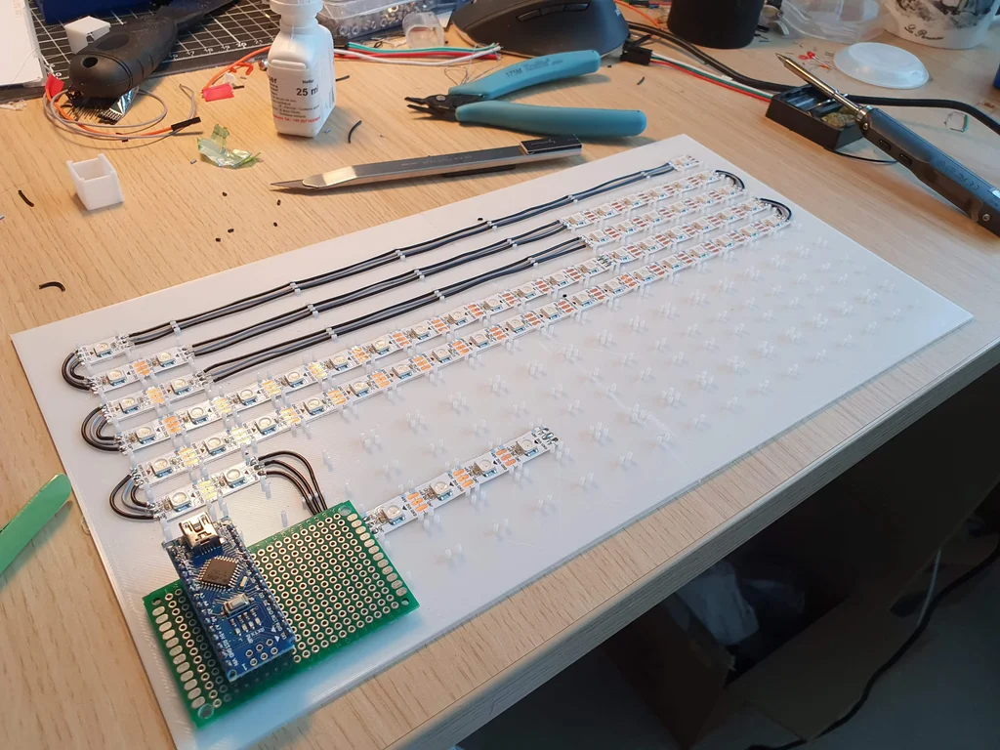
      </li>
      <li class="splide__slide">
        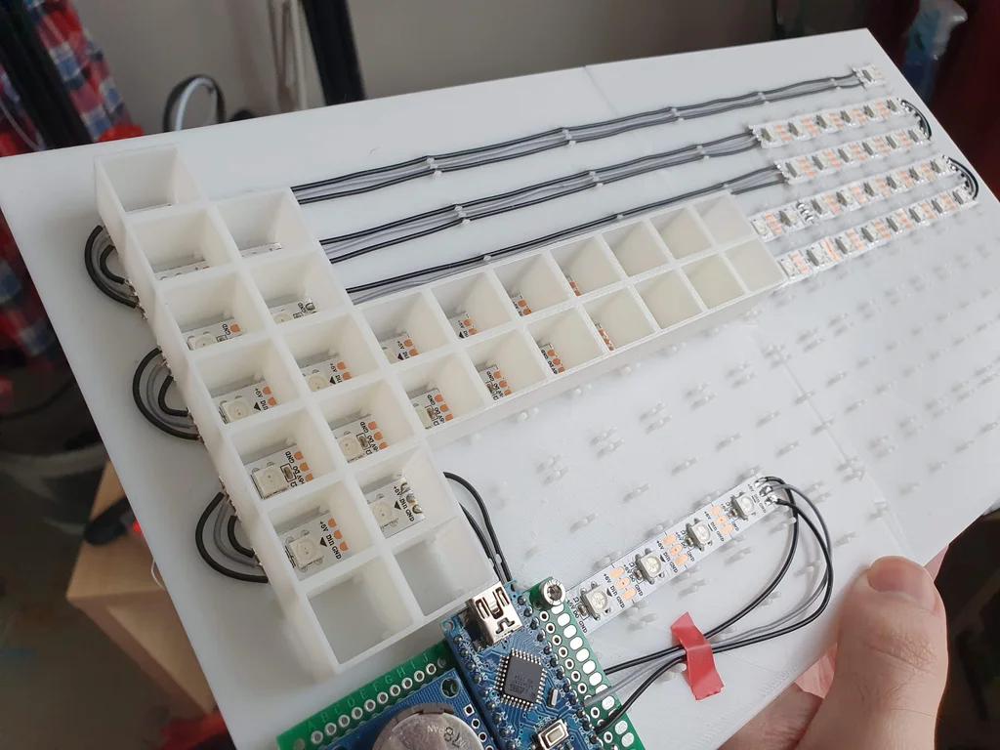
      </li>
      <li class="splide__slide">
        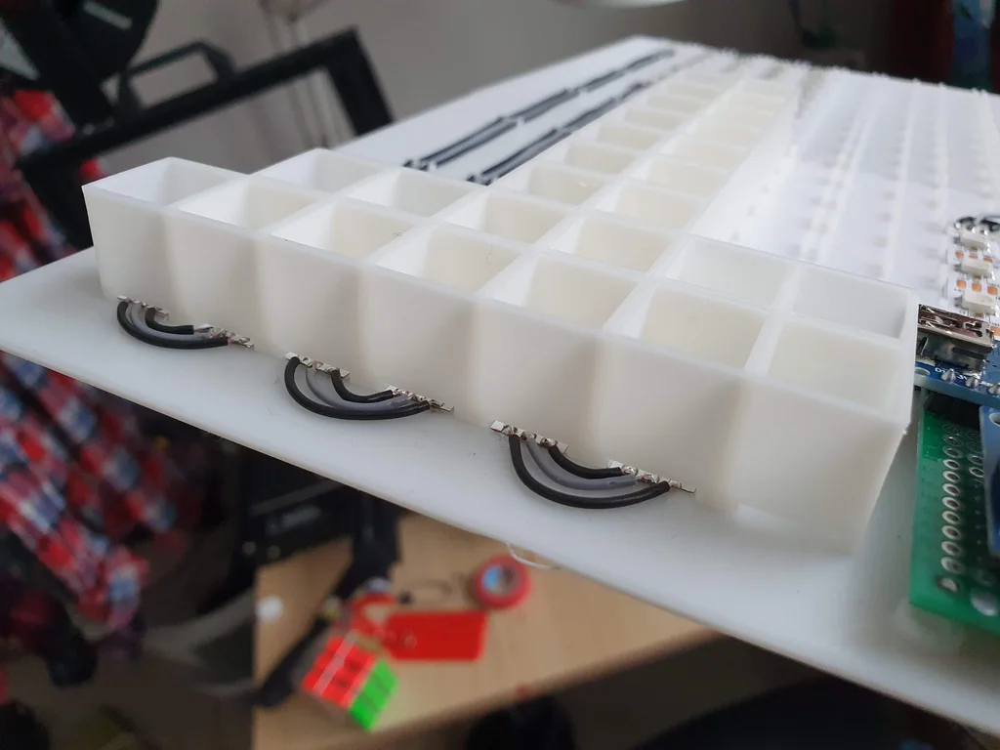
      </li>
    </ul>
  </div>
</section>
</div>
<ul id="thumbnails" class="thumbnails">
  <li class="thumbnail">
    
  </li>
  <li class="thumbnail">
    
  </li>
    <li class="thumbnail">
    
  </li>
  <li class="thumbnail">
    
  </li>
  <li class="thumbnail">
    
  </li>
  <li class="thumbnail">
    
  </li>
</ul>

Parts used in this step:
- [3d printed] BasePlate 1 & 2, LightGuide 1 & 2 & 3
- LED Strip

## The Code

We'll be using the FastLED Library for the addressable LEDs along with Wire.h and RTClib.h to control the RealTimeClock.

The FastLED Library for Arduino can be downloaded here: https://fastled.io/

And the RTClib can be found here: https://www.arduinolibraries.info/libraries/rt-clib

### Customization

To customize your date and time setting, go to void setup and edit this line:

```arduino
RTC.adjust(DateTime(Year, Month, Day, Hour, Minute, Second));
```

After you upload the code, the RTC will start from the defined date and time.

You can also customize the color of the LED's by editing this line:
```arduino
#define hourColor CRGB::Blue;
#define minuteColor CRGB::Green;
#define secondColor CRGB::Red;
```

These values can also be edited with custom RGB values such as:

```arduino
#define secondColor CRGB(255,0,0);
```
Where each number represents the RGB value, in this case Red=255, Green=0, Blue=0

There's also the option to customize the overlapping colors, these colors are displayed if there's an overlap between hours, minutes and seconds. eg. the time is 08:08:08
```arduino
#define HMoverlap CRGB::Cyan;
#define MSoverlap CRGB::Yellow;
#define SHoverlap CRGB::Purple;
```
Note: If you don't have experience with Arduino or don't know how to install libraries you can check this site.

### Upload The Code

Now you can upload the code to your Arduino and test the LED lights for the first time!