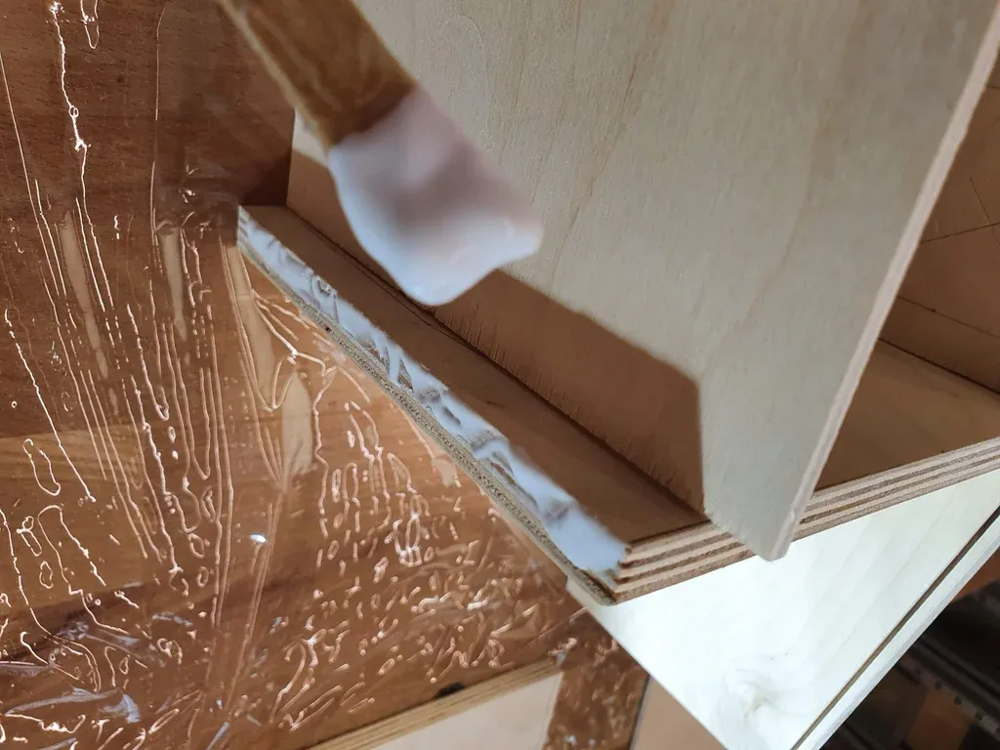

## Introduction {.invisible}

https://www.youtube.com/watch?v=SblBEVpVaPY

**Featured on**
 [HackSpace Magazine | Quantum Death Machine](https://hackspace.raspberrypi.com/articles/quantum-death-machine){target="_blank"}
 {.press}


_You're in an old antique shop and notice the mysterious wooden box that is sitting on the shelf, you get closer and see that there is a cat skull inside, and a hole below the glass display. You read the poorly written engraving below the hole: "INSERT FINGER". You're curious and insert your finger inside the hole, there is some light shining on your finger, you feel that your finger is getting scanned and think it might be one of those fortune teller machines that were popular back in the day. But why the cat skull? You remove your finger and the machine starts to make a horrible sound as some paper is coming out of the machine. You remove the paper and read:_

_'This is how YOU DIE'_

            _BEES_

📝**NOTE**
This project is archived and no longer maintained. While the core concepts may still be applicable, the instructions and code provided may not work with the latest versions of hardware, software, or libraries. It was originally published on instructables, you can view the comments to the original article on this archived link: [https://archive.ph/HQuJl ](https://archive.ph/HQuJl){target="_blank"}  
{.note}

Happy Halloween!

This year I channeled my inner evil scientist, put my background in physics to use, and built a Halloween project based on one of the spooky properties of Quantum Physics. The Quantum Death Machine is powered by a raspberry pi, a thermal printer, and a fingerprint scanner. When someone puts their finger on the scanner, instructions of a quantum circuit(a quantum dice) are sent to an actual [quantum computer by IBM.](https://quantum-computing.ibm.com/){target="_blank"} A prompt from a DeathList is then selected based on the quantum dice result and gets printed on thermal paper.

### Inspiration
Ever since I took Quantum Mechanics in university I wanted to use it somehow on one of my projects. After taking an online course on Quantum Computation by IBM I was introduced to the world of Quantum Computing. After finishing the course, the first thing that came to my mind was to make a project that uses an actual quantum computer. The first project Idea I had was to build an 8ball but with Halloween approaching I decided to make a spookier project.

I primarily wanted to use the True Randomness of quantum computers by creating a quantum dice because it's a good and easy introduction to quantum computing and its properties. I also wanted to create an easy-to-follow tutorial for all makers so they can also use quantum computing in their projects.

The first idea that came to my mind was to create a Schrodinger's cat inspired box with a twist. Instead of the cat being dead or alive it would be the user who uses the box. It would print dead or alive based on the result from the quantum computer. But while I was researching some combinations of Death Box, Death Machine, etc. I came upon a book which is called the Machine of Death which is an anthology of short stories edited by Ryan North, Matthew Bennardo, and David Malki. In the book, the Machine is described as:

"The machine had been invented a few years ago: a machine that could tell, from just a sample of your blood, how you were going to die. The problem with the machine is that nobody really knew how it worked, which wouldn’t actually have been that much of a problem if the machine worked as well as we wished it would. But the machine was frustratingly vague in its predictions"

This gave me a lot of inspiration! I changed the output from Dead/Alive to a list of prompts. And used the result from the quantum computer to choose from the list. I also added a fingerprint scanner to give a personalized feeling. The prompts from the book felt a bit serious so I wrote my own and also asked on social media for people to contribute, thus the Quantum Death Machine was born!

### Outline

In the first step, I'll explain the inspiration behind this project. Next, I will give a short introduction to Quantum Computing and provide you with some resources if you want to know more. Then I will show you how to set up your raspberry pi and configure it for the project. Later I will explain how the code works so you use a quantum computer for your own projects. After giving you a step-by-step assembly guide I'll end the Instructable with a troubleshooting guide.

Let's get started!

## Supplies

### Tools:

- 3D printer
- Table saw

### Parts:

- [Raspberry Pi 3](https://www.raspberrypi.com/products/raspberry-pi-3-model-b/)
- [Adafruit Thermal Printer & thermal paper roll](https://www.adafruit.com/product/597)
- [Fingerprint sensor](https://wiki.dfrobot.com/SEN0188_Fingerprint)
- Arduino Nano
- Plywood(200cmx25cm) in total
- Chestnut varnish

## Introduction to Quantum Computing

https://www.youtube.com/watch?v=OWJCfOvochA

Classical computers that we use in our daily lives: phones, tablets, computers etc. operate on binary. 1's and 0's. the combination of those is what makes computation possible.

The bits in Quantum Computers on the other hand which are called Qubits can be 1 and 0 simultaneously. Thus Quantum computing is a type of computation that harnesses the collective properties of quantum states, such as superposition, interference, and entanglement, to perform calculations.

For the sake of the project, I will only introduce you to the true randomness property of Quantum Computers but I will link some resources at the end of this step so you can go further down the rabbit hole if you're interested.

### What is true randomness?

If you throw a penny in the air, wait for it to drop on the floor and check if it's heads or tails. Is the outcome random? It might seem random at first but the thing is that if you observe the penny while being thrown and make the necessary calculations considering the density of the air the force applied by the hand etc. you can predict the outcome precisely. this also applies to dice rolls and even random number generators used by classical computers. They basically generate random numbers based on other factors. If you know the function and those factors(seeds) you can easily predict the outcome.

Quantum computers, using uniquely quantum properties, can generate truly random numbers. They don't use any factors or seeds to generate any numbers. The randomness comes from the measurement of the quantum states. Thus a random number generated by a quantum computer, in theory, can not be predicted. In the context of this project you would never know why a certain prompt was chosen for you from the list. And that's the spooky quantum property which this machine is using!

### Resources:

[Quantum.country](https://quantum.country/qcvc) - A really good guide on quantum computing, involves step-by-step practice-based interaction so you have a clear picture of what quantum computing is when you finish.

[Quantum Dice](https://medium.com/design-ibm/truly-quantum-dice-cfe372f4c586) - Practical application of the quantum dice using Python and Qiskit

[Qiskit](https://qiskit.org/textbook/ch-states/introduction.html) - The Qiskit website itself has a really good introduction to the basics of quantum computing, and shows how quantum computers work compared to classical computers.

## Raspberry Pi Setup - Raspberry Pi OS


_Note: In this step, I'll explain how to set up your raspberry pi from scratch, if you've already installed Raspberry Pi OS you can skip this step_

**Installing Raspberry Pi OS**

_note: you'll need a keyboard, mouse, and monitor to set up your raspberry pi_

Before we get into the code of our project, we first need to set up the Raspberry Pi.You can follow this official guide on how to install an operating system on your Pi:

[https://www.raspberrypi.org/documentation/installation/installing-images/README.md](https://www.raspberrypi.org/documentation/installation/installing-images/README.md)

Make sure you install ["Raspberry Pi OS (32-bit) with desktop and recommended software"](https://www.raspberrypi.org/downloads/raspberry-pi-os/), this version will have all the software we need to run the code.

After you've installed the operating system and started your raspberry pi, open up the terminal and type:

```bash
sudo raspi-config
```

- This will open up the configuration menu, navigate to _Interfacing Options,_ and enable _SSH_.
- Under _Interfacing Options_, select “Serial.” Turn OFF the login shell over serial, and ENABLE the hardware serial port. **This is required for the thermal printer to work!**

Enabling SSH will help us get into the Raspberry Pi remotely so we won't have to use a keyboard, mouse, and monitor every time.

Now our Raspberry Pi is ready to use! in the next step, we'll install the required libraries for the Thermal Printer, and also we'll install Qiskit which will let us connect to an actual Quantum Computer.

## Raspberry Pi Setup - Install Required Libraries


We need two libraries for our project to work, the first library we're going to install is the Thermal-Printer-Library from Adafruit. The second library we need to install is Qiskit which will let us use an actual quantum computer from IBM.

  

### Thermal Printer Library

First, we need to update packages and install the required libraries for the thermal printer. Type:
 ```bash 
sudo apt-get update
 ```
  

to update the packages. Next, install the required libraries by typing:

 ```bash 
sudo apt-get install git cups wiringpi build-essential libcups2-dev libcupsimage2-dev python-serial python-pil python-unidecode
 ```
  

Now we need to install the thermal printer driver. Simply type in order:

 ```bash 
cd ~
git clone https://github.com/adafruit/zj-58
cd zj-58
make
sudo ./install
 ```
This will install the required drivers for the printer to work.

  

Lastly, create a project folder by typing:

 ```bash
mkdir DeathMachine
cd DeathMachine
   ```

  

now we can install the thermal printer library by Adafruit:
 ```bash 
git clone https://github.com/adafruit/Python-Thermal-Printer.git
 ```
The Thermal Printer is ready to use!

  

### Installing Qiskit

  

Now we get to the tricky part. Curently Qiskit isn't optimized to use on the raspberry pi, normally we would be able to install Qiskit by simply typing

 ```bash 
 pip install Qiskit
 ```

  

But this does not work right now, so we have to configure some prerequisites and install some dependencies manually for it to work. This will take 3 steps

First, we install **retworkx:**
 ```bash 
pip install setuptools-rust
curl -o get\_rustup.sh -s https://sh.rustup.rs
sh ./get\_rustup.sh -y
 ```
  

this will set up the rust language environment. now we can install by typing:

 ```bash 
source ~/.cargo/env
pip install --prefer-binary retworkx
 ```

Next, we install **libcint, pyscf** and **cython**:

 ```bash 
sudo apt -y install cmake libatlas-base-dev git
git clone https://github.com/sunqm/libcint.git
mkdir -p libcint/build && cd libcint/build
cmake -DCMAKE\_INSTALL\_PREFIX:PATH=/usr/local/ ..
sudo make install
pip install --prefer-binary pyscf cython
 ```
Now we are ready to install Qiskit:

Simply type:

 ```bash 
pip install --prefer-binary 'qiskit\[visualization\]==0.20.\*'
 ```
To check the installations you can type:

 ```bash 
pip list | grep qiskit
 ```
  

and you should see something like this:
 ```bash 
qiskit              0.20.1
qiskit-aer            0.6.1
qiskit-aqua            0.7.5
qiskit-ibmq-provider       0.8.0
qiskit-ignis           0.4.0
qiskit-terra           0.15.2
 ```
Qiskit is now ready to use!


## Step 4: The Code

I'm using IBMQ Qiskit as the Quantum Computer provider, they have many machines available for everyone to use. Simply open an account and you're good to go! 

The first thing you need to do is to [open an IBMQ account.](https://quantum-computing.ibm.com/) In the homepage of your IBMQ page you will see your API token. This token will let you connect to IBMQ from your raspberry pi.

Connect to your raspberry pi using SSH, type python and hit enter. This will open the python environment. Now type:

```bash
>>> from qiskit import IBMQ
>>> IBMQ.save\_account('YOUR\_API\_KEY')
```

This will save your API key to your machine. Now you're ready to run the code!

To download the project code first create a folder for the project:

```bash
mkdir QuantumDeathMachine
cd QuantumDeathMachine
```

and now use GitHub to clone the project to your folder:
```bash
git clone https://github.com/gocivici/QuantumDeathMachine.git
```
Now you can run the code by:
```bash
python QuantumDeathMachine.py
```

### Arduino Code

I had to use an Arduino because the tx rx ports on my raspberry were occupied. I'm using the Arduino to create a brıdge between the Raspberry Pi and the fingerprint sensor. Simply download the code from this step and upload the code to your Arduino.

_Note: now I will be going into detail on how I'm using Qiskit to receive true random numbers, you can skip the rest if you're not interested in the details._

## Assembly - Electronics


You can attach everything using jumper cables, no soldering is required.

First power the Thermal printer with the power supply and connect it with jumper cables to your Raspberry Pi as shown:

| Printer | Raspberry Pi 3 |
| --- | --- |
| GND | GND |
| TX | 8 |
| RX | 10 |

After uploading the code to the arduino connect the Finger print sensor to the Arduino as shown, and connect it to to raspberry pi via USB.

| Finger Print | Arduino Nano |
| --- | --- |
| GND | GND |
| POWER | 5V |
| GREEN | 2 |
| WHITE | 3 |

Now you're done with electronics and are ready for the next step!

## First Prototype & Test


For the first prototype, I directly connected the Raspberry Pi to the thermal printer and fingerprint scanner. At this stage, the main objective is to test the setup and to check if they're working properly.

First, connect to the Raspberry Pi with SSH and locate your project folder.

To test if the printer is working properly type:
```bash
nano QuantumDeathMachine.py
```
this will let you edit the code on your Raspberry Pi, go to line 29, and put # at the beginning. next, uncomment line 31
```Python
#backend = least\_busy(provider.backends(n\_qubits=5, operational=True, simulator=False))
```
This will comment the line so we can test the printer without pinging the quantum computer and wait for it.

Now simply type:
```bash
python QuantumDeathMachine.py
```
This will get data from the IBM quantum simulator and print the result quickly. If everything is working properly you can start to build your box! If not go to step 13 for troubleshooting.

## Wood Box
### Design


I designed the wooden box in fusion360 I'm attaching the design file to this step so you can customize it to your needs.

The design was mostly inspired by 1960s wood candy vending machines. I wanted to create that retro-futuristic look.

### Cut & Assemble

<div class="imageSlides">
<section id="main-carousel" class="splide" aria-label="project images">
  <div class="splide__track">
    <ul class="splide__list">
      <li class="splide__slide">
        
      </li>
      <li class="splide__slide">
        
      </li>
      <li class="splide__slide">
        
      </li>
      <li class="splide__slide">
        
      </li>
      <li class="splide__slide">
        
      </li>
      <li class="splide__slide">
        
      </li>
      <li class="splide__slide">
        
      </li>
    </ul>
  </div>
</section>
</div>
<ul id="thumbnails" class="thumbnails">
  <li class="thumbnail">
    
  </li>
  <li class="thumbnail">
    
  </li>
    <li class="thumbnail">
    
  </li>
  <li class="thumbnail">
    
  </li>
  <li class="thumbnail">
    
  </li>
  <li class="thumbnail">
    
  </li>
  <li class="thumbnail">
    
  </li>
</ul>


### Varnish

<div class="imageSlides">
<section id="main-carousel" class="splide" aria-label="project images">
  <div class="splide__track">
    <ul class="splide__list">
      <li class="splide__slide">
        
      </li>
      <li class="splide__slide">
        
      </li>
      <li class="splide__slide">
        
      </li>

    </ul>
  </div>
</section>
</div>
<ul id="thumbnails" class="thumbnails">
  <li class="thumbnail">
    
  </li>
  <li class="thumbnail">
    
  </li>
    <li class="thumbnail">
    
  </li>

</ul>

## 3D Printing


There are two 3d printed parts for this build, one is the fingerprint mount that I designed that will be glued inside the box. You can find it attached to this step, the other part is the cat skull which I found on Thingiverse:

You can download it here:

[https://www.thingiverse.com/thing:2845427](https://www.thingiverse.com/thing:2845427)

_Note: enlarge the cat skull 1.5 times before printing. and don't forget to use supports._

The printer I used is the TEVO Tornado with the following settings:

Nozzle: 0.4mm

infill: %30

Filament: PLA

- 

## Final Assembly & Test
<div class="imageSlides">
<section id="main-carousel" class="splide" aria-label="project images">
  <div class="splide__track">
    <ul class="splide__list">
      <li class="splide__slide">
        
      </li>
      <li class="splide__slide">
        
      </li>
    </ul>
  </div>
</section>
</div>
<ul id="thumbnails" class="thumbnails">
  <li class="thumbnail">
    
  </li>
  <li class="thumbnail">
    
  </li>

</ul>

Now that you've assembled the box you can try to power up the pi and see if it works!

Again connect to your Raspberry Pi with SSH and run the code. Put your finger in the hole and wait. If you have any problems at this stage you can look at the next step for troubleshooting. If not, put your machine in front of your door for some spooky action!

## Troubleshooting

**\+ I can't connect to IBM Quantum**

- make sure you have typed the API code correctly. Also, it might take some time for your credentials to be verified. If the problem continues drop a comment below

**\+ Program stuck at Queue**

- This program sends a request to an actual quantum computer, IBM has limited amount of quantum computers and hobby use is not prioritized. If you do not want to wait fir the queue you can simply change the provider to ibm\_qasm\_simulator which is a quantum computer simulator available at all times!

**\+ Thermal printer not printing properly**

- I had a lot of issues while setting my printer up, if the prints are not visible you can try to increase the voltage. The Adafruit printer is rated for 5-9V and sometimes increasing the voltage can solve the visibility problem. If not you can also edit the file inside Adafruit-Thermal-Printer in the project folder and increase the heat values.

## What's Next

In this step, I will list some ideas that I had. But did not find the time/resources to add them:

1. Glass in front of the cat skull. I had planned for this and made some grooves for the glass but didn't have time to find a glass piece that fits. This would complete the retro look.
2. Currently the finger print scanner acts only as a button, in the future I'd love to use the data from scanner to customize the results.
3. Engraving on the front panel would also be interesting, for now I just used a sharpie to write 'Insert Finger'
4. Some art on the sides would also add more to the aesthetic of the machine.

Feel free to add more ideas or ways to improve this project in the comments!