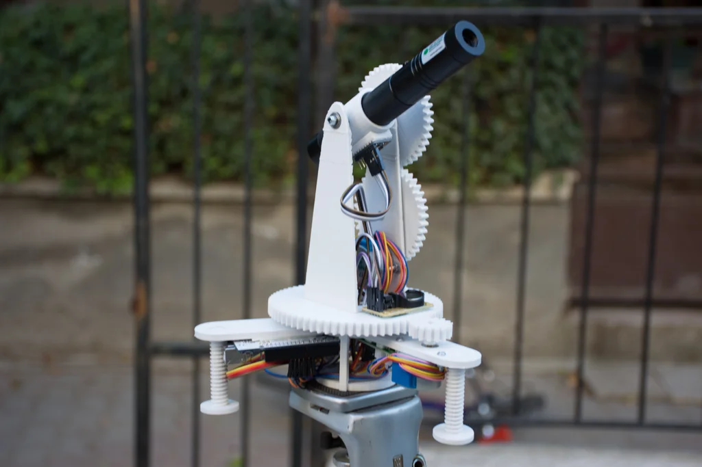

https://vimeo.com/176745067

**Featured on**
 [Arduino Blog | Star Track is an Arduino-powered star pointer and tracker](https://blog.arduino.cc/2016/08/01/star-track-is-an-arduino-powered-star-pointer-and-tracker/){target="_blank"}
 [Hackaday.com | Star Track: A Lesson In Positional Astronomy With Lasers](https://hackaday.com/2016/08/10/star-track-a-lesson-in-positional-astronomy-with-lasers/){target="_blank"} {.press}

📝**NOTE**
This project is archived and no longer maintained. While the core concepts may still be applicable, the instructions and code provided may not work with the latest versions of hardware, software, or libraries. It was originally published on instructables in 2016, you can view the comments to the original article on this archived link: [https://archive.ph/44sXn](https://archive.ph/44sXn){target="_blank"}  
{.note}

Star track is an Arduino based, GoTo-mount inspired star tracking system. It can point and track any object in the sky(Celestial coordinates are given as input) with 2 Arduinos, a gyro,RTC module,two low-cost stepper motors and a 3D printed structure.

In the first step, I'm going to introduce you to the basics of Positional Astronomy. Next, I'll explain the idea behind this project. I'll give you the Tinkercad links for the 3d printed parts. So you can edit them to your preferences. Also, I'll include a troubleshooting guide based on the problems I encountered during this build. This way you don't have to build the same thing. Maybe you can find a better algorithm to track the stars. Or you can develop the structure and use bigger motors to drive a telescope? Your imagination (and resources of course :')) is the limit. Let me know about your build!


**IMPORTANT NOTE:**
_This project includes laser pointers thus needs safety measures before use. In many countries, it is illegal to point lasers to an Aircraft and to use them near airports. For more information please check: [http://www.laserpointersafety.com/](http://www.laserpointersafety.com/)_**


_You can use_ [a cheap red dot sight](http://www.aliexpress.com/item/High-Quality-Hunting-Tactical-Holographic-1x22x33-Reflex-Red-Green-Dot-Sight-Scope-Shockproof-RifleScope/32657243524.html?spm=2114.01010208.3.57.k2PDVy&ws_ab_test=searchweb201556_8,searchweb201602_3_10057_10056_10055_10037_10049_10033_10059_10032_10058_10017_10060_10061_10062_10064,searchweb201603_2&btsid=df13b462-4434-4c72-8473-270bf6191ac5) _instead of the laser. This will_ _avoid all the issues with the laser (eye safety, legal issues, airplanes)._( thanks for the feedback of Marty on Hackaday)

## Step 1: A Little Bit of Positional Astronomy


In order to track the stars, you have to know the basics of the [Celestial Coordinate System](https://en.wikipedia.org/wiki/Celestial_coordinate_system). Celestial coordinates define positions of objects in the sky. It's based on the observations of ancient astronomers. They believed that the earth was motionless and at the center of the universe. The sky, they thought , was a moving sphere surrounding Earth, a _celestial sphere_.\[1\] In its modern sense, as used in astronomy and navigation, the celestial sphere is an imaginary rotating sphere of undefined radius. All objects in the sky can be thought of as lying upon the sphere.\[2\] Unlike planets, since the distance between stars and Earth is gigantic, we can simplify the positions of the stars by projecting them on an imaginary sphere.

There are differents ways to specify a objects location on the celestial sphere, These differ in their choice of fundamental plane, which divides the celestial sphere into two equal hemispheres along a great circle.

Each coordinate system is named for its choice of fundamental plane:

1. [Horizontal system](https://en.wikipedia.org/wiki/Celestial_coordinate_system#Horizontal_system)
2. [Equatorial system](https://en.wikipedia.org/wiki/Celestial_coordinate_system#Equatorial_system)
3. [Ecliptic system](https://en.wikipedia.org/wiki/Celestial_coordinate_system#Ecliptic_system)
4. [Galactic system](https://en.wikipedia.org/wiki/Celestial_coordinate_system#Galactic_system)
5. [Supergalactic system](https://en.wikipedia.org/wiki/Celestial_coordinate_system#Supergalactic_system)

**Equatorial System**

I chose the Equatorial system for this project. Because the altitude and azimuth of a star are constantly changing, it is not possible to use the horizontal coordinate system in a catalogue of positions. And since this project will track the objects in the sky based on the coordinates given. we need a coordinate system for cataloguing purposes. One based on the celestial equator and the celestial poles and defined in a similar manner to latitude and longitude on the surface of the Earth. In this system, known as the equatorial coordinate system, the position of an object is defined by the declination and right ascension. And the coordinates of an object in the sky do not change relative to your position.\[3\]

**Equatorial Coordinates on Celestial sphere**

Like Earth, the celestial sphere also has an equator, north pole and a south pole called celestial equator, celestial north pole, and celestial south pole. These are just projections of Earths equator,north pole and a south pole on the celestial sphere.

Like coordinates on earth (longitude and latitude), two coordinates define a point on the celestial sphere, _Declination_, and _Right Ascension._

**Declination**

The coordinate indicating where an object is between the celestial poles is declination. Measured from the celestial equator it ranges from 0° to 90° at the north celestial pole and to -90° at the south celestial pole.\[4\]

**Right Ascension**

The second coordinate [Right Ascension](http://www.physics.csbsju.edu/astro/CS/CS.10.html)(RA). It is like (but not the same as) longitude. It locates where a star is along the celestial equator. It has a zero reference point like green which, called the [Vernal Equinox Point](https://en.wikipedia.org/wiki/First_Point_of_Aries) (we will get into locating that later).\[4\] Unlike Declination, Right Ascension changes with time(rotation of the earth) And the coordinate of Right Ascension is not in degrees but in hours minutes and seconds. The celestial sphere will make a full rotation in 24h [sidereal time](http://www.astro.cornell.edu/academics/courses/astro201/sidereal.htm) (ie if a stars coordinates are 20 dec, 5h RA. After 2 hours the coordinates will be 20dec,7hRA.) Since 360/24=15 1 hour of RA is 15 degrees.

**Sidereal Time**

Sidereal time is different than solar time. A sidereal day is about 4 minutes less than a solar day. Because of the Earths orbit around the sun. I'm not going into details on how to calculate Sidereal time. I will include some links below if you are interested. You can use a [Sidereal calculator](http://www.jgiesen.de/astro/astroJS/siderealClock/). Local Sidereal Time (LST) indicates the Right Ascension on the sky that is currently crossing the Local Meridian. So, if a star has a Right Ascension of 05h 32m 24s, it will be on your meridian at LST=05:32:24.\[5\] In other words, if you face the north at 0h Local Sidereal Time. the Vernal Equinox Point(0h Ra) will be right above you. to understand it more clearly open this animation

[http://astro.unl.edu/classaction/animations/coords...](http://astro.unl.edu/classaction/animations/coordsmotion/celhorcomp.html)

select your location and hit start animation, You will see a line rotating. when that line is above the stick figure it is 0h Local sidereal time.

Here is a demonstration of Equatorial Coordinates on Celestial sphere by UNL Astronomy.

[Celestial-Equatorial (RA/Dec) Demonstrator](http://astro.unl.edu/classaction/animations/coordsmotion/radecdemo.html)

**How to Locate the North Celestial Pole**

Now we know the coordinate system of the celestial sphere. But how do we locate a reference point to use our coordinate system? The North Celestial Pole will only change with your latitude. And can be located easily by the north star. Here is an interactive demonstration, you can change the latitude and hit the switch so you can see where the celestial sphere is located.

[Celestial and Horizon Systems Comparison](http://astro.unl.edu/classaction/animations/coordsmotion/celestialhorizon.html)

Also here you can animate the movement of an object on the celestial sphere:

[Coordinate Systems Comparison](http://astro.unl.edu/classaction/animations/coordsmotion/celhorcomp.html)

**Note:**

I did not get into details since this is something like an introduction to positional astronomy. If you want to learn more I will include the links that were really helpful for me. There are also problems that you can solve to practice what you have learned. This way you will be able to calculate the coordinates of a star with a given latitude and time.

**Further Reading:**

History - [http://csep10.phys.utk.edu/astr161/lect/retrograde...](http://csep10.phys.utk.edu/astr161/lect/retrograde/aristotle.html)

RA and DEC - [http://www.physics.csbsju.edu/astro/sky/sky.11.htm...](http://www.physics.csbsju.edu/astro/sky/sky.11.html)

Celestial Sphere - [http://www.astronomyforbeginners.com/astronomy/cel...](http://www.astronomyforbeginners.com/astronomy/celestialsphere.php)

Coordinate Systems - [https://dept.astro.lsa.umich.edu/ugactivities/Labs...](https://dept.astro.lsa.umich.edu/ugactivities/Labs/coords/)

Celestial Coordinates - [http://sbo.colorado.edu/SBO\_OLD\_SITE/sbo/astroinfo...](http://sbo.colorado.edu/SBO_OLD_SITE/sbo/astroinfo/coords/coordinates.html)

Finding Astronomical Objects - [https://www.saddleback.edu/faculty/mhaeri/document.. .](https://www.saddleback.edu/faculty/mhaeri/documents/CoordinatesH.pdf)

Local Side Real Clock converter - [http://www.jgiesen.de/astro/astroJS/siderealClock/](http://www.jgiesen.de/astro/astroJS/siderealClock/)

How to Calculate Sidereal time - [http://aa.usno.navy.mil/faq/docs/GAST.php](http://aa.usno.navy.mil/faq/docs/GAST.php)

**References:**

\[1\][http://www.skyandtelescope.com/astronomy-resources...](http://www.skyandtelescope.com/astronomy-resources/what-are-celestial-coordinates/)

\[2\][http://www.newworldencyclopedia.org/entry/Celestia...](http://www.newworldencyclopedia.org/entry/Celestial_sphere)

\[3\][http://www.jtwastronomy.com/tutorials/celestial\_co...](http://www.jtwastronomy.com/tutorials/celestial_coordinates.html)

\[4\][http://astro.unl.edu/naap/motion1/cec\_units.html](http://astro.unl.edu/naap/motion1/cec_units.html)

\[5\][https://docs.kde.org/trunk5/en/kdeedu/kstars/ai-si...](https://docs.kde.org/trunk5/en/kdeedu/kstars/ai-sidereal.html)

## Step 2: The Idea




Many computerized telescopes have a type of telescope mount and related software which can automatically point a telescope to astronomical objects that the user selects. Called GoTo mounts. Like a standard equatorial mount, equatorial GoTo mounts can track the night sky by driving the right-ascension axis\[1\]

Since laser pointers are a perfect way to point stars, I thought a laser pointer with a GoTo mount would be a perfect tool for locating stars and to track them.

First I had to design a 2-axis mount.

1. 360-degree rotating axis for RA
2. A up-down axis for DEC

After aligning the RA axis with the North Celestial Pole, an Arduino connected with an RTC should be able to calculate and track RA with sidereal time. And you can adjust the 2 axes to the user input from a computer via serial.

But first I had to find a way to precisely point the mount to given degrees. The main idea was to use step motors and give them a specific step to take. But after a few tests I found out that the pointing was not accurate(a few degrees).

Instead, I used a gyroscope placed on the laser pointer to track the degrees on the two axes, this way I was able to send a command to the step motor to start and stop the movement if necessary.

## Step 3: Tools & Parts


I used two Arduino's in this project(due to the lack of digital pins).One to control the motors, the other to process the gyro data and send commands to the other Arduino(Master-puppet) I had an Uno and nano lying around so I used them. You can use other Arduino's as well.

Here are the main parts I used in this project:

[5v Stepper Motor(x2)](http://www.aliexpress.com/item/5V-Stepper-Motor-28BYJ-48-With-Drive-Test-Module-Board-ULN2003-5-Line-4-Phase/32608569300.html?spm=2114.30010308.3.1.nHbrGv&ws_ab_test=searchweb201556_8,searchweb201602_3_10057_10056_10055_10037_10049_10033_10059_10032_10058_10017_405_404_10040_10060_412,searchweb201603_8&btsid=f78cde47-a99c-418d-8186-4bedf36cf083) - 3.68$

[Arduino Uno r3 clone](http://www.aliexpress.com/item/Free-Shipping-one-set-Funduino-UNO-R3-with-USB-cable-line/32576427719.html?spm=2114.30010308.3.11.xqT8TJ&ws_ab_test=searchweb201556_8,searchweb201602_3_10057_10056_10055_10037_10049_10033_10059_10032_10058_10017_405_404_10040_10060_412,searchweb201603_8&btsid=de182632-ff13-431e-9c03-16292434608b) - 5.80$

[Arduino nano clone](http://www.aliexpress.com/item/NANO-3-0-controlador-compatible-con-arduino-NANO-CH340-turno-USB-controlador-ninguna-CABLE-V3-0/32574545871.html?spm=2114.30010308.3.1.AgDhes&ws_ab_test=searchweb201556_8,searchweb201602_3_10057_10056_10055_10037_10049_10033_10059_10032_10058_10017_405_404_10040_10060_412,searchweb201603_8&btsid=0d37d766-d11e-41ff-a514-d3857a403b11)\- 2.18$

[3-Axis Gyro](http://www.aliexpress.com/item/NEW-3-Axes-Accelerometer-Gyroscope-Module-For-Arduino-MPU-6050-new-arrival/32581666472.html?spm=2114.30010308.3.1.We1T12&ws_ab_test=searchweb201556_8,searchweb201602_3_10057_10056_10055_10037_10049_10033_10059_10032_10058_10017_405_404_10040_10060_412,searchweb201603_8&btsid=8775c487-58d0-4ae8-8494-8982780415ca) - 2.03$

[RTC](http://www.aliexpress.com/item/1PCS-RTC-DS1302-Real-Time-Clock-Module-For-AVR-ARM-PIC-SMD/32292033234.html?spm=2114.30010308.3.19.NwQGuX&ws_ab_test=searchweb201556_8,searchweb201602_3_10057_10056_10055_10037_10049_10033_10059_10032_10058_10017_405_404_10040_10060_412,searchweb201603_8&btsid=254c41ab-4e50-4171-a6da-058f8b2505a3) - 1.07$

\_\_\_\_\_\_\_\_\_\_\_\_\_\_\_\_\_\_\_\_\_\_\_\_\_\_\_\_\_\_\_\_\_\_\_\_\_\_

Total - 14,76$

Also,

- Lots of jumper cables
- [30x47x11mm thrust ball bearing](http://www.aliexpress.com/item/5-30-x-47-x-11mm-51106-Axial-Ball-Thrust-Bearing-3-Parts-30-47/32365874806.html)(again you can use a bearing you like but have to change the dimension on the parts.)
- (10x) M3 bolts and nuts
- (4x) 623 2RS bearings (I had these bearings at the moment. You can use any bearing, but you have to adjust the pieces from tinkercad to your dimensions.
- X-acto knife
- Superglue
- [A laser pointer](http://www.aliexpress.com/item/Top-Laser-303-200mW-Green-Laser-Pointer-Adjustable-Focal-Length-and-with-Star-Pattern-Filter-WITH/555563643.html?spm=2114.01010208.3.2.wU9Gy4&ws_ab_test=searchweb201556_8,searchweb201602_3_10057_10056_10055_10037_10049_10033_10059_10032_10058_10017_10060_10061_10062_10063_412,searchweb201603_8&btsid=f67e8ad0-9f43-44c9-97ec-476a7aaf3e96)([recommended](http://www.aliexpress.com/item/2-in-1-50mw-green-laser-pointer-pen-with-star-head-laser-kaleidoscope-light/858389713.html?spm=2114.01010208.3.1.6C7R0Q&ws_ab_test=searchweb201556_8,searchweb201602_3_10057_10056_10055_10037_10049_10033_10059_10032_10058_10017_10060_10061_10062_10063_412,searchweb201603_8&btsid=646295ef-cfe4-4a3f-9ecf-c6b11f512d01))

## Step 4: Designing the Parts

The first part to design is the base. I thought of a delta type base plate so I can attach 3 legs and adjust them. Here is the Base plate You can edit it on tinkercad as you like. I will also include all .stl files in a zip folder.  
  
The Base  
  
https://www.tinkercad.com/things/5VG81msm1Ex-epic-tumelo
  
  
Base Screw  
  
https://www.tinkercad.com/things/8zj7A3q7srV-copy-of-epic-tumelo
  
  
Tripod Mount (Attached to the base)  

https://www.tinkercad.com/things/fTZho4tztwO-copy-of-epic-tumelo  
  
Pitch(DEC) Mount

https://www.tinkercad.com/things/5NmvxOXuanh-copy-of-epic-tumelo  
  
  
  
  
Gyro Mount  
  
https://www.tinkercad.com/things/dW0cLpGraQL-glorious-maimu
  
  
The Base Gear  
  
https://www.tinkercad.com/things/3bG7x8oJ8pO-copy-of-fabulous-uusam-habbi 
  
  
Note: I'm giving these tinkercad links so you can change the parts to your preferences. All the other files including these are in the Parts.zip folder.  
  
The Gears  
  
Now for the most important part, designing the gears. I tried to create the gears in Autodesk Inventor but later I found a gear generator tool that generates gears to a .stl file. This was a life-saver for me.  
  
[http://joostn.github.io/OpenJsCad/](http://joostn.github.io/OpenJsCad/)  
  
I printed the parts with a prusa i3 3d printer.  


## Step 5: Assembly-Base Structure

<div class="imageSlides">
<section id="main-carousel" class="splide" aria-label="project images">
  <div class="splide__track">
    <ul class="splide__list">
      <li class="splide__slide">
        
      </li>
      <li class="splide__slide">
        
      </li>
      <li class="splide__slide">
        
      </li>
      <li class="splide__slide">
        
      </li>
      <li class="splide__slide">
        
      </li>
      <li class="splide__slide">
        
      </li>
      <li class="splide__slide">
        
      </li>
      <li class="splide__slide">
        
      </li>

    </ul>
  </div>
</section>
</div>
<ul id="thumbnails" class="thumbnails">
  <li class="thumbnail">
    
  </li>
  <li class="thumbnail">
    
  </li>
  <li class="thumbnail">
    
  </li>
  <li class="thumbnail">
    
  </li>
  <li class="thumbnail">
    
  </li>
  <li class="thumbnail">
    
  </li>
  <li class="thumbnail">
    
  </li>
  <li class="thumbnail">
    
  </li>
</ul>

## Step 6: Electronics & Code


**How Does it Work?**

There are two Arduino's working in order. Arduino Uno being master and nano being the puppet.

**Master module**

The master(Uno) module has two inputs,

1. Gyro data
2. RTC(Real Time Clock) data

and 6 outputs,

1. cw(base motor clockwise)
2. ccw(base motor counter clockwise)
3. stahp(base motor stop)
4. cw2(DEC motor clockwise)
5. ccw2(DEC motor counter clockwise)
6. stahp2(DEC motor stop)

The RTC is set to UTC time, a function calculates local sidereal time in degrees and rotates the mount to 0h RA position. The loop constantly checks if the gyro data is equal to the user input & sidereal time data. The default is 0,0. If there is a change and the equality breaks the master module send a command to the puppet module.

- If the user value is higher than the gyro value a signal is sent through cw the motor turns clockwise.
- If the user value is less than the gyro value a signal is sent through ccw the motor turns counter clockwise
- If the user value is equal to the gyro value a signal is sent through stahp and the motor stops

same for cw2,ccw2,stahp2.

This way the mount will turn to the user-specified coordinates. And update with sidereal time thus it will track the sky.

**Note:** _I could use serial communication between the two Arduino's but since the analog pins are used by the inputs I had to use digital pins._

**I uploaded the code my codebase so I can update it from one place:**

[https://code.gorkyver.com/Gorkem/Star-Track](https://code.gorkyver.com/Gorkem/Star-Track)

**Master module code:**
```arduino
/*  
 This is the source code for the master-module of Star Track.  
 Required Libraries:  
 [https://virtuabotix-virtuabotixllc.netdna-ssl.com...](https://virtuabotix-virtuabotixllc.netdna-ssl.com/core/wp-content/uploads/2014/01/virtuabotixRTC.zip)  
 [https://github.com/jrowberg/i2cdevlib/zipball/mas...](https://github.com/jrowberg/i2cdevlib/zipball/master)  
  
 Created 20 July 2016 by Görkem Bozkurt  
*/  
#include <virtuabotixRTC.h>  
#include <Wire.h>  
#include <MPU6050.h>  
MPU6050 mpu;  
//define RTC.  
virtuabotixRTC myRTC(A0, A1, A2);  
double M,Y,D,MN,H,S;  
double A,B;  
double location =32.88;//your longtitude  
double LST\_degrees;//variable to store local side real time(LST) in degrees.  
double LST\_hours;//variable to store local side real time(LST) in decimal hours.  
unsigned long timer = 0;  
float timeStep = 0.01;  
// Pitch and Yaw values  
double pitch = 0;  
double yaw = 0;  
double val = 0;//variable to store the user input DEC  
double val2 = 0;//variable to store the user input RA  
double temp = val2;//temporary value to store val2  
const int stahp=7,stahp2=10;  
const int cw=8,cw2=11;  
const int ccw=6,ccw2=9;  
void setup() {  
    //set date-time according to (seconds, minutes, hours, day of the week, day of the month, month, year)   
    myRTC.setDS1302Time(00, 38, 23, 5, 27, 7, 2016);  
    Serial.begin(115200);  
    pinMode(stahp,OUTPUT);  
    pinMode(cw,OUTPUT);  
    pinMode(ccw,OUTPUT);  
    pinMode(stahp2,OUTPUT);  
    pinMode(cw2,OUTPUT);  
    pinMode(ccw2,OUTPUT);  
    delay(5000);//wait before starting  
    while(!mpu.begin(MPU6050\_SCALE\_2000DPS, MPU6050\_RANGE\_2G))  
    {  
    }  
    mpu.calibrateGyro();  
    mpu.setThreshold(3);  
}//--(end setup )---  
void loop()  
{  
    //this will update the RA degrees with sidereal time 1degree at a time  
    //this way the object or star on the sky is tracked.  
    if( floor(LST\_degrees)==LST\_degrees ){   
      if (LST\_degrees>180){  
        val2 = temp+(360-LST\_degrees);  
        }else{  
        val2 = temp-LST\_degrees;  
        }  
    }  
  
    myRTC.updateTime();  
    LST\_time();  
    recvdata();  
    pitch\_check();  
    yaw\_check();  
    timer = millis();  
    Vector norm = mpu.readNormalizeGyro();  
    //I've put the sensor with a 90 degree angle on the setup due to  
    //cable connection problems. Because of that the data values from the mpu6050 chip are  
    //different in this case:  
    //roll data(X-axis) is pitch.  
    //pitch data(Y-axis) is yaw.  
    yaw = yaw + norm.YAxis \* timeStep;  
    pitch = pitch + norm.XAxis \* timeStep;  
    Serial.print(" Yaw = ");  
    Serial.print(yaw);  
    Serial.print(" Pitch = ");  
    Serial.print(pitch);  
    Serial.print(" LST\_d = ");  
    Serial.print(LST\_degrees);  
    Serial.print(" LST\_h = ");  
    Serial.println(LST\_hours);//local sidereal time in decimal hours.  
    delay((timeStep\*1000) - (millis() - timer));//timer for the gyro.  
}  
void recvdata(){  
  //This function receives data from serial as (0.00,0.00)  
  //splits it to strings by the comma ","  
  //than converts them to doubles   
    if (Serial.available() > 0){  
        String a= Serial.readString();  
        String value1, value2;  
        // For loop which will separate the String in parts  
        // and assign them the the variables we declare  
        for (int i = 0; i < a.length(); i++) {  
            if (a.substring(i, i+1) == ",") {  
                value2 = a.substring(0, i);  
                value1= a.substring(i+1);  
                break;  
            }  
        }  
        val=90-value1.toFloat();  
        val2=value2.toFloat();  
        temp = val2;  
    }  
}  
void pitch\_check(){  
    //check if pitch is high, low or equal to the user input  
    //send commands to puppet-module to start and stop motors  
    if(floor(pitch\*100)/100==floor(val\*100)/100){  
        digitalWrite(stahp,HIGH);  
        }else{  
        digitalWrite(stahp,LOW);  
    }  
    if(floor(pitch\*100)<floor(val\*100)){  
        digitalWrite(cw,HIGH);  
        }else{  
        digitalWrite(cw,LOW);  
    }  
    if(floor(pitch\*100)>floor(val\*100)){  
        digitalWrite(ccw,HIGH);  
        }else{  
        digitalWrite(ccw,LOW);  
    }  
}  
void yaw\_check(){  
    //check if yaw is high, low or equal to the user input  
    //send commands to puppet-module to start and stop motors  
    if(floor(yaw\*100)==floor(val2\*100)){  
        digitalWrite(stahp2,HIGH);  
        }else{  
        digitalWrite(stahp2,LOW);  
    }  
    if(floor(yaw\*100)<floor(val2\*100)){  
        digitalWrite(cw2,HIGH);  
        }else{  
        digitalWrite(cw2,LOW);  
    }  
    if(floor(yaw\*100)>floor(val2\*100)){  
        digitalWrite(ccw2,HIGH);  
        }else{  
        digitalWrite(ccw2,LOW);  
    }  
}  
void LST\_time(){  
    //Calculates local sidereal time based on this calculation,  
    //http://www.stargazing.net/kepler/altaz.html   
    M = (double) myRTC.month;  
    Y = (double) myRTC.year;  
    D = (double) myRTC.dayofmonth;  
    MN = (double) myRTC.minutes;  
    H = (double) myRTC.hours;  
    S = (double) myRTC.seconds;  
    A = (double)(Y-2000)\*365.242199;  
    B = (double)(M-1)\*30.4368499;  
    double JDN2000=A+B+(D-1)+myRTC.hours/24;  
    double decimal\_time = H+(MN/60)+(S/3600) ;  
    double LST = 100.46 + 0.985647 \* JDN2000 + location + 15\*decimal\_time;  
    LST\_degrees = (LST-(floor(LST/360)\*360));  
    LST\_hours = LST\_degrees/15;  
}  
```
**puppet Module:**
```arduino
/*  
this is the source code for the puppet module of Star Track  
Required Libraries:  
http://www.airspayce.com/mikem/arduino/AccelStepper/AccelStepper-1.51.zip  
Created 20 July 2016 by Görkem Bozkurt  
*/  
#include <AccelStepper.h>  
#define HALFSTEP 8  
#include <Wire.h>  
// Motor pin definitions  
#define motorPin1  2     // IN1 on the ULN2003 driver 1  
#define motorPin2  3     // IN2 on the ULN2003 driver 1  
#define motorPin3  4     // IN3 on the ULN2003 driver 1  
#define motorPin4  5     // IN4 on the ULN2003 driver 1  
  
  
#define motorPin5  A0     // IN1 on the ULN2003 driver 1  
#define motorPin6  A1     // IN2 on the ULN2003 driver 1  
#define motorPin7  A2     // IN3 on the ULN2003 driver 1  
#define motorPin8  A3     // IN4 on the ULN2003 driver 1  
// Initialize with pin sequence IN1-IN3-IN2-IN4 for using the AccelStepper with 28BYJ-48  
AccelStepper stepper1(HALFSTEP, motorPin1, motorPin3, motorPin2, motorPin4);  
AccelStepper stepper2(HALFSTEP, motorPin5, motorPin7, motorPin6, motorPin8);  
  
  
int stahp = 7,stahp2=10;  
int cw = 6,cw2 = 11;  
int ccw = 8,ccw2=9;  
  
  
boolean stopped = false;  
boolean stopped2 = false;  
void setup() {  
    stepper1.setMaxSpeed(1000.0);  
    stepper2.setMaxSpeed(1000.0);  
    pinMode(stahp2,INPUT);  
    pinMode(cw2,INPUT);  
    pinMode(ccw2,INPUT);  
    pinMode(stahp,INPUT);  
    pinMode(cw,INPUT);  
    pinMode(ccw,INPUT);  
}//--(end setup )---  
void loop()  
{  
    motor\_pitch();  
    motor\_roll();  
  
    if(stopped==false){  
        stepper1.run();  
    }  
    if(stopped2==false){  
        stepper2.run();  
    }  
}  
void motor\_roll(){  
    if(digitalRead(stahp)==HIGH){  
        stopped = true;  
    }else{ if(digitalRead(cw)==HIGH){  
            stepper1.setSpeed(100);  
            stopped = false;  
        }  
        if(digitalRead(ccw)==HIGH){  
            stepper1.setSpeed(-100);  
            stopped = false;  
        }  
    }  
}  
void motor\_pitch(){  
    if(digitalRead(stahp2)==HIGH){  
        stopped2 = true;  
    }else{ if(digitalRead(cw2)==HIGH){  
            stepper2.setSpeed(100);  
            stopped2 = false;  
        }  
        if(digitalRead(ccw2)==HIGH){  
            stepper2.setSpeed(-100);  
            stopped2 = false;  
        }  
    }  
  
}  
```
The puppet module has 6 inputs from the master module with the same names. And drives the motors.


## Step 8: First Test


We assembled the base and connected the electronics, now for the first test(indoor),

\-Upload the master and puppet codes to the Arduino's.

master ==> uno

puppet ==> nano

\-Connect the Arduino Uno to the computer and open the _serial monitor .Y_ou will see 4 values printed to the serial monitor,

**_Yaw_** _==> RA value in degrees_

**Pitch** _==> DEC value in degrees_

**LST\_d** _==> Local Sidereal Time in degrees_

**LST\_h** _==>_ _Local Sidereal Time in decimal hours_

When you first plug in the Arduino it will wait for 5 seconds. Then it will update the RA(yaw) value to your local sidereal time. After it is done it will continue to update the RA value 1 degree at a time.

Let's input 0,0 to the serial monitor.

When you try to move the mount, it will adjust itself to yaw=0, pitch=0.

Now let's try an input like 5.00,5.00(5 degrees DEC,5 degrees RA). The motors should position the mount at 5,5. degrees. If you encounter any problems check the next step.

## Step 9: Troubleshooting

**\-The steppers are just vibrating**

Check the connections of your stepper to the Arduino, different steppers have different pin outputs.

**\-The steppers start to wiggle when they arrive at the specified position**

If your stepper speed is too fast it will struggle to stop at the position specified. Edit the speed of the stepper on the puppet module(puppet.ino) to something like 50-75.

**\-RA is not updating**

Check the coin-cell battery on the RTC or the connections between the Arduino.

**\-RA-DEC values do not update(stuck at 0).**

The gyro is the main cause of his problem (in my case it was). this is why I put 5 seconds of delay, in the beginning, this way there was no problem. If yıu find another way please let me know.

If you encounter any problem during the build let me know(Even if you solved the problem). So I can put it here.

## Step 10: Final Assembly & Tracking

<div class="imageSlides">
<section id="main-carousel" class="splide" aria-label="project images">
  <div class="splide__track">
    <ul class="splide__list">
      <li class="splide__slide">
        
      </li>
      <li class="splide__slide">
        
      </li>
      <li class="splide__slide">
        
      </li>
      <li class="splide__slide">
        
      </li>
      <li class="splide__slide">
        
      </li>
      <li class="splide__slide">
        
      </li>
      <li class="splide__slide">
        
      </li>

    </ul>
  </div>
</section>
</div>
<ul id="thumbnails" class="thumbnails">
  <li class="thumbnail">
    
  </li>
  <li class="thumbnail">
    
  </li>
  <li class="thumbnail">
    
  </li>
  <li class="thumbnail">
    
  </li>
  <li class="thumbnail">
    
  </li>
  <li class="thumbnail">
    
  </li>
  <li class="thumbnail">
    
  </li>
</ul>

After assembling mount it to a tripod and go outside. The tripod will be a major tool because you will use it to align the setup with the north celestial pole.

After going outside away from city lights, adjust the Laser to an upright position by turning the motor with your hand.

Adjust the base gear so the RTC module is faced north.

Adjust the tripod angle while the laser is on and at an upright position, it should point the north star. If you can not see the north star you can use a phone app like sky map.

Plug in your Arduino to the setup. And wait while the RA degrees update.

Now you are all set. The laser pointer is now pointing 90 DEC,0 RA on the celestial sphere.


**Tracking a star**

There are huge star databases you can use. I will include the links below but for now, I will use Wikipedia for the coordinates of the star _Arcturus._ the coordinates of Arcturus are 14h 15m 39.7s , 19° 10′ 56″ first we have to convert this data to degrees, so our setup can process it.I used [https://www.swift.psu.edu/secure/toop/convert.htm](https://www.swift.psu.edu/secure/toop/convert.htm)

the result is: **RA**: 213.9167 **DEC**: 19.1822

You can put this values into the serial monitor like this 213.9167,19.1822

and the setup will start to point and track that object/star.

Databases:

[http://www.stellar-database.com/](http://www.stellar-database.com/)

[http://simbad.u-strasbg.fr/simbad/](http://simbad.u-strasbg.fr/simbad/)

## Step 11: What's Next

There are lots of things to improve on this project. My main goals for a later version are,

- Star database integrated into an android app. You will be able to choose a star. The data will be sent through Bluetooth to the Arduino as RA degrees, DEC degrees.
- Laser on/off switch with a servo. After the user input, the laser will be turned on for 3-5 seconds to point the star(currently you have to press it manually)
- more powerful motors and a bigger mount for a DSLR camera (maybe?)
- Bigger gear ratios for precise locations.
- Getting time and location data from a GPS module(currently, those are entered manually)

I hope you enjoyed this project as I did and learned something from it. If you find a mistake in the code or wrong information of any kind please let me know. All questions are welcome!
