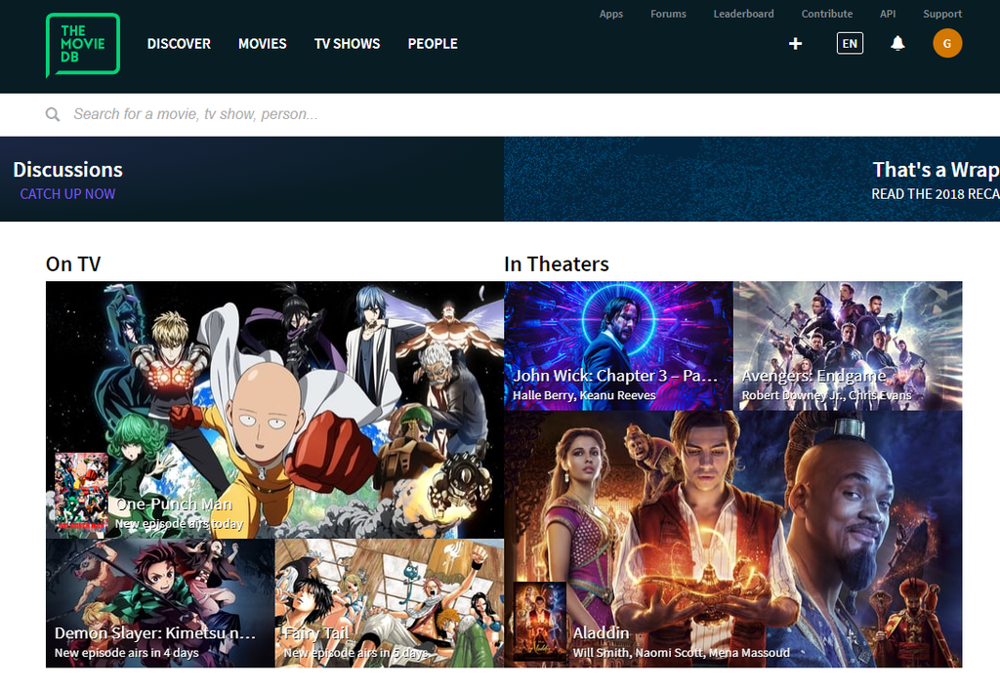

## Introducion {.invisible}

https://www.youtube.com/watch?v=Q-e9M304Fjo

**Featured on**
 [Adafruit Blog | Movie Tracker – Raspberry Pi Powered Theatrical Release Tracker](https://blog.adafruit.com/2019/06/14/movie-tracker-raspberry-pi-powered-theatrical-release-tracker-piday-raspberrypi-raspberry_pi/){target="_blank"}
 [Hackster.io | Raspberry Pi-Powered Movie Clapperboard Prints Mini Posters](https://www.hackster.io/news/raspberry-pi-powered-movie-clapperboard-prints-mini-posters-1b70b63ce61f){target="_blank"} {.press}

📝**NOTE**
This project is archived and no longer maintained. While the core concepts may still be applicable, the instructions and code provided may not work with the latest versions of hardware, software, or libraries. It was originally published on instructables, you can view the comments to the original article on this archived link: [https://archive.ph/pyQbN](https://archive.ph/pyQbN){target="_blank"}  
{.note}

Movie Tracker is a clapperboard shaped, Raspberry Pi-powered Release Tracker. It uses the TMDb API to print the poster, title, release date and overview of upcoming movies in your region, in a specified time interval(eg. movie releases this week) on thermal paper. There is a LED on the back of the board that lights up when there are new releases. Also, It has two magnets so you can attach the movies you want to watch on the board.

**Outline**

In the first step, I'll talk about the Idea behind this project. Next, I'll give you a list of all the parts&tools used to build this project. Then I'll show you how to set up your Raspberry Pi to run this program. After giving you a step by step assembly guide I'll end this instructable with a troubleshooting guide and what's next section.

Let's begin!

## Step 1: The Idea


I am a huge movie fan, I always keep my tickets and attach them to my journal. One day I thought "It would be awesome if movie tickets had posters on them." So this project started with me printing posters for my journal. Later I added a Release date on the poster so I can remember when It was released and that evolved slowly into a movie planning board.

## Step 2: Tools & Parts

### Tools:

- 3D printer
- Soldering Iron
- Drill
- Pliers
- Masking Tape
- Black Spray Paint

### Parts:

- Raspberry Pi 3 (I've had this around but Raspberry Zero is better because of its size)
- Push Button (5mm)
- [Adafruit Thermal Printer](https://www.adafruit.com/product/597) & thermal paper roll
- Green LED (5mm)
- 330-ohm resistor
- Tin sheet (0.5mm)
- 3 x (30mm M3 bolt & nut)
- 4 x (15mm M3 bolt & nut)
- 4 x (5x5mm M3 heat insert)

### 3D Printed Parts:

### 

- board.stl
- boardLid.stl
- clapperBottom.stl
- clapperLids.stl
- clapperTop.stl
- triangle.stl

## Step 3: Setting Up Your Raspberry Pi


### Installing Raspbian

To get the Pi work with our program we first need to set up the SD card that it will boot into. If you are a beginner you can check this detailed tutorial:

[https://www.instructables.com/id/Setting-Up-Raspberry-Pi-3/](https://www.instructables.com/id/Setting-Up-Raspberry-Pi-3/)

Next you have to enable SSH on your Raspberry Pi, again there is a detailed tutorial on this,

[https://www.instructables.com/id/How-To-Use-SSH-with-Raspberry-Pi-2/](https://www.instructables.com/id/How-To-Use-SSH-with-Raspberry-Pi-2/)

Enabling SSH will help us get into the Raspberry Pi remotely so we won't have to use a keyboard & monitor every time.

Now login to your raspberry pi with SSH and follow the steps below.

### **Thermal Printer Library**

To use the thermal printer with your Raspberry you first have to install the library that Adafruit is providing.

First create a folder to organize all the files of this project simply by:
```bash
mkdir movie-tracker-project
```
and get into that folder by:
```bash
cd movie-tracker-project
```
now let's install the required libraries. We will be using git to download all code on to the raspberry pi. Install the thermal printer library by:
```bash
git clone https://github.com/adafruit/Python-Thermal-Printer.git
```
### Movie Tracker Code

Install the Movie Tracker Code by:
```bash
git clone https://github.com/gocivici/movie-tracker.git
```
now for our code to work, it should be at the same folder with the thermal printer library. to get them in the same folder first get into the Movie Tracker folder by:
```bash
cd movie-tracker
```
and then copy the file to the thermal printer library by:
```bash
cp tracker.py /home/pi/Pyhton-Thermal-Printer
```
now your code is ready for customization.

_Note: the code will not execute currently since it has to be customized with an API key._

## Step 4: The Movie DB API



We will be using TMDb to get the movie data for this project. TMDb is a great platform which is free to use where you can create movie lists etc. (like IMDB) The best part of TMDb is that they have a free API service which lets you get movie data including posters, release dates etc. programmatically. To use this service you first have to create an account and follow the instructions [here](https://developers.themoviedb.org/3/getting-started/introduction) to get your API key.

## Step 5: Customizing the Code

### API Key

Login to your Raspberry Pi using SSH and go to the folder where you put the tracker.py file in. Now to edit the file use:
```bash
sudo nano tracker.py
```
inside the file you'll see the place of the API Key indicated as \[YOUR\_API\_KEY\]. Copy the key that you've got from TMDb and paste it here. Now your code is ready to run simply test it by:
```bash
python tracker.py
```
It should get the latest movie release info and print it on the console. If not check the Troubleshooting guide at the end of this instructable.

If you want to use the tracker with its default settings you can skip the next part.

### Further Customization

In its default setting, the tracker will update **each day** to get new release info and will save it if the release date is in the interval of **10 days.** You can change these settings to your liking. by changing this line:
```bash
rDate = 10
```
## Step 6: Assembly - Electronics


After connecting the electronics as shown on the image we'll test each part to make sure they're working.

### Thermal Printer

Get into the Thermal printer library folder and run:

cd Python-Thermal-Printer
python printertest.py

this should print a test sheet I there is a problem check the printer parts and test again.

### LED

Create a new file “LED\_Test.py” by typing the following:
```bash
nano LED\_Test.py
```
and copy this to the file:
```python
import RPi.GPIO as GPIO  
import time  
GPIO.setmode(GPIO.BCM)  
GPIO.setwarnings(False)  
GPIO.setup(18,GPIO.OUT)  
print "LED on"  
GPIO.output(18,GPIO.HIGH)  
time.sleep(1) print "LED off"  
GPIO.output(18,GPIO.LOW)
```
When you run this code by:
```bash
sudo python LED\_Test.py
```
the LED should light up. If not there is a problem with your LED

## Step 7: First Prototype & Test


_You don't need a 3D casing for this project. You can use it as shown on the image on its prototype stage._

Now let's test the tracker. Run the tracker by:

sudo python tracker.py

You should see the upcoming movie list on the command line. Now press the button and wait for the printer to finish printing. check if there is in any error on the information on the page. If not your project is ready for the case.

## Step 8: 3D Print


_Printing all pieces before assembling them is highly recommended._

The printer I used is the TEVO Tornado with the following settings:

- Nozzle: 0.4mm
- infill: %20
- Filament: PLA

Make sure to sand the pieces before painting them.


## Step 9: Masking & Painting

<div class="imageSlides">
<section id="main-carousel" class="splide" aria-label="project images">
  <div class="splide__track">
    <ul class="splide__list">
      <li class="splide__slide">
        
      </li>
      <li class="splide__slide">
        
      </li>
      <li class="splide__slide">
        
      </li>

    </ul>
  </div>
</section>
</div>
<ul id="thumbnails" class="thumbnails">
  <li class="thumbnail">
    
  </li>
  <li class="thumbnail">
    
  </li>
    <li class="thumbnail">
    
  </li>

</ul>

Each blue strip of masking tape is 20mm in diameter. I eyeballed the angle of the stripes.

## Step 10: Assembly - Clapper

<div class="imageSlides">
<section id="main-carousel" class="splide" aria-label="project images">
  <div class="splide__track">
    <ul class="splide__list">
      <li class="splide__slide">
        
      </li>
      <li class="splide__slide">
        
      </li>

    </ul>
  </div>
</section>
</div>
<ul id="thumbnails" class="thumbnails">
  <li class="thumbnail">
    
  </li>
  <li class="thumbnail">
    
  </li>

</ul>

I used a tin sheet and cut it with a Dremel in this shape. The tension of the tin was adjusted by bending it. You can also use other springy parts, It doesnt have to be tin.

## Step 11: Assembly - Board

<div class="imageSlides">
<section id="main-carousel" class="splide" aria-label="project images">
  <div class="splide__track">
    <ul class="splide__list">
      <li class="splide__slide">
        
      </li>
      <li class="splide__slide">
        
      </li>
      <li class="splide__slide">
        
      </li>
      <li class="splide__slide">
        
      </li>
      <li class="splide__slide">
        
      </li>
      <li class="splide__slide">
        
      </li>
      <li class="splide__slide">
        
      </li>

    </ul>
  </div>
</section>
</div>
<ul id="thumbnails" class="thumbnails">
  <li class="thumbnail">
    
  </li>
  <li class="thumbnail">
    
  </li>
  <li class="thumbnail">
    
  </li>
  <li class="thumbnail">
    
  </li>
  <li class="thumbnail">
    
  </li>
  <li class="thumbnail">
    
  </li>
  <li class="thumbnail">
    
  </li>
</ul>

Use a soldering Iron to heat-fit the inserts

## Step 12: Soldering


Solder the resistor to the LED and use a heat-shrink to cover it. You don't have to solder the button, I used two jumper cables to attach them to the Raspberry Pi.

## Step 13: Final Assembly & Test

<div class="imageSlides">
<section id="main-carousel" class="splide" aria-label="project images">
  <div class="splide__track">
    <ul class="splide__list">
      <li class="splide__slide">
        
      </li>
      <li class="splide__slide">
        
      </li>
      <li class="splide__slide">
        
      </li>
      <li class="splide__slide">
        
      </li>
      <li class="splide__slide">
        
      </li>
      <li class="splide__slide">
        
      </li>

    </ul>
  </div>
</section>
</div>
<ul id="thumbnails" class="thumbnails">
  <li class="thumbnail">
    
  </li>
  <li class="thumbnail">
    
  </li>
  <li class="thumbnail">
    
  </li>
  <li class="thumbnail">
    
  </li>
  <li class="thumbnail">
    
  </li>
  <li class="thumbnail">
    
  </li>
</ul>


I've used a pingpong ball to diffuse the led. It works like magic. You just have to drill a small hole and fit the led inside the ball as shown on the picture.

## Step 14: Troubleshooting

**\+ Printer gets stuck and stops printing**

**\-** this can be due to the power supplier, try using one with larger current

**\+ Can't get data from the API**

**\-** There are daily limits for API usage. If you are above the limit they will cut the access of your key. Usually, The limit resets at the end of the day.

_Don't hesitate to leave a comment If you are having problems. I'll collect them and try to answer them here._

## Step 15: What's Next


In this step, I will list some things I had in my mind. But did not find the time/resources to add them. Feel free to add more Ideas or ways to improve this project in the comments:

- Auto cutter, so you don't have to cut the paper every time manually.
- Watchlist integration, only the movies that are on your watchlist will be printed.
- RGB LEDs can change color for different genres(horror+red etc)
- A wall mount would be nice.

This is not a finished Project. I hope many of you try to build their own consoles so we can develop this together.

If you have any questions ask away! & tell me about your build!