https://www.youtube.com/watch?v=YoGgdORVARs

<!-- <div style="display:none">

## Introducion 

</div> -->

📝**NOTE**
You can keep track of the components with [this interactive guide](ibom.html) {.note}

Trinteract is an open-source Arduino-compatible universal 3DOF input device. In other words, a joystick capable of moving in all 3 Dimensions but you decide what the joystick could be! Trinteract uses a Triple-Axis Magnetometer and a Neodymium magnet to detect motion in 3D space. It comes with a 3D-printed knob but electromagnets, magnetic textiles, or any magnetic object can also be used to control the input, creating more opportunities for interaction!

Trinteract consists of 3 main components:

1. a **custom PCB** that acts as a breakout board for the sensor and makes it easy to connect to an Arduino.
2. a **3D-printed flexure mechanism** in the form of an ergonomic knob that is housing a magnet.
3. an **Arduino pro micro** to act as an HID and communicate the data to the computer.

It acts as a high-resolution gamepad when connected to a computer by converting the magnetic input to a joystick axis range of (-512,512) for each axis without the need for keyboard or mouse emulation, and thus can be further customized in 3D graphics applications like Blender or 2D interfaces like Figma. It can also be used [as a midi input device](https://www.youtube.com/watch?v=bSu7iv_qj9k&t=205s){target="_blank"} for music production software like Ableton. Additionally, third-party tools like [KeySticks](https://keysticks.net/){target="_blank"} can be used to map the input for apps that do not provide support for gamepads.

<div class="imageSlides">
<section id="main-carousel" class="splide" aria-label="project images">
  <div class="splide__track">
    <ul class="splide__list">
      <li class="splide__slide">
        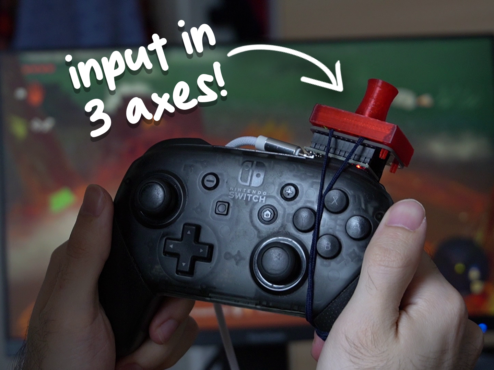
      </li>
      <li class="splide__slide">
        
      </li>
      <li class="splide__slide">
        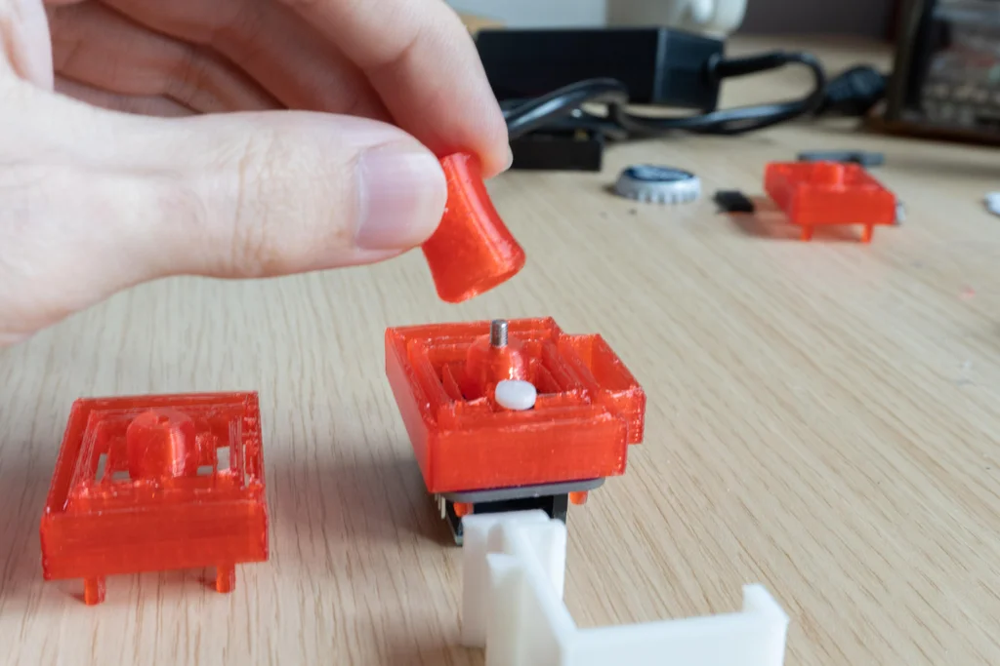
      </li>
    </ul>
  </div>
</section>
</div>
<ul id="thumbnails" class="thumbnails">
  <li class="thumbnail">
    
  </li>
  <li class="thumbnail">
    
  </li>
    <li class="thumbnail">
    
  </li>
</ul>

### Why 3D?

Although the most common device used for desktop 3D interaction is the keyboard and mouse, It’s still difficult to implement direct manipulation techniques for 2D input devices, correlating 2D hand movement with the mouse to interaction in 3D space requires a chain of inputs( like holding a button on the keyboard while moving the mouse to rotate the object in a specified direction etc.) which complicates the interaction.

This issue is not limited only to desktop use, video games like The Legend of Zelda: Tears of the Kingdom also require complex input combinations for 3D interaction, like the ultrahand ability that lets you move objects in 3D space, this ability requires 2 separate input methods operated by two thumbs(the right joystick to move up/down + left/right and the D-pad to move forward/backward). Trinteract aims to offer a customizable direct interaction method to simplify these complex interactions.

### Outline

This guide is based on my master's degree project and is mainly aimed at providing a step-by-step guide to build Trinteract from scratch, however, It also includes details about the background and thinking process behind the project including initial prototypes, for those who want to experiment with magnetic input themselves. If you are only interested in building Trinteract you can skip these optional steps!

## Supplies

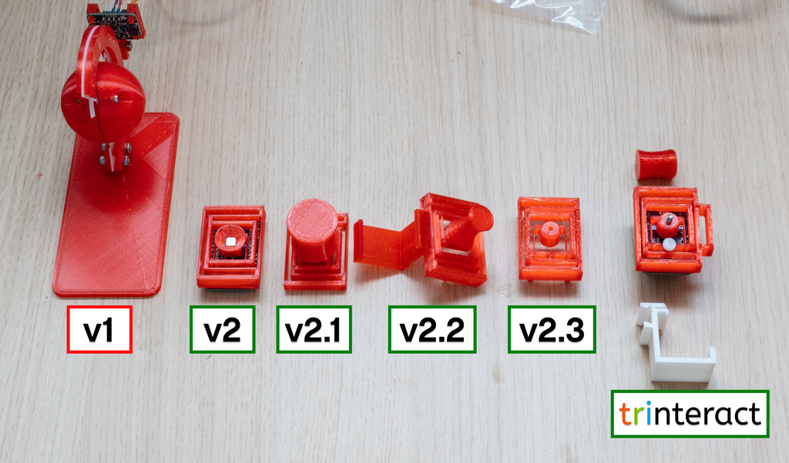

### Trinteract

- Trinteract PCB (Details on step 5)
- 3D printed flexure (Details on step 7)
- Infenion TLV493DA Low Power 3D Magnetic Sensor
- 2 x 2.2k Ω SMD Resistor 0805 - R1 & R3
- 680 Ω SMD Resistor 0805 - R2
- 4.7k Ω SMD Resistor 0805 - R4
- 100n SMD Capacitor 0805 - C1
- Tactile Switch 5 X 5mm, 2 mm Actuator Height
- 4x4mm neodymium cube magnet

📝**NOTE**
The components can be bought from any major electronics supplier, like Digikey or Mouser{.note}

### Prototype (Optional)

- Breadboard
- Jumper cables
- Adafruit TLV493D triple-Axis Magnetometer
- neodymium magnets of any size

### Tools
- 3D printer
- Soldering Iron
- Pliers

## Background

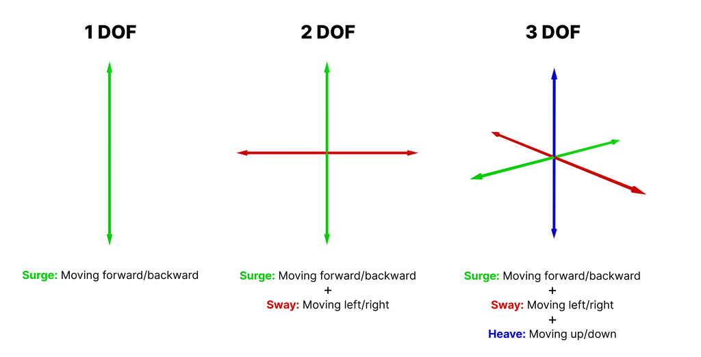

The concept of a 3D input device is not new, however commercial devices that are available today(eg. 3D Connexion SpaceMouse) are expansive and are specifically designed to be used in task-specific desktop CAD applications. While the mouse has been accepted as the standard for 2D interaction, none of the existing 3D input devices has emerged as a standard for 3D interfaces. As part of my master's degree project, I wanted to explore the challenges of 3D input devices and as a result, Trinteract was born!

### What is 3D input?

In computing, an input device is defined as the bridge between the real world and the computer world of symbolic representations of information. Input devices come in many shapes and forms that include keyboards, mice, scanners, etc., and can be further categorized by the number of degrees of freedom involved [1]. A degree of freedom is simply the specific, independent way a body moves in space. A device such as a mouse detects two-dimensional motion relative to a surface in 2 axes (x,y) creating two degrees of freedom.

Movements of the pointing device are echoed on the screen by movements of the pointer, creating a simple, intuitive way to navigate a computer’s graphical user interface [2]. 6DOF devices like the 3Dconnexion SpaceMouse are specifically designed to be used in desktop 3D CAD applications for manipulating virtual objects. A slight push and pull pressure on the cap of the device generates movement in 3 axes. With slight twists and turning of the cap, additional rotational motions are generated along the 3 axes creating 6DOF in total.

### Other DIY Devices

A few open-source 3D input devices have also been developed as alternatives for commercial devices and shared online which were helpful in the development of this project. [SpaceFox](https://github.com/pepijndevos/spacefox){target="_blank"}, [JoySix](https://hackaday.io/project/9354-joysix){target="_blank"} and [SpaceMushroom](https://www.instructables.com/Space-Mushroom-Full-6-DOFs-Controller-for-CAD-Appl/){target="_blank"} are 6DOF input devices that can be built with cheap off-the-shelf components.

For this project, however, I wanted to focus on 3DOF input rather than 6DOF because during my research I found out that Although 6DOF devices were specifically designed for these environments and were efficient in certain 3D tasks like CAD applications, they were difficult to operate while making fine manipulations, and it took a lot of practice to become proficient with them.

## Magnets!

<div class="imageSlides">
<section id="main-carousel" class="splide" aria-label="project images">
  <div class="splide__track">
    <ul class="splide__list">
      <li class="splide__slide">
        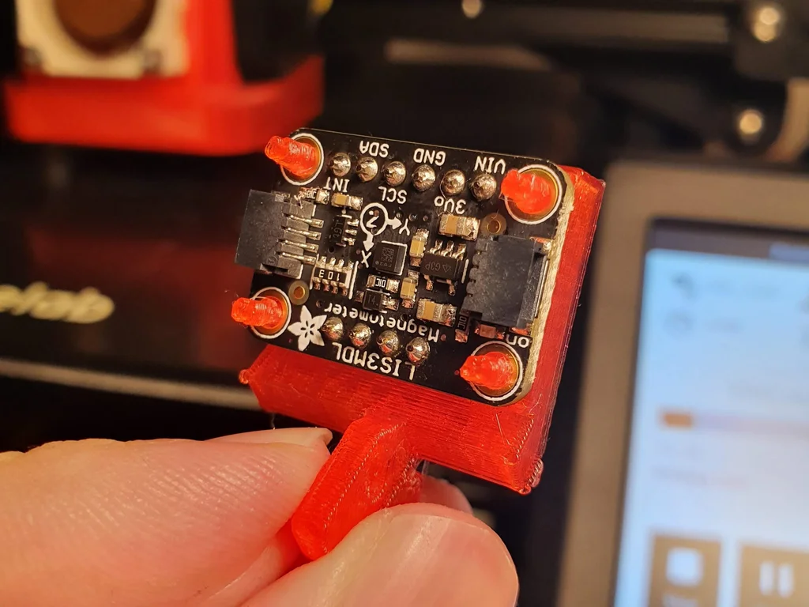
      </li>
      <li class="splide__slide">
        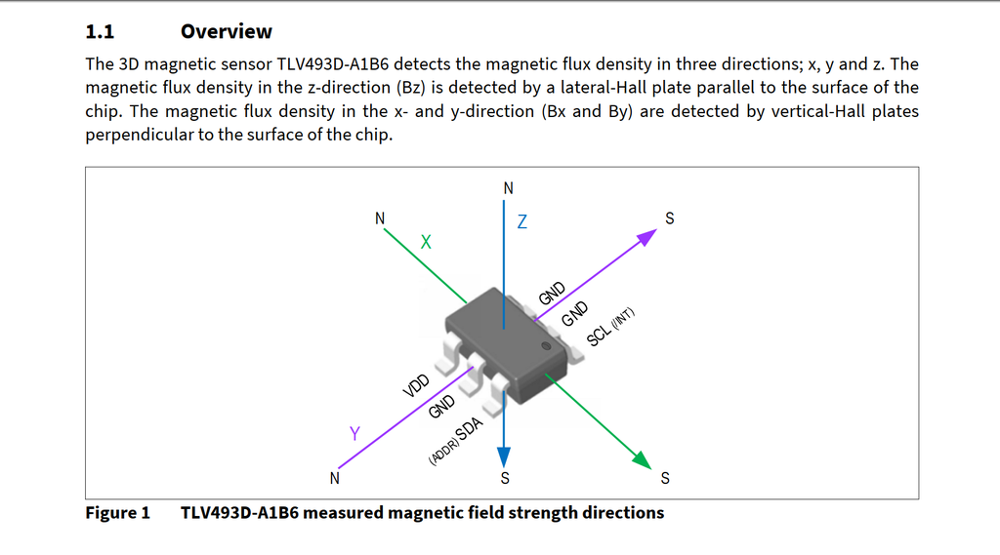
      </li>
    </ul>
  </div>
</section>
</div>
<ul id="thumbnails" class="thumbnails">
  <li class="thumbnail">
    
  </li>
  <li class="thumbnail">
    
  </li>
</ul>

Using regular input methods like potentiometers currently used in gaming controllers would’ve made this tool more limited. Using a magnetic sensor on the other hand increases the potential by using any magnetic object as an input method. It also doesn’t require complex mechanical contraptions and reduces the wear and tear of the device.

The TLV493D-A1B6 Low Power 3D Hall effect magnetic sensor can detect 3D magnetic flux density sensing of ±160 mT (TLV493D-A1B6 3D Magnetic Sensor Datasheet, n.d.) and is capable to communicate with the Arduino via the I2C protocol. This sensor was chosen for its low cost and small form factor.

If you want to experiment with 3D magnetic sensors and don't want to assemble a PCB I would recommend the TLV493D Triple-Axis Magnetometer from Adafruit. This sensor was used for the prototyping of this project.

## First Prototype (optional)

<div class="imageSlides">
<section id="main-carousel" class="splide" aria-label="project images">
  <div class="splide__track">
    <ul class="splide__list">
      <li class="splide__slide">
        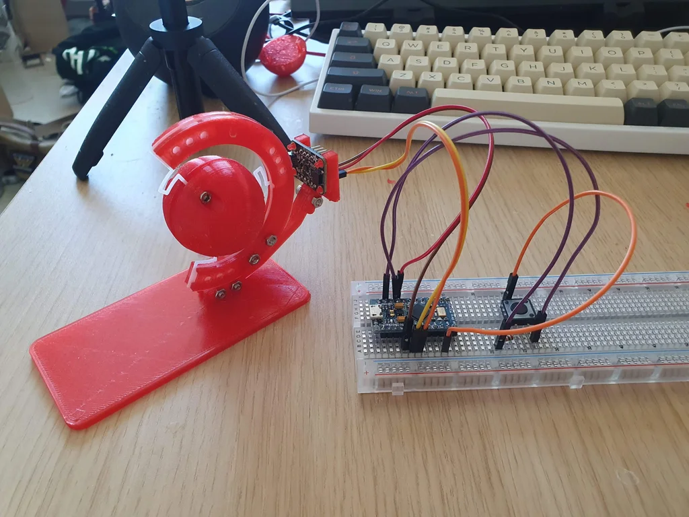
      </li>
      <li class="splide__slide">
        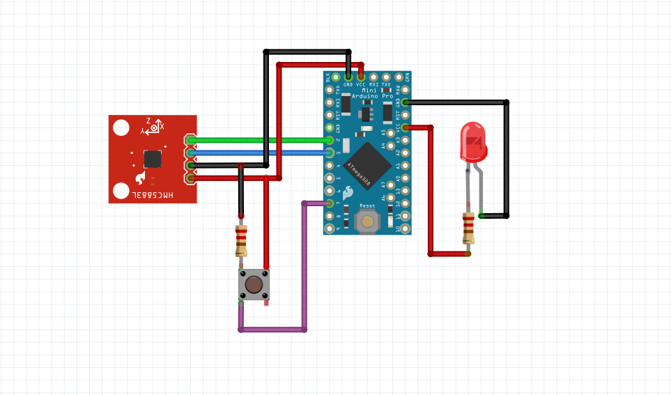
      </li>
      <li class="splide__slide">
        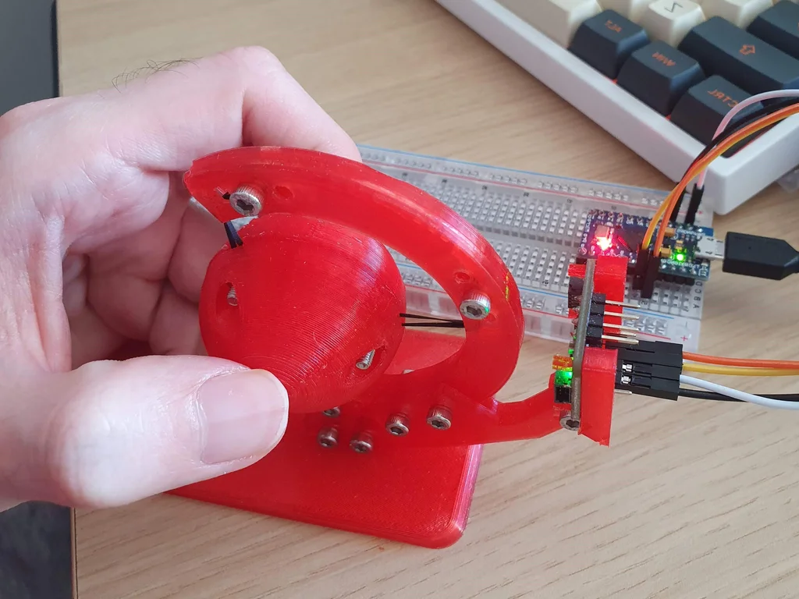
      </li>
            <li class="splide__slide">
        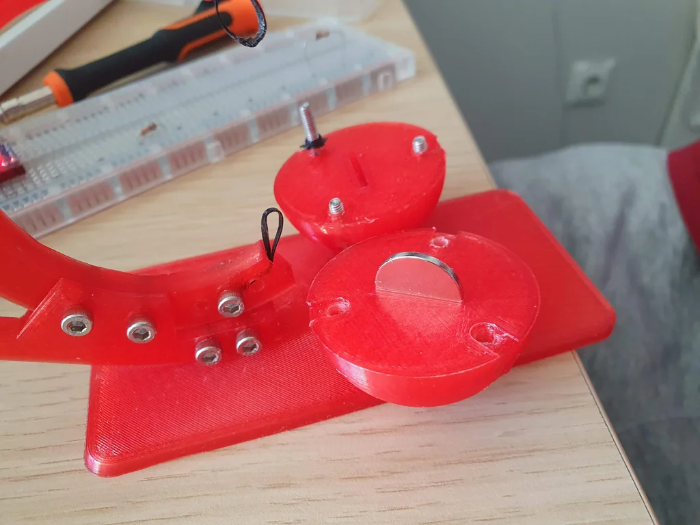
      </li>
    </ul>
  </div>
</section>
</div>
<ul id="thumbnails" class="thumbnails">
  <li class="thumbnail">
    
  </li>
  <li class="thumbnail">
    
  </li>
    <li class="thumbnail">
    
  </li>
      <li class="thumbnail">
    
  </li>
</ul>

I would recommend creating a prototype first since it's tricky to experiment with magnets. You have to find a way to fix the magnet to a position while providing some room for it to move. I did this in my first prototype with a floating ball held by rubber bands that had a neodymium magnet inside. Its aim was to allow the users to grasp and manipulate the ball easily, providing a familiar and comfortable experience while enabling a full range of motion, allowing users to control and manipulate objects in a three-dimensional space directly with precision.

### Code
You can download the [TLV493D library](https://github.com/Infineon/TLV493D-A1B6-3DMagnetic-Sensor){target="_blank"} to test the magnetic sensor with your prototype. After you've installed your library, on the Arduino IDE go to File > examples > TLV493 > cartesian and upload the code to your Arduino. Now you should be able to see the magnetic sensor data on the serial monitor.
### From the First Prototype to Trinteract
A printed circuit board was designed to house the electrical components in a compact way. The size has been reduced to make the device less bulky and more compact. The ball was replaced with a knob which allowed two-finger operation compared to the three-finger operation of the previous prototype. This small form factor allowed the device to be used as an attachment to a laptop or keyboard. Creating more opportunities for non-desktop use.

## Schematic & PCB

<div class="imageSlides">
<section id="main-carousel" class="splide" aria-label="project images">
  <div class="splide__track">
    <ul class="splide__list">
      <li class="splide__slide">
        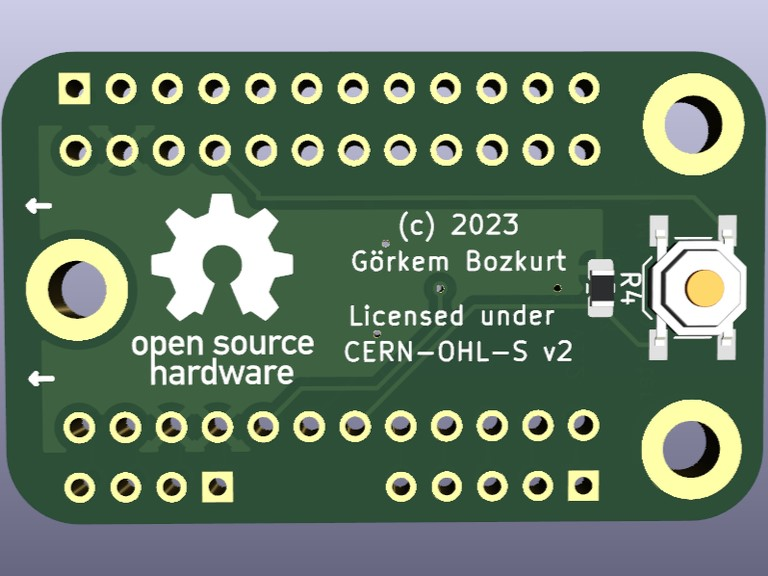
      </li>
      <li class="splide__slide">
        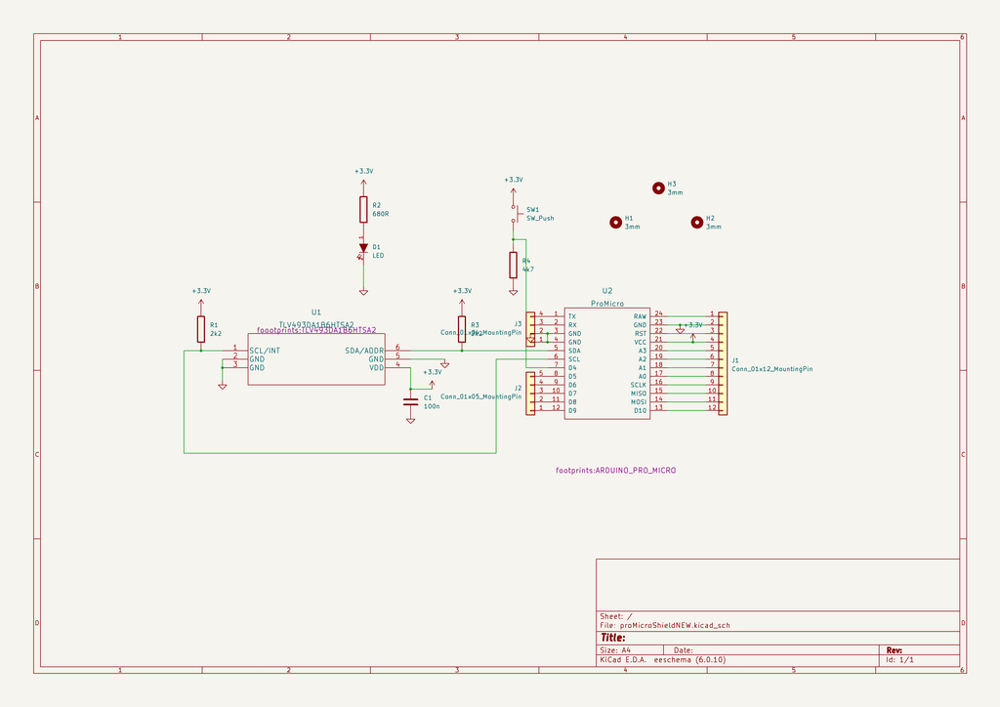
      </li>
      <li class="splide__slide">
        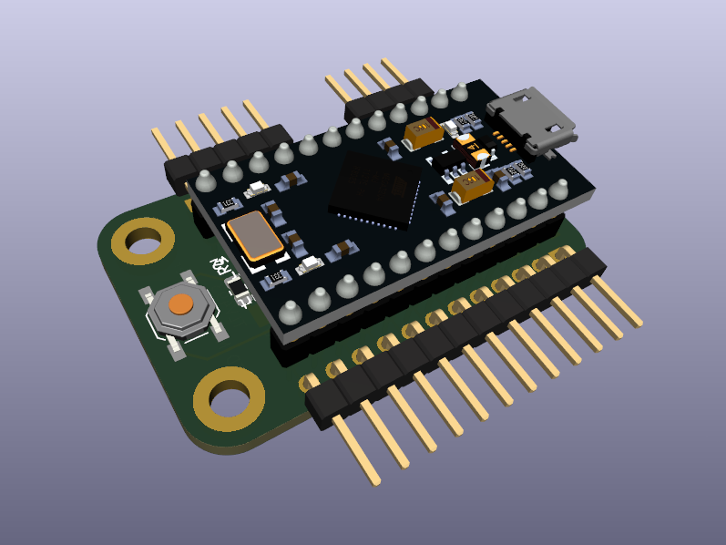
      </li>
            <li class="splide__slide">
        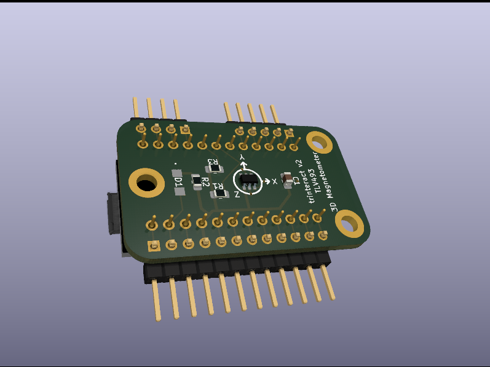
      </li>
    </ul>
  </div>
</section>
</div>
<ul id="thumbnails" class="thumbnails">
  <li class="thumbnail">
    
  </li>
  <li class="thumbnail">
    
  </li>
    <li class="thumbnail">
    
  </li>
      <li class="thumbnail">
    
  </li>
</ul>

The schematic and PCB [are available as editable files!](https://github.com/gocivici/trinteract){target="_blank"} You can customize the schematic and PCB according to you needs in KiCAD.

### The Schematic

The circuit of Trinteract is very simple, the TLV493 magnetic sensor is connected to the Arduino pins via I2C, and a 100nF capacitor is connected between VCC and ground of the sensor. Two 2.2k pull-up resistors are connected to SDA and SCL lines based on the datasheet of the sensor, a push button along with a resistor and a power indicator LED is also connected to VCC and ground.

### The PCB

The PCB was designed as a shield for the Arduino pro micro, expansion pins were added to make use of all the pins that are available on the device. The sensor was placed in the middle of the PCB to make calibration easier. And 3x3mm mounting holes were added to make mounting easier.

## PCB Manufacturing

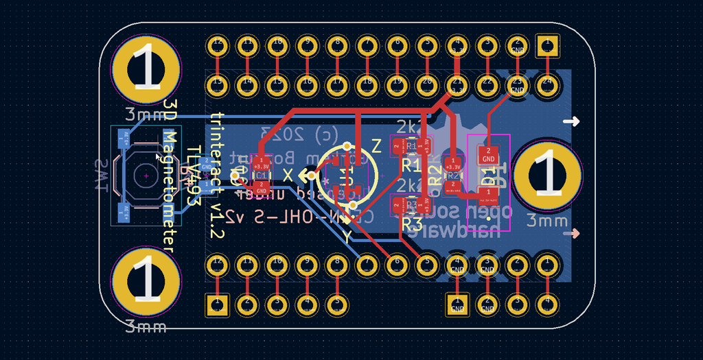

The PCB now is ready to manufacture!

The latest PCB files can be downloaded [from the repository here.](https://github.com/gocivici/trinteract){target="_blank"}

There are two subfolders under the PCB folder. One contains the KiCAD files that can be edited and customized. The other folder titled “Gerbers” contains the manufacture-ready files that can be directly sent to a PCB manufacturer like JLCPCB.

I didn't order a stencil with the PCB as I was planning to hand-solder the components.

## Soldering

<div class="imageSlides">
<section id="main-carousel" class="splide" aria-label="project images">
  <div class="splide__track">
    <ul class="splide__list">
      <li class="splide__slide">
        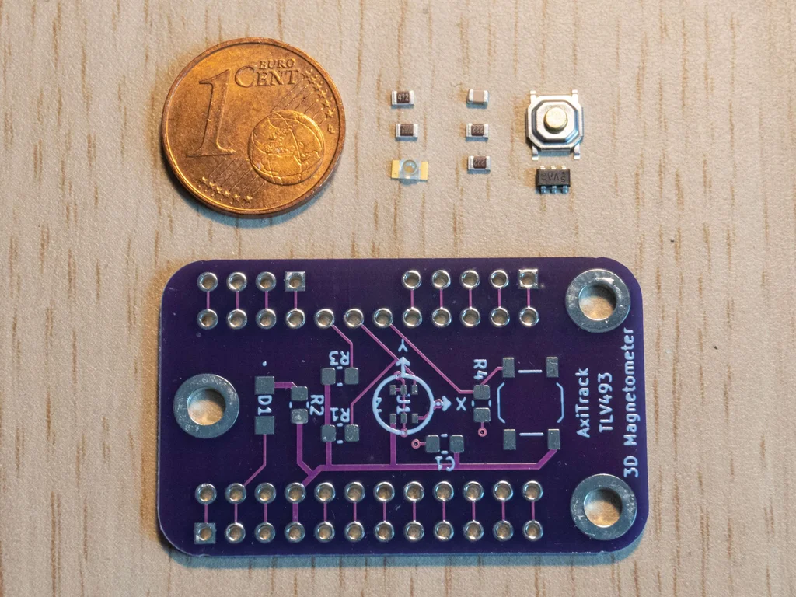
      </li>
      <li class="splide__slide">
        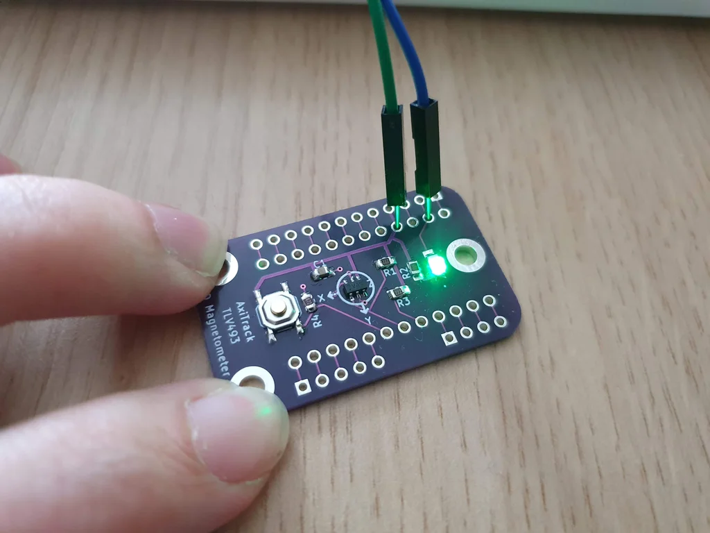
      </li>
      <li class="splide__slide">
        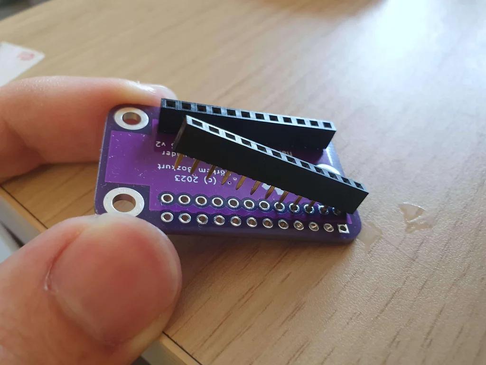
      </li>
    </ul>
  </div>
</section>
</div>
<ul id="thumbnails" class="thumbnails">
  <li class="thumbnail">
    
  </li>
  <li class="thumbnail">
    
  </li>
    <li class="thumbnail">
    
  </li>
</ul>

### SMD Soldering

Soldering with a reflow oven is usually recommended to achieve high accuracy however I used hand soldering to solder the components without any issues. I followed this tutorial for hand soldering:

https://www.youtube.com/watch?v=4zXP0TtORWo

### Through-Hole Components

The only Through-Hole components in this build are the header pins. You can also solder additional expansion pins if you plan to prototype with the board.

## 3D Printed Flexure

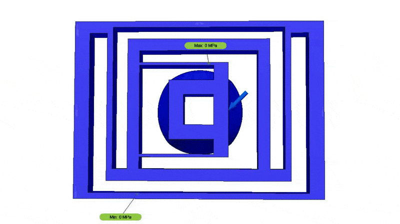

The 3D-printed flexure is housing a 4mm cube magnet and is capable to move in 3D and come back to the center position. This is essential for this device as minor fluctuations in movement can affect the input.

The Flexure was designed and tested in Fusion 360. The simulation helped make adjustments to the structure of the flexure to make sure distortions wouldn't happen.

The Fusion360 files for the flexures are available as editable files and can be customized based on the filament you use.

The printer I used is the Voxelab Aquila with the following settings:

    Nozzle: 0.4mm
    infill: %20
    Filament: ZIRO Translucent PLA

## Code & Configuration

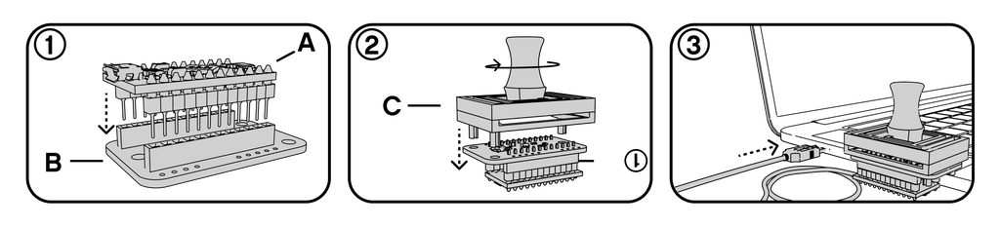

The Arduino code is using the TLV493D library to communicate with the sensor and the Joystick.h library to act as a gamepad for the computer. The latest version of the code can be found in the Trinteract GitHub repository.
Using Different Magnets

the Arduino code comes configured and calibrated based on a 4x4mm neodymium magnet. If you want to use a different magnet or magnetic material like magnetic textiles etc. you have to configure the range of the magnetic field in the Arduino code.

First, uncomment the following lines to open the serial port:

```arduino
//  uncomment the following line for debugging
Serial.begin(9600);
Serial.print(Tlv493dMagnetic3DSensor.getX());
Serial.print(Tlv493dMagnetic3DSensor.getY());
Serial.println(Tlv493dMagnetic3DSensor.getZ());
```


Next, upload the code to arduino and launch the serial monitor to see the new values. Now move the magnet to the maximum and minimum ends to determine the range of values.

Replace xMin, xMax, yMin, yMax, zMin, zMax with the new values.

```arduino
int y = map((calX-Tlv493dMagnetic3DSensor.getX()),yMax,yMin,-64,64);
int x = map((calY-Tlv493dMagnetic3DSensor.getY()),xMax,xMin,-64,64);
int z = map((calZ-Tlv493dMagnetic3DSensor.getZ()),zMin,zMax,-64,64);
```

The button on trinteract is set up as a calibration button, however calibration is also implemented on boot so you can configure to use it to control something else. If you decide to do so you can comment the following line in the arduino code:

```arduino
// comment the following lines if you want to use the button
// for something else
if(digitalRead(calButton) || !calibrationState){
  calibrate();
  calibrationState = true;
}
```


Upload the Code

Now you can upload the code to your Arduino and test trinteract!

## Testing
To test the device connect it to a Windows computer. Your computer will recognize trinteract as a game controller. To check if it’s recognized go to: Control Panel → Devices and Printers → Set up USB game controllers and click Properties

You should be able to see the input in real-time in the properties panel. You can also use the settings page to calibrate the device further.

### Navigating Figma

https://www.youtube.com/watch?v=e4s24j4kAKQ

Trinteract can be used on Figma to navigate thanks to this plugin by Chuanqi Sun.

Launch Figma and go to Plugins and search for “3DConnexion SpaceMouse Driver”, attach Trinteract to your computer and you are ready to navigate!

### Custom Interaction Using KeySticks

<div class="imageSlides">
<section id="main-carousel" class="splide" aria-label="project images">
  <div class="splide__track">
    <ul class="splide__list">
      <li class="splide__slide">
        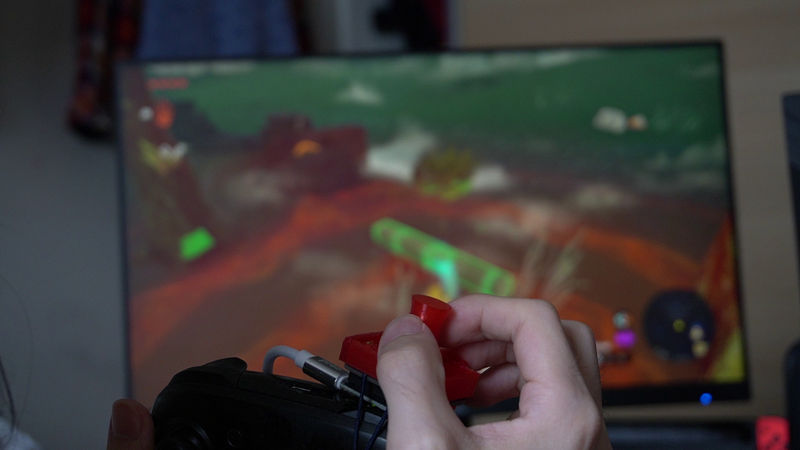
      </li>
      <li class="splide__slide">
        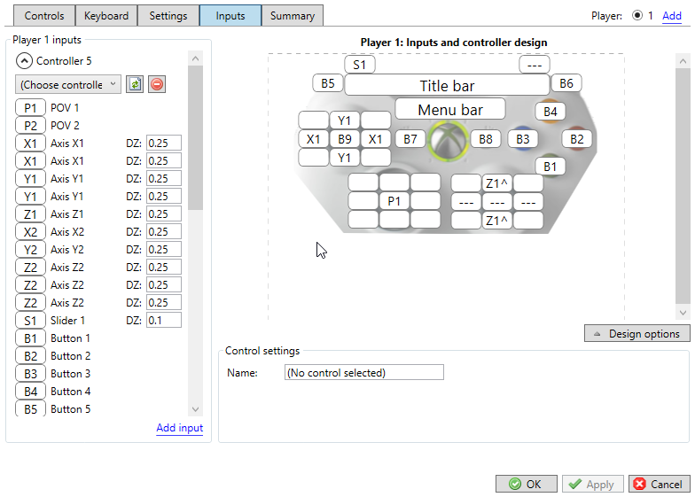
      </li>
    </ul>
  </div>
</section>
</div>
<ul id="thumbnails" class="thumbnails">
  <li class="thumbnail">
    
  </li>
  <li class="thumbnail">
    
  </li>
</ul>

Keysticks lets you map a game controller to customize your interaction with your PC, you can surf the web, play games that do not support gamepad inputs, or customize emulator input(I can't get into detail for legal reasons unfortunately) for non-PC games.
Setup

The setup is pretty straight forward, Trinteract is already recognized by your computer as a game controller so all you have to do is to download KeySticks here. And follow the images to assign buttons for the axes.

## What's Next

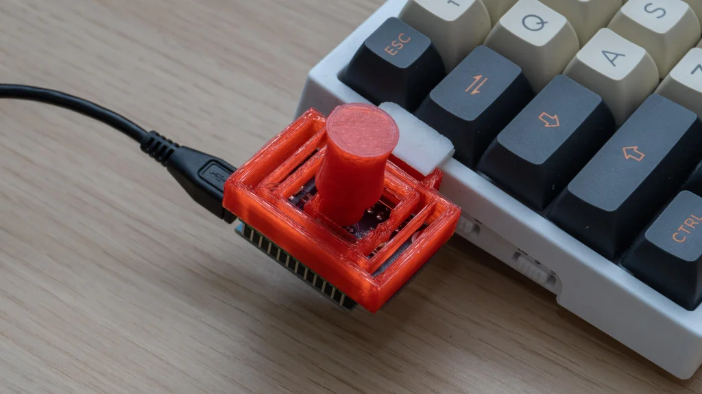

DIY 3D input devices for computer interaction are not that common at the moment thus developing interactions for specific applications requires time and effort. This is where you come in! I will list some ideas that came up while building this project, feel free to add more ideas or ways to improve this project in the comments.

Here are a few,

- Midi input to ableton or other music production software.
- Experiments with magnetic textiles: certain actions can be triggered on wearable devices based on input.
- VR controller: a controller attachment that is attached to your arm and can be controlled with your fingers.
- Robot arm controller: trinteract can also be used to control physical objects like robotic arms or drones.

I hope this project inspires people to build their own input devices so we can collectively redefine and enhance the way we interact with our computers.

If you have any questions ask away! & tell me about your build!